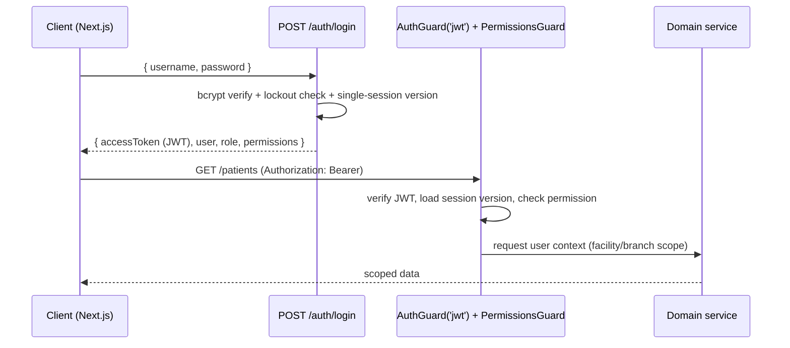
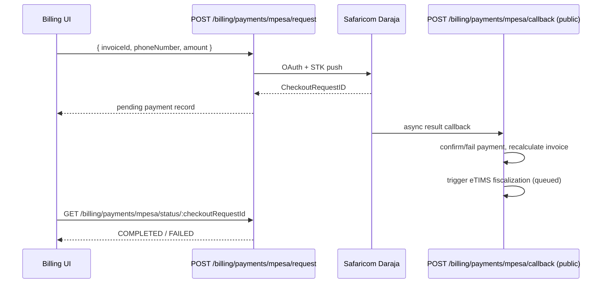
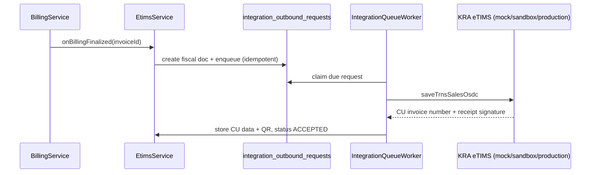

# API Reference

> Auto-generated from the NestJS controllers by
> `backend/scripts/generate-api-reference.mjs`. Regenerate after adding or
> changing routes: `cd backend && node scripts/generate-api-reference.mjs`.

**47 controllers · 341 endpoints**

## Conventions

- **Base URL**: the backend service root (e.g. `http://localhost:3000`).
- **Authentication**: routes guarded by `AuthGuard('jwt')` require
  `Authorization: Bearer <access token>` obtained from `POST /auth/login`.
  Controllers with no auth guard are public (webhooks, health, verification).
- **Authorization**: `Permissions` values are enforced by
  `PermissionsGuard` from the role→permission matrix in
  `backend/src/auth/permissions.ts`; `Roles` values by `RolesGuard`.
  `Step-up` marks routes requiring recent re-authentication
  (`StepUpGuard`).
- **Validation**: request bodies are validated by the global
  `ValidationPipe` (`whitelist`, `forbidNonWhitelisted`, `transform`)
  against the DTO listed per route (see `dto/` folder of each module).
- **Errors**: failures return the standard envelope produced by the global
  exception filter — `{ statusCode, message, error }` with appropriate
  HTTP status (400 validation, 401 unauthenticated, 403 forbidden,
  404 not found, 409/422 domain conflicts, 429 rate limited, 500 internal).
- **Correlation**: every response carries `X-Request-Id`; clients may
  supply their own via `X-Request-Id`/`X-Correlation-Id`.

## Endpoint index by module

- [ai-assistant](#module-ai-assistant)
- [app-root](#module-app-root)
- [appointment](#module-appointment)
- [audit-log](#module-audit-log)
- [auth](#module-auth)
- [billing](#module-billing)
- [branch](#module-branch)
- [clinic](#module-clinic)
- [clinical-safety](#module-clinical-safety)
- [consultation](#module-consultation)
- [department](#module-department)
- [doctor-lab-review](#module-doctor-lab-review)
- [enterprise](#module-enterprise)
- [facility](#module-facility)
- [facility-subscription](#module-facility-subscription)
- [feedback](#module-feedback)
- [integration](#module-integration)
- [ipd](#module-ipd)
- [ipd-clinical](#module-ipd-clinical)
- [lab](#module-lab)
- [master-catalog](#module-master-catalog)
- [notification](#module-notification)
- [operational-module](#module-operational-module)
- [patient](#module-patient)
- [patient-portal](#module-patient-portal)
- [pharmacy](#module-pharmacy)
- [pharmacy-stock](#module-pharmacy-stock)
- [prescription](#module-prescription)
- [prescription-item](#module-prescription-item)
- [queue](#module-queue)
- [reports](#module-reports)
- [resilience](#module-resilience)
- [role](#module-role)
- [settings](#module-settings)
- [sha-claims](#module-sha-claims)
- [staff](#module-staff)
- [triage](#module-triage)
- [user](#module-user)
- [user-location](#module-user-location)
- [user-review](#module-user-review)

## Module: ai-assistant

### AiAssistantController

Source: `src/ai-assistant/ai-assistant.controller.ts` · Class guards: `AuthGuard('jwt')`

| Method | Path | Handler | Authorization | Request body (DTO) |
| --- | --- | --- | --- | --- |
| GET | `/ai-assistant/status` | getStatus | – | – |
| POST | `/ai-assistant/clinical-draft` | createClinicalDraft | – | `ClinicalAiRequestDto` |
| POST | `/ai-assistant/identity-ocr` | extractIdentity | – | `IdentityOcrRequestDto` |

## Module: app-root

### AppController

Source: `src/app.controller.ts` · **Public (no class-level auth guard)**

| Method | Path | Handler | Authorization | Request body (DTO) |
| --- | --- | --- | --- | --- |
| GET | `/` | getHello | – | – |

## Module: appointment

### AppointmentController

Source: `src/appointment/appointment.controller.ts` · Class guards: `AuthGuard('jwt')`

| Method | Path | Handler | Authorization | Request body (DTO) |
| --- | --- | --- | --- | --- |
| POST | `/appointments` | create | – | `CreateAppointmentDto` |
| GET | `/appointments` | findAll | – | – |
| GET | `/appointments/number/:appointmentNumber` | findByAppointmentNumber | – | – |
| GET | `/appointments/:id` | findOne | – | – |
| PATCH | `/appointments/:id` | update | – | `UpdateAppointmentDto` |
| PATCH | `/appointments/:id/check-in` | checkIn | – | – |
| PATCH | `/appointments/:id/start-consultation` | startConsultation | – | – |
| PATCH | `/appointments/:id/complete` | completeAppointment | – | – |
| DELETE | `/appointments/:id` | remove | – | – |

## Module: audit-log

### AuditLogController

Source: `src/audit-log/audit-log.controller.ts` · Class guards: `AuthGuard('jwt'), RolesGuard`

| Method | Path | Handler | Authorization | Request body (DTO) |
| --- | --- | --- | --- | --- |
| POST | `/audit-logs` | create | – | `CreateAuditLogDto` |
| GET | `/audit-logs` | findAll | – | – |
| GET | `/audit-logs/export` | exportAuditLogs | – | – |
| GET | `/audit-logs/module/:moduleName` | findByModule | – | – |
| GET | `/audit-logs/entity/:entityType/:entityId` | findByEntity | – | – |
| GET | `/audit-logs/:id` | findOne | – | – |

## Module: auth

### AuthTestController

Source: `src/auth/auth-test.controller.ts` · Class guards: `JwtAuthGuard, RolesGuard`

| Method | Path | Handler | Authorization | Request body (DTO) |
| --- | --- | --- | --- | --- |
| GET | `/auth-test/admin-only` | adminOnly | roles: SUPER_ADMIN, ADMIN | – |
| GET | `/auth-test/doctor-only` | doctorOnly | roles: DOCTOR | – |
| GET | `/auth-test/lab-only` | labOnly | roles: LAB_TECH | – |

### AuthController

Source: `src/auth/auth.controller.ts` · **Public (no class-level auth guard)**

| Method | Path | Handler | Authorization | Request body (DTO) |
| --- | --- | --- | --- | --- |
| POST | `/auth/login` | login | – | `LoginDto` |
| POST | `/auth/forgot-password` | forgotPassword | – | `ForgotPasswordDto` |
| POST | `/auth/reset-password` | resetPassword | – | `ResetPasswordDto` |
| GET | `/auth/me` | getProfile | – | – |
| POST | `/auth/accept-deactivation` | acceptDeactivation | – | – |
| POST | `/auth/step-up` | createStepUpToken | – | `StepUpDto` |

## Module: billing

### BillingController

Source: `src/billing/billing.controller.ts` · Class guards: `AuthGuard('jwt'), PermissionsGuard, StepUpGuard`

| Method | Path | Handler | Authorization | Request body (DTO) |
| --- | --- | --- | --- | --- |
| POST | `/billing/services` | createBillingService | `billing.write` · roles: SUPER_ADMIN, ADMIN, FACILITY_ADMIN · guards: RolesGuard | `CreateBillingServiceDto` |
| GET | `/billing/services` | getAllBillingServices | `billing.read` | – |
| GET | `/billing/tariffs/pricing-template` | getServiceTariffPricingTemplate | `billing.write` · roles: SUPER_ADMIN, ADMIN, FACILITY_ADMIN · guards: RolesGuard | – |
| POST | `/billing/tariffs/pricing-import` | importServiceTariffs | `billing.write` · roles: SUPER_ADMIN, ADMIN, FACILITY_ADMIN · guards: RolesGuard | `ImportServiceTariffsCsvDto` |
| POST | `/billing/tariffs` | createServiceTariff | `billing.write` · roles: SUPER_ADMIN, ADMIN, FACILITY_ADMIN · guards: RolesGuard | `CreateServiceTariffDto` |
| GET | `/billing/tariffs` | getServiceTariffs | `billing.read` | – |
| PATCH | `/billing/tariffs/:id` | updateServiceTariff | `billing.write` · roles: SUPER_ADMIN, ADMIN, FACILITY_ADMIN · guards: RolesGuard | `UpdateServiceTariffDto` |
| POST | `/billing/invoices` | createInvoice | `billing.write` | `CreateInvoiceDto` |
| POST | `/billing/patients/:id/open-invoice` | openPatientInvoice | `billing.write` | `OpenPatientInvoiceDto` |
| GET | `/billing/patients/:id/workspace` | getPatientBillingWorkspace | `billing.read` | – |
| POST | `/billing/admissions/:id/bed-charge` | postAdmissionBedCharge | `billing.write` | `PostBedChargeDto` |
| GET | `/billing/invoices` | getAllInvoices | `billing.read` | – |
| GET | `/billing/invoices/:id/pdf` | downloadInvoicePdf | `billing.read` | – |
| GET | `/billing/invoices/verify/public` | verifyInvoicePublic | – | – |
| GET | `/billing/invoices/verify/public.pdf` | downloadVerifiedInvoicePdf | – | – |
| GET | `/billing/invoices/:id` | getInvoiceById | `billing.read` | – |
| POST | `/billing/invoices/:id/items` | addInvoiceItem | `billing.write` | `AddInvoiceItemDto` |
| POST | `/billing/invoices/:id/close` | closeInvoice | `billing.write` | – |
| PATCH | `/billing/invoice-items/:id` | updateInvoiceItem | `billing.write` | `UpdateInvoiceItemDto` |
| PATCH | `/billing/invoice-items/:id/remove` | removeInvoiceItem | `billing.write` | `RemoveInvoiceItemDto` |
| GET | `/billing/patient/:patientNumber` | getPatientBillingByPatientNumber | `billing.read` | – |
| POST | `/billing/payments/cash` | createCashPayment | `payment.collect` | `CreateCashPaymentDto` |
| GET | `/billing/payments/:id/receipt.pdf` | downloadPaymentReceiptPdf | `billing.read` | – |
| POST | `/billing/payments/mpesa/request` | createMpesaPaymentRequest | `payment.collect` | `CreateMpesaPaymentRequestDto` |
| POST | `/billing/payments/:id/mpesa/resend` | resendMpesaPaymentRequest | `payment.collect` | – |
| POST | `/billing/payments/mpesa/confirm` | confirmMpesaPayment | – | `ConfirmMpesaPaymentDto` |
| PATCH | `/billing/payments/mpesa/fail/:checkoutRequestId` | failMpesaPayment | `payment.manual_confirm` · step-up | – |
| GET | `/billing/payments/mpesa/status/:checkoutRequestId` | getMpesaPaymentStatus | `payment.collect` | – |
| GET | `/billing/dashboard` | getBillingDashboard | `billing.read` | – |
| GET | `/billing/revenue-integrity` | getRevenueIntegrity | `reports.read` | – |
| GET | `/billing/cashier-close` | getCashierClose | `reports.read` | – |

### MpesaCallbackController

Source: `src/billing/billing.controller.ts` · **Public (no class-level auth guard)**

| Method | Path | Handler | Authorization | Request body (DTO) |
| --- | --- | --- | --- | --- |
| POST | `/billing/payments/mpesa/callback` | handleCallback | – | `unknown` |

### BillingPublicController

Source: `src/billing/billing.controller.ts` · **Public (no class-level auth guard)**

| Method | Path | Handler | Authorization | Request body (DTO) |
| --- | --- | --- | --- | --- |
| GET | `/billing-public/invoices/verify` | verifyInvoice | – | – |
| GET | `/billing-public/invoices/verify.pdf` | downloadInvoicePdf | – | – |

### PayheroBillingController

Source: `src/billing/payhero.controller.ts` · Class guards: `AuthGuard('jwt'), PermissionsGuard`

| Method | Path | Handler | Authorization | Request body (DTO) |
| --- | --- | --- | --- | --- |
| POST | `/billing/payments/payhero/request` | createPayheroPaymentRequest | `payment.collect` | `CreatePayheroPaymentRequestDto` |
| GET | `/billing/payments/payhero/status/:paymentId` | getPayheroPaymentStatus | `payment.collect` | – |

### PayheroCallbackController

Source: `src/billing/payhero.controller.ts` · **Public (no class-level auth guard)**

| Method | Path | Handler | Authorization | Request body (DTO) |
| --- | --- | --- | --- | --- |
| POST | `/billing/payments/payhero/callback` | handleCallback | – | `Record<string` |

## Module: branch

### BranchController

Source: `src/branch/branch.controller.ts` · Class guards: `AuthGuard('jwt')`

| Method | Path | Handler | Authorization | Request body (DTO) |
| --- | --- | --- | --- | --- |
| POST | `/branches` | create | roles: SUPER_ADMIN, ADMIN, FACILITY_ADMIN · guards: RolesGuard | `CreateBranchDto` |
| GET | `/branches` | findAll | – | – |
| GET | `/branches/facility/:facilityId` | findByFacility | – | – |
| GET | `/branches/code/:code` | findByCode | – | – |
| GET | `/branches/:id` | findOne | – | – |
| PATCH | `/branches/:id` | update | roles: SUPER_ADMIN, ADMIN, FACILITY_ADMIN · guards: RolesGuard | `UpdateBranchDto` |
| DELETE | `/branches/:id` | remove | roles: SUPER_ADMIN, ADMIN, FACILITY_ADMIN · guards: RolesGuard | – |
| POST | `/branches/access/grant` | grantUserBranchAccess | roles: SUPER_ADMIN, ADMIN, FACILITY_ADMIN · guards: RolesGuard | `GrantUserBranchAccessDto` |
| GET | `/branches/access/user/:userId` | getUserBranchAccesses | – | – |
| PATCH | `/branches/access/user/home-branch` | setUserHomeBranch | roles: SUPER_ADMIN, ADMIN, FACILITY_ADMIN · guards: RolesGuard | `SetUserHomeBranchDto` |

## Module: clinic

### ClinicController

Source: `src/clinic/clinic.controller.ts` · Class guards: `AuthGuard('jwt')`

| Method | Path | Handler | Authorization | Request body (DTO) |
| --- | --- | --- | --- | --- |
| POST | `/clinics` | create | roles: SUPER_ADMIN, ADMIN, FACILITY_ADMIN · guards: RolesGuard | `CreateClinicDto` |
| GET | `/clinics` | findAll | – | – |
| GET | `/clinics/facility/:facilityId` | findByFacility | – | – |
| GET | `/clinics/branch/:branchId` | findByBranch | – | – |
| GET | `/clinics/code/:code` | findByCode | – | – |
| GET | `/clinics/:id` | findOne | – | – |
| PATCH | `/clinics/:id` | update | roles: SUPER_ADMIN, ADMIN, FACILITY_ADMIN · guards: RolesGuard | `UpdateClinicDto` |
| DELETE | `/clinics/:id` | remove | roles: SUPER_ADMIN, ADMIN, FACILITY_ADMIN · guards: RolesGuard | – |

## Module: clinical-safety

### ClinicalSafetyController

Source: `src/clinical-safety/clinical-safety.controller.ts` · Class guards: `AuthGuard('jwt'), PermissionsGuard`

| Method | Path | Handler | Authorization | Request body (DTO) |
| --- | --- | --- | --- | --- |
| POST | `/clinical-safety/evaluate` | evaluate | `consultation.write` | `EvaluateClinicalSafetyDto` |

## Module: consultation

### ConsultationController

Source: `src/consultation/consultation.controller.ts` · Class guards: `AuthGuard('jwt')`

| Method | Path | Handler | Authorization | Request body (DTO) |
| --- | --- | --- | --- | --- |
| POST | `/consultations` | create | – | `CreateConsultationDto` |
| GET | `/consultations` | findAll | – | – |
| GET | `/consultations/:id/workspace` | getWorkspace | – | – |
| GET | `/consultations/number/:consultationNumber` | findByConsultationNumber | – | – |
| GET | `/consultations/appointment/:appointmentId` | findByAppointmentId | – | – |
| GET | `/consultations/patient/:patientId` | findByPatientId | – | – |
| GET | `/consultations/:id` | findOne | – | – |
| PATCH | `/consultations/:id` | update | – | `UpdateConsultationDto` |
| PATCH | `/consultations/:id/complete` | complete | – | – |
| DELETE | `/consultations/:id` | remove | – | – |

## Module: department

### DepartmentController

Source: `src/department/department.controller.ts` · Class guards: `AuthGuard('jwt')`

| Method | Path | Handler | Authorization | Request body (DTO) |
| --- | --- | --- | --- | --- |
| POST | `/departments` | create | roles: SUPER_ADMIN, ADMIN, FACILITY_ADMIN · guards: RolesGuard | `CreateDepartmentDto` |
| GET | `/departments` | findAll | – | – |
| GET | `/departments/facility/:facilityId` | findByFacility | – | – |
| GET | `/departments/branch/:branchId` | findByBranch | – | – |
| GET | `/departments/code/:code` | findByCode | – | – |
| GET | `/departments/:id` | findOne | – | – |
| PATCH | `/departments/:id` | update | roles: SUPER_ADMIN, ADMIN, FACILITY_ADMIN · guards: RolesGuard | `UpdateDepartmentDto` |
| DELETE | `/departments/:id` | remove | roles: SUPER_ADMIN, ADMIN, FACILITY_ADMIN · guards: RolesGuard | – |

## Module: doctor-lab-review

### DoctorLabReviewController

Source: `src/doctor-lab-review/doctor-lab-review.controller.ts` · **Public (no class-level auth guard)**

| Method | Path | Handler | Authorization | Request body (DTO) |
| --- | --- | --- | --- | --- |
| GET | `/doctor-lab-review/appointment/:appointmentId` | getOrdersByAppointment | – | – |
| GET | `/doctor-lab-review/order/:orderId` | getSingleOrderReview | – | – |
| GET | `/doctor-lab-review/doctor/:doctorId` | getDoctorPendingReviews | – | – |

## Module: enterprise

### EnterpriseController

Source: `src/enterprise/enterprise.controller.ts` · **Public (no class-level auth guard)**

| Method | Path | Handler | Authorization | Request body (DTO) |
| --- | --- | --- | --- | --- |
| GET | `/enterprise/status` | getStatus | – | – |

## Module: facility

### FacilityController

Source: `src/facility/facility.controller.ts` · Class guards: `AuthGuard('jwt')`

| Method | Path | Handler | Authorization | Request body (DTO) |
| --- | --- | --- | --- | --- |
| POST | `/facilities` | create | roles: SUPER_ADMIN, ADMIN, FACILITY_ADMIN · guards: RolesGuard | `CreateFacilityDto` |
| GET | `/facilities` | findAll | – | – |
| GET | `/facilities/default` | findDefault | – | – |
| GET | `/facilities/code/:code` | findByCode | – | – |
| GET | `/facilities/:id` | findOne | – | – |
| PATCH | `/facilities/:id` | update | roles: SUPER_ADMIN, ADMIN, FACILITY_ADMIN · guards: RolesGuard | `UpdateFacilityDto` |
| DELETE | `/facilities/:id` | remove | roles: SUPER_ADMIN, ADMIN, FACILITY_ADMIN · guards: RolesGuard | – |

## Module: facility-subscription

### FacilitySubscriptionController

Source: `src/facility-subscription/facility-subscription.controller.ts` · Class guards: `AuthGuard('jwt')`

| Method | Path | Handler | Authorization | Request body (DTO) |
| --- | --- | --- | --- | --- |
| GET | `/facility-subscriptions/my-status` | getMyStatus | – | – |
| GET | `/facility-subscriptions/platform` | findPlatform | roles: SUPER_ADMIN · guards: RolesGuard | – |
| POST | `/facility-subscriptions/payments` | recordPayment | roles: SUPER_ADMIN · guards: RolesGuard | `RecordFacilitySubscriptionPaymentDto` |

## Module: feedback

### FeedbackController

Source: `src/feedback/feedback.controller.ts` · Class guards: `AuthGuard('jwt')`

| Method | Path | Handler | Authorization | Request body (DTO) |
| --- | --- | --- | --- | --- |
| POST | `/feedback` | create | – | `CreateFeedbackDto` |
| GET | `/feedback/mine` | findMine | – | – |
| GET | `/feedback/platform` | findPlatform | roles: SUPER_ADMIN · guards: RolesGuard | – |
| PATCH | `/feedback/:id/reply` | reply | roles: SUPER_ADMIN · guards: RolesGuard | `ReplyFeedbackDto` |

## Module: integration

### DhaController

Source: `src/integration/dha/dha.controller.ts` · Class guards: `AuthGuard('jwt'), PermissionsGuard`

| Method | Path | Handler | Authorization | Request body (DTO) |
| --- | --- | --- | --- | --- |
| GET | `/integrations/dha/status` | getStatus | `billing.read` | – |
| POST | `/integrations/dha/patients/verify` | verifyPatient | `patient.read` | `VerifyPatientDto` |
| POST | `/integrations/dha/practitioners/verify` | verifyPractitioner | `users.manage` | `VerifyPractitionerDto` |
| POST | `/integrations/dha/facilities/verify` | verifyFacility | `billing.read` | `VerifyFacilityDto` |
| POST | `/integrations/dha/eligibility` | checkEligibility | `billing.read` | `CheckEligibilityDto` |
| POST | `/integrations/dha/consent` | recordConsent | `patient.write` | `RecordConsentDto` |
| POST | `/integrations/dha/referrals` | submitReferral | `consultation.write` | `SubmitReferralDto` |
| POST | `/integrations/dha/encounters/consultation/:consultationId` | submitEncounter | `consultation.write` | – |
| GET | `/integrations/dha/transactions` | listTransactions | `billing.read` | – |

### EtimsController

Source: `src/integration/etims/etims.controller.ts` · Class guards: `AuthGuard('jwt'), PermissionsGuard`

| Method | Path | Handler | Authorization | Request body (DTO) |
| --- | --- | --- | --- | --- |
| GET | `/integrations/etims/status` | getStatus | `billing.read` | – |
| GET | `/integrations/etims/invoices/:invoiceId` | getInvoiceFiscalStatus | `billing.read` | – |
| POST | `/integrations/etims/invoices/:invoiceId/submit` | submitInvoice | `billing.write` | – |
| POST | `/integrations/etims/invoices/:invoiceId/credit-note` | createCreditNote | `billing.write` | `CreateEtimsAmendmentDto` |
| POST | `/integrations/etims/invoices/:invoiceId/debit-note` | createDebitNote | `billing.write` | `CreateEtimsAmendmentDto` |
| POST | `/integrations/etims/invoices/:invoiceId/cancel` | cancelInvoice | `billing.write` | `CancelEtimsInvoiceDto` |
| POST | `/integrations/etims/sync` | syncNow | `billing.write` | – |
| GET | `/integrations/etims/queue/dead-letters` | listDeadLetters | `billing.read` | – |
| POST | `/integrations/etims/queue/:requestId/requeue` | requeue | `billing.write` | – |

## Module: ipd

### IpdController

Source: `src/ipd/ipd.controller.ts` · Class guards: `AuthGuard('jwt')`

| Method | Path | Handler | Authorization | Request body (DTO) |
| --- | --- | --- | --- | --- |
| POST | `/ipd/wards` | createWard | – | `CreateWardDto` |
| GET | `/ipd/wards` | getAllWards | – | – |
| POST | `/ipd/beds` | createBed | – | `CreateBedDto` |
| GET | `/ipd/beds` | getAllBeds | – | – |
| POST | `/ipd/admissions` | createAdmission | – | `CreateAdmissionDto` |
| GET | `/ipd/admissions` | getAllAdmissions | – | – |
| GET | `/ipd/admissions/active` | getActiveAdmissions | – | – |
| GET | `/ipd/admissions/:id` | getAdmissionById | – | – |
| PATCH | `/ipd/wards/:id` | updateWard | – | `UpdateWardDto` |
| PATCH | `/ipd/beds/:id` | updateBed | – | `UpdateBedDto` |
| PATCH | `/ipd/beds/:id/status` | updateBedStatus | – | `UpdateBedStatusDto` |
| PATCH | `/ipd/admissions/:id/transfer-bed` | transferAdmissionBed | – | `TransferAdmissionBedDto` |
| PATCH | `/ipd/admissions/:id/discharge` | dischargeAdmission | – | – |

## Module: ipd-clinical

### IpdClinicalController

Source: `src/ipd-clinical/ipd-clinical.controller.ts` · Class guards: `AuthGuard('jwt')`

| Method | Path | Handler | Authorization | Request body (DTO) |
| --- | --- | --- | --- | --- |
| POST | `/ipd-clinical/progress-notes` | createProgressNote | – | `CreateIpdProgressNoteDto` |
| GET | `/ipd-clinical/progress-notes/admission/:admissionId` | getProgressNotesByAdmission | – | – |
| POST | `/ipd-clinical/vitals` | createVitalRecord | – | `CreateIpdVitalRecordDto` |
| GET | `/ipd-clinical/vitals/admission/:admissionId` | getVitalRecordsByAdmission | – | – |
| POST | `/ipd-clinical/doctor-reviews` | createDoctorReview | – | `CreateIpdDoctorReviewDto` |
| GET | `/ipd-clinical/doctor-reviews/admission/:admissionId` | getDoctorReviewsByAdmission | – | – |
| POST | `/ipd-clinical/treatment-chart` | createTreatmentEntry | – | `CreateTreatmentChartEntryDto` |
| GET | `/ipd-clinical/treatment-chart/admission/:admissionId` | getTreatmentChartByAdmission | – | – |
| PATCH | `/ipd-clinical/treatment-chart/:entryId/administer` | administerTreatment | – | – |
| POST | `/ipd-clinical/admissions/:admissionId/medicine-administration` | administerAdmissionMedicine | – | `AdministerIpdMedicineDto` |
| POST | `/ipd-clinical/discharge-summary` | createOrUpdateDischargeSummary | – | `CreateIpdDischargeSummaryDto` |
| GET | `/ipd-clinical/discharge-summary/admission/:admissionId` | getDischargeSummaryByAdmission | – | – |
| GET | `/ipd-clinical/lab-orders/admission/:admissionId` | getAdmissionLabOrders | – | – |
| GET | `/ipd-clinical/dashboard/admission/:admissionId` | getAdmissionClinicalDashboard | – | – |
| GET | `/ipd-clinical/documents/admissions/:admissionId/medical-summary.pdf` | downloadMedicalSummaryPdf | – | – |
| GET | `/ipd-clinical/documents/admissions/:admissionId/discharge-summary.pdf` | downloadDischargeSummaryPdf | – | – |
| GET | `/ipd-clinical/documents/admissions/:admissionId/treatment-chart.pdf` | downloadTreatmentChartPdf | – | – |

## Module: lab

### LabController

Source: `src/lab/lab.controller.ts` · Class guards: `AuthGuard('jwt')`

| Method | Path | Handler | Authorization | Request body (DTO) |
| --- | --- | --- | --- | --- |
| POST | `/lab/tests` | createTestCatalogItem | roles: SUPER_ADMIN, ADMIN, FACILITY_ADMIN · guards: RolesGuard | `CreateLabTestDto` |
| GET | `/lab/tests` | getAllTests | – | – |
| POST | `/lab/orders` | createOrder | – | `CreateLabOrderDto` |
| GET | `/lab/orders` | getAllOrders | – | – |
| GET | `/lab/orders/:id` | getOrderById | – | – |
| GET | `/lab/queue` | getLabQueue | – | – |
| POST | `/lab/results` | createResult | – | `CreateLabResultDto` |
| GET | `/lab/orders/:id/results` | getResultsByOrder | – | – |

## Module: master-catalog

### MasterCatalogController

Source: `src/master-catalog/master-catalog.controller.ts` · Class guards: `AuthGuard('jwt'), RolesGuard`

| Method | Path | Handler | Authorization | Request body (DTO) |
| --- | --- | --- | --- | --- |
| GET | `/master-catalog/overview` | getOverview | – | – |
| GET | `/master-catalog/medicines` | getMedicines | – | – |
| GET | `/master-catalog/medicines/template` | getMedicinesTemplate | – | – |
| POST | `/master-catalog/medicines/import` | importMedicines | – | `ImportMasterCatalogCsvDto` |
| GET | `/master-catalog/billing-services` | getBillingServices | – | – |
| GET | `/master-catalog/billing-services/template` | getBillingServicesTemplate | – | – |
| POST | `/master-catalog/billing-services/import` | importBillingServices | – | `ImportMasterCatalogCsvDto` |
| GET | `/master-catalog/lab-tests` | getLabTests | – | – |
| GET | `/master-catalog/lab-tests/template` | getLabTestsTemplate | – | – |
| POST | `/master-catalog/lab-tests/import` | importLabTests | – | `ImportMasterCatalogCsvDto` |

## Module: notification

### NotificationController

Source: `src/notification/notification.controller.ts` · Class guards: `AuthGuard('jwt')`

| Method | Path | Handler | Authorization | Request body (DTO) |
| --- | --- | --- | --- | --- |
| POST | `/notifications` | create | – | `CreateNotificationDto` |
| GET | `/notifications` | findAll | – | – |
| GET | `/notifications/stats` | getStats | – | – |
| GET | `/notifications/recipients` | getRecipients | – | – |
| GET | `/notifications/branch-alerts` | getBranchAlerts | – | – |
| GET | `/notifications/pharmacy-alerts` | getPharmacyAlerts | – | – |
| GET | `/notifications/unresolved-count` | getUnresolvedCount | – | – |
| GET | `/notifications/pharmacist-dashboard/:staffId` | getPharmacistDashboardAlerts | – | – |
| GET | `/notifications/cashier-dashboard/:staffId` | getCashierDashboardAlerts | – | – |
| GET | `/notifications/admin-operations/:userId` | getAdminOperationsAlerts | – | – |
| GET | `/notifications/user/:userId` | findForUser | – | – |
| GET | `/notifications/staff/:staffId` | findForStaff | – | – |
| GET | `/notifications/:id` | findOne | – | – |
| PATCH | `/notifications/read-all` | markScopedAsRead | – | – |
| PATCH | `/notifications/:id/read` | markAsRead | – | – |
| PATCH | `/notifications/:id/resolve` | resolve | – | `ResolveNotificationDto` |
| PATCH | `/notifications/staff/:staffId/read-all` | markAllForStaffAsRead | – | – |
| PATCH | `/notifications/user/:userId/read-all` | markAllForUserAsRead | – | – |

## Module: operational-module

### OperationalModuleController

Source: `src/operational-module/operational-module.controller.ts` · Class guards: `AuthGuard('jwt')`

| Method | Path | Handler | Authorization | Request body (DTO) |
| --- | --- | --- | --- | --- |
| GET | `/operational-modules/summary` | getGlobalSummary | – | – |
| GET | `/operational-modules/:moduleSlug/records` | findModuleRecords | – | – |
| POST | `/operational-modules/:moduleSlug/records` | create | – | `CreateOperationalModuleRecordDto` |
| GET | `/operational-modules/:moduleSlug/records/:id` | findOne | – | – |
| PATCH | `/operational-modules/:moduleSlug/records/:id` | update | – | `UpdateOperationalModuleRecordDto` |

## Module: patient

### PatientController

Source: `src/patient/patient.controller.ts` · Class guards: `AuthGuard('jwt')`

| Method | Path | Handler | Authorization | Request body (DTO) |
| --- | --- | --- | --- | --- |
| POST | `/patients` | create | – | `CreatePatientDto` |
| GET | `/patients` | findAll | – | – |
| GET | `/patients/search/suggestions` | searchSuggestions | – | – |
| POST | `/patients/duplicate-check` | duplicateCheck | – | `PossibleDuplicatePatientDto` |
| GET | `/patients/number/:patientNumber` | findByPatientNumber | – | – |
| GET | `/patients/:id` | findOne | – | – |
| PATCH | `/patients/:id` | update | – | `UpdatePatientDto` |
| DELETE | `/patients/:id` | remove | – | – |

## Module: patient-portal

### PatientPortalController

Source: `src/patient-portal/patient-portal.controller.ts` · Class guards: `AuthGuard('jwt')`

| Method | Path | Handler | Authorization | Request body (DTO) |
| --- | --- | --- | --- | --- |
| GET | `/patient-portal/profile` | getProfile | – | – |
| GET | `/patient-portal/appointments` | getAppointments | – | – |
| GET | `/patient-portal/invoices` | getInvoices | – | – |
| GET | `/patient-portal/lab-results` | getLabResults | – | – |
| GET | `/patient-portal/prescriptions` | getPrescriptions | – | – |

## Module: pharmacy

### OtcSalesController

Source: `src/pharmacy/otc-sales.controller.ts` · Class guards: `AuthGuard('jwt'), PermissionsGuard`

| Method | Path | Handler | Authorization | Request body (DTO) |
| --- | --- | --- | --- | --- |
| GET | `/pharmacy/otc/medicines/search` | searchMedicines | – | – |
| POST | `/pharmacy/otc/sales` | createSale | – | `CreateOtcSaleDto` |
| GET | `/pharmacy/otc/sales` | listSales | – | – |
| GET | `/pharmacy/otc/sales/:id` | getSale | – | – |
| POST | `/pharmacy/otc/sales/:id/items` | addItem | – | `OtcSaleItemInputDto` |
| PATCH | `/pharmacy/otc/sales/:id/items/:itemId` | updateItem | – | `UpdateOtcSaleItemDto` |
| DELETE | `/pharmacy/otc/sales/:id/items/:itemId` | removeItem | – | – |
| POST | `/pharmacy/otc/sales/:id/pay` | recordPayment | – | `RecordOtcSalePaymentDto` |
| POST | `/pharmacy/otc/sales/:id/complete` | completeSale | – | – |
| GET | `/pharmacy/otc/sales/:id/receipt.pdf` | downloadReceiptPdf | – | – |
| POST | `/pharmacy/otc/sales/:id/cancel` | cancelSale | – | – |

### PharmacyController

Source: `src/pharmacy/pharmacy.controller.ts` · Class guards: `AuthGuard('jwt'), PermissionsGuard`

| Method | Path | Handler | Authorization | Request body (DTO) |
| --- | --- | --- | --- | --- |
| POST | `/pharmacy/medicines` | createMedicine | `stock.adjust` | `CreateMedicineDto` |
| GET | `/pharmacy/medicines` | getAllMedicines | – | – |
| GET | `/pharmacy/medicines/:id` | getMedicineById | – | – |
| POST | `/pharmacy/prescriptions` | createPrescription | `consultation.write` | `CreatePrescriptionDto` |
| GET | `/pharmacy/prescriptions` | getAllPrescriptions | – | – |
| GET | `/pharmacy/prescriptions/:id` | getPrescriptionById | – | – |
| GET | `/pharmacy/queue` | getPharmacyQueue | `pharmacy.dispense` | – |
| PATCH | `/pharmacy/prescriptions/:id/dispense` | dispensePrescription | `pharmacy.dispense` | – |
| POST | `/pharmacy/direct-administrations` | directMedicineAdministration | `consultation.write` | `DirectMedicineAdministrationDto` |

## Module: pharmacy-stock

### PharmacyStockController

Source: `src/pharmacy-stock/pharmacy-stock.controller.ts` · Class guards: `AuthGuard('jwt')`

| Method | Path | Handler | Authorization | Request body (DTO) |
| --- | --- | --- | --- | --- |
| POST | `/pharmacy-stock` | create | – | `CreateBranchMedicineStockDto` |
| GET | `/pharmacy-stock` | findAll | – | – |
| GET | `/pharmacy-stock/low-stock` | getLowStock | – | – |
| GET | `/pharmacy-stock/branch/:branchId/pricing-template` | getBranchPricingTemplate | – | – |
| POST | `/pharmacy-stock/branch/:branchId/pricing-import` | importBranchPricing | – | `ImportBranchPricingCsvDto` |
| GET | `/pharmacy-stock/branch/:branchId/search` | searchBranchMedicines | – | – |
| GET | `/pharmacy-stock/branch/:branchId` | findByBranch | – | – |
| GET | `/pharmacy-stock/branch/:branchId/medicine/:medicineId/alternatives` | findMedicineAlternatives | – | – |
| GET | `/pharmacy-stock/:id` | findOne | – | – |
| PATCH | `/pharmacy-stock/:id` | update | – | `UpdateBranchMedicineStockDto` |
| PATCH | `/pharmacy-stock/:id/add-stock/:quantity` | addStock | – | – |
| PATCH | `/pharmacy-stock/:stockId/restock` | restockBranchMedicine | – | `RestockBranchMedicineDto` |
| PATCH | `/pharmacy-stock/:id/deduct-stock/:quantity` | deductStock | – | – |

## Module: prescription

### PrescriptionController

Source: `src/prescription/prescription.controller.ts` · Class guards: `AuthGuard('jwt'), PermissionsGuard`

| Method | Path | Handler | Authorization | Request body (DTO) |
| --- | --- | --- | --- | --- |
| POST | `/prescriptions` | create | `consultation.write` | `CreatePrescriptionDto` |
| GET | `/prescriptions` | findAll | – | – |
| GET | `/prescriptions/consultation/:consultationId` | findByConsultationId | – | – |
| GET | `/prescriptions/patient/:patientId` | findByPatientId | – | – |
| GET | `/prescriptions/:id` | findOne | – | – |
| PATCH | `/prescriptions/:id` | update | `consultation.write` | `UpdatePrescriptionDto` |
| DELETE | `/prescriptions/:id` | remove | `consultation.write` | – |

## Module: prescription-item

### PrescriptionItemController

Source: `src/prescription-item/prescription-item.controller.ts` · Class guards: `AuthGuard('jwt'), PermissionsGuard`

| Method | Path | Handler | Authorization | Request body (DTO) |
| --- | --- | --- | --- | --- |
| POST | `/prescription-items` | create | `consultation.write` | `CreatePrescriptionItemDto` |
| GET | `/prescription-items/prescription/:prescriptionId` | findByPrescriptionId | – | – |
| GET | `/prescription-items/:id` | findOne | – | – |
| PATCH | `/prescription-items/:id` | update | `consultation.write` | `UpdatePrescriptionItemDto` |
| DELETE | `/prescription-items/:id` | remove | `consultation.write` | – |

## Module: queue

### QueueController

Source: `src/queue/queue.controller.ts` · Class guards: `AuthGuard('jwt')`

| Method | Path | Handler | Authorization | Request body (DTO) |
| --- | --- | --- | --- | --- |
| GET | `/queue` | getFullQueue | – | – |
| GET | `/queue/today` | getTodayQueue | – | – |
| GET | `/queue/waiting` | getWaitingQueue | – | – |
| GET | `/queue/doctor/:doctorId` | getDoctorQueue | – | – |
| GET | `/queue/stats` | getQueueStats | – | – |

## Module: reports

### ReportsController

Source: `src/reports/reports.controller.ts` · Class guards: `AuthGuard('jwt')`

| Method | Path | Handler | Authorization | Request body (DTO) |
| --- | --- | --- | --- | --- |
| GET | `/reports/dashboard` | getReportsDashboard | – | – |
| GET | `/reports/dashboard/export` | getReportsDashboardExport | – | – |
| GET | `/reports/modules` | getModuleOperationsReport | – | – |
| GET | `/reports/modules/export` | getModuleOperationsExport | – | – |
| GET | `/reports/dashboard-summary` | getDashboardSummary | – | – |
| GET | `/reports/opd` | getOpdAnalytics | – | – |
| GET | `/reports/billing` | getBillingAnalytics | – | – |
| GET | `/reports/lab` | getLabAnalytics | – | – |
| GET | `/reports/pharmacy` | getPharmacyAnalytics | – | – |
| GET | `/reports/otc-sales` | getOtcSalesReport | – | – |
| GET | `/reports/otc-sales/export` | getOtcSalesReportExport | – | – |
| GET | `/reports/profit` | getProfitAnalytics | – | – |
| GET | `/reports/profit/export` | getProfitAnalyticsExport | – | – |
| GET | `/reports/ipd` | getIpdAnalytics | – | – |
| GET | `/reports/doctor-workload` | getDoctorWorkload | – | – |
| GET | `/reports/system-health` | getSystemHealth | – | – |
| GET | `/reports/medical/consultations/:id.pdf` | downloadConsultationMedicalReportPdf | – | – |

## Module: resilience

### HealthController

Source: `src/resilience/health.controller.ts` · **Public (no class-level auth guard)**

| Method | Path | Handler | Authorization | Request body (DTO) |
| --- | --- | --- | --- | --- |
| GET | `/health/live` | live | – | – |
| GET | `/health/ready` | ready | – | – |
| GET | `/health/deep` | deep | – | – |

## Module: role

### RoleController

Source: `src/role/role.controller.ts` · Class guards: `AuthGuard('jwt'), RolesGuard`

| Method | Path | Handler | Authorization | Request body (DTO) |
| --- | --- | --- | --- | --- |
| POST | `/roles` | create | – | `CreateRoleDto` |
| GET | `/roles` | findAll | – | – |
| GET | `/roles/code/:code` | findByCode | – | – |
| GET | `/roles/:id` | findOne | – | – |
| PATCH | `/roles/:id` | update | – | `UpdateRoleDto` |
| DELETE | `/roles/:id` | remove | – | – |

## Module: settings

### SettingsController

Source: `src/settings/settings.controller.ts` · Class guards: `AuthGuard('jwt'), RolesGuard`

| Method | Path | Handler | Authorization | Request body (DTO) |
| --- | --- | --- | --- | --- |
| POST | `/settings` | create | – | `CreateSettingDto` |
| POST | `/settings/seed-defaults` | seedDefaults | – | – |
| GET | `/settings` | findAll | – | – |
| GET | `/settings/public` | findPublic | – | – |
| GET | `/settings/category/:category` | findByCategory | – | – |
| GET | `/settings/key/:settingKey` | findByKey | – | – |
| GET | `/settings/:id` | findOne | – | – |
| PATCH | `/settings/:id` | update | – | `UpdateSettingDto` |
| PATCH | `/settings/key/:settingKey/value` | updateByKey | – | – |
| DELETE | `/settings/:id` | remove | – | – |

## Module: sha-claims

### ShaClaimsController

Source: `src/sha-claims/sha-claims.controller.ts` · Class guards: `AuthGuard('jwt')`

| Method | Path | Handler | Authorization | Request body (DTO) |
| --- | --- | --- | --- | --- |
| GET | `/sha-claims` | findAll | – | – |
| GET | `/sha-claims/summary` | getSummary | – | – |
| GET | `/sha-claims/:id/pdf` | downloadClaimPdf | – | – |
| POST | `/sha-claims` | create | roles: SUPER_ADMIN, ADMIN, FACILITY_ADMIN · guards: RolesGuard | `CreateShaClaimDto` |
| PATCH | `/sha-claims/:id` | update | roles: SUPER_ADMIN, ADMIN, FACILITY_ADMIN · guards: RolesGuard | `UpdateShaClaimDto` |

## Module: staff

### StaffController

Source: `src/staff/staff.controller.ts` · Class guards: `AuthGuard('jwt')`

| Method | Path | Handler | Authorization | Request body (DTO) |
| --- | --- | --- | --- | --- |
| POST | `/staff` | create | roles: SUPER_ADMIN, ADMIN, FACILITY_ADMIN · guards: RolesGuard | `CreateStaffDto` |
| GET | `/staff` | findAll | – | – |
| GET | `/staff/:id` | findOne | – | – |
| PATCH | `/staff/:id` | update | roles: SUPER_ADMIN, ADMIN, FACILITY_ADMIN · guards: RolesGuard | `UpdateStaffDto` |
| DELETE | `/staff/:id` | remove | roles: SUPER_ADMIN, ADMIN, FACILITY_ADMIN · guards: RolesGuard | – |

## Module: triage

### TriageController

Source: `src/triage/triage.controller.ts` · Class guards: `AuthGuard('jwt')`

| Method | Path | Handler | Authorization | Request body (DTO) |
| --- | --- | --- | --- | --- |
| POST | `/triage` | create | – | `CreateTriageDto` |
| GET | `/triage` | findAll | – | – |
| GET | `/triage/waiting` | findWaiting | – | – |
| GET | `/triage/ready-for-doctor` | findReadyForDoctor | – | – |
| GET | `/triage/appointment/:appointmentId` | findByAppointmentId | – | – |
| GET | `/triage/:id` | findOne | – | – |
| PATCH | `/triage/:id/start` | startTriage | – | – |
| PATCH | `/triage/:id/complete` | completeTriage | – | `UpdateTriageDto` |

## Module: user

### UserController

Source: `src/user/user.controller.ts` · Class guards: `AuthGuard('jwt'), RolesGuard`

| Method | Path | Handler | Authorization | Request body (DTO) |
| --- | --- | --- | --- | --- |
| POST | `/users` | create | – | `CreateUserDto` |
| GET | `/users` | findAll | – | – |
| GET | `/users/username/:username` | findByUsername | – | – |
| GET | `/users/email/:email` | findByEmail | – | – |
| GET | `/users/:id` | findOne | – | – |
| PATCH | `/users/:id` | update | – | `UpdateUserDto` |
| PATCH | `/users/:id/reset-password` | adminResetPassword | – | `AdminResetPasswordDto` |
| DELETE | `/users/:id` | remove | – | – |

## Module: user-location

### UserLocationController

Source: `src/user-location/user-location.controller.ts` · Class guards: `AuthGuard('jwt')`

| Method | Path | Handler | Authorization | Request body (DTO) |
| --- | --- | --- | --- | --- |
| POST | `/user-locations/logout` | markLogout | – | – |
| POST | `/user-locations/precise` | recordPreciseLocation | – | `PreciseLocationDto` |
| GET | `/user-locations/platform/overview` | getPlatformOverview | roles: SUPER_ADMIN · guards: RolesGuard | – |
| GET | `/user-locations/platform/events` | getPlatformEvents | roles: SUPER_ADMIN · guards: RolesGuard | – |

## Module: user-review

### UserReviewController

Source: `src/user-review/user-review.controller.ts` · **Public (no class-level auth guard)**

| Method | Path | Handler | Authorization | Request body (DTO) |
| --- | --- | --- | --- | --- |
| GET | `/reviews/public` | findPublicReviews | – | – |
| GET | `/reviews/me` | getMyReviewStatus | guards: AuthGuard('jwt') | – |
| POST | `/reviews/me` | upsertMyReview | guards: AuthGuard('jwt') | `UpsertUserReviewDto` |

## Key sequence diagrams

### Login and authenticated request

### M-PESA STK payment

### Fiscalized billing event (eTIMS)

