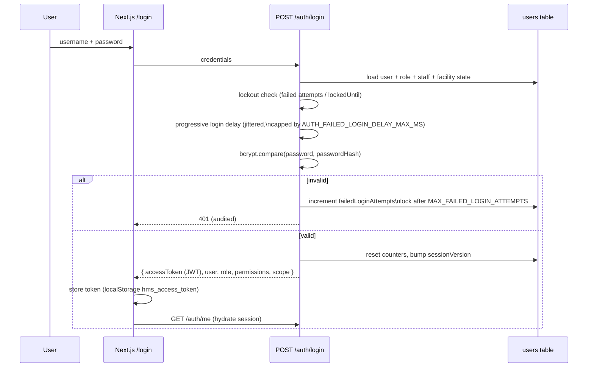

# Authentication

Implemented in [`backend/src/auth/`](../backend/src/auth) (Passport JWT)
and consumed by the frontend `AuthProvider`.

## 1. Login flow

Key mechanics (all verifiable in `auth.service.ts`):

- **Password hashing** — bcrypt (`bcryptjs`, cost 10). Password policy
  enforced by `password-policy.ts` (minimum length `PASSWORD_MIN_LENGTH`,
  default 12, complexity checks; unit-tested).
- **Brute-force protection** — per-user failed-attempt counter with
  account lock after `MAX_FAILED_LOGIN_ATTEMPTS`, plus a progressive,
  jittered delay on every attempt; rate limiter additionally caps
  `/auth/*` at `AUTH_RATE_LIMIT_MAX`/window per IP.
- **Single active session** — each login bumps `User.sessionVersion`;
  `JwtStrategy.validate` rejects tokens carrying an older version, so a
  new login invalidates all previous tokens.
- **Login blocks** — deactivated users, facilities with
  subscription/compliance login blocks, and pending-deactivation flows are
  enforced during validation.

## 2. Token & session management

| Aspect | Implementation |
| --- | --- |
| Token type | Signed JWT (HS256) — `JWT_SECRET` (min 32 chars; 48+ high-entropy enforced in production) |
| Lifetime | `JWT_EXPIRES_IN` (default `1d`) |
| Claims | `sub` (userId), username, roleId/code, staffId, facility/branch scope, sessionVersion |
| Transport | `Authorization: Bearer` header only (no cookies → no CSRF surface) |
| Storage (frontend) | `localStorage` `hms_access_token`; cleared on logout/401 |
| Revocation | Session-version bump (login, password change, admin reset) invalidates outstanding tokens |
| Idle timeout | Frontend auto-logout after 20 min inactivity (60s warning); activity events reset the timer |
| Session registry | `UserSession` rows track sessions; `user-location` module records IP/geo per session for the security dashboard |

## 3. Step-up re-authentication

Sensitive routes are annotated `@StepUpRequired()` and enforced by
`StepUpGuard` when `STEP_UP_ENFORCEMENT_ENABLED=true`: the client must
present a short-lived step-up token (obtained by re-entering the password,
TTL `STEP_UP_TTL_SECONDS`, default 300s) in addition to the session JWT.
Rollout is feature-flagged (disabled by default) so facilities can adopt
it without breaking existing clients.

## 4. Password reset & account recovery

- `PasswordResetToken` rows with expiry back the
  forgot/reset-password flow (`/forgot-password`, `/reset-password`
  pages). In development, `RETURN_DEV_RESET_TOKEN=true` returns the token
  in the response for testing; in production the token is delivered
  out-of-band.
- Admin-initiated resets (`users.manage`) bump the session version,
  logging the user out everywhere.

## 5. Patient portal authentication

The patient portal (`patient-portal` module + `/patient-access` pages) is
feature-flagged (`PATIENT_PORTAL_ENABLED`) and uses dedicated portal users
(`Patient.portalUserId → User`) with the `PATIENT` role restricted to
`patient.portal.read` — portal accounts can never access staff endpoints.

## 6. Machine-to-machine credentials

Outbound integrations authenticate independently of user sessions:
M-PESA Daraja OAuth (cached consumer-key tokens), KRA eTIMS device
credentials, DHA OAuth2 client credentials with cached single-flight
refresh. See [INTEGRATIONS.md](INTEGRATIONS.md).

## Related

- [AUTHORIZATION.md](AUTHORIZATION.md) — roles, permissions, scoping
- [SECURITY.md](SECURITY.md) — threat model and hardening
