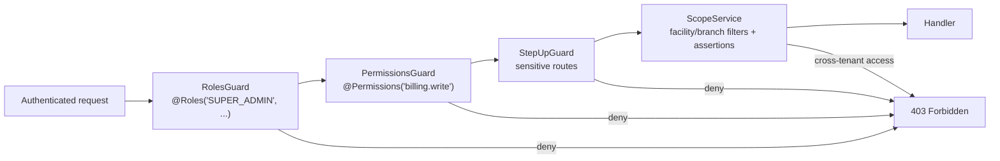

# Authorization

Three cooperating layers: **role-based access control** (route guards),
**fine-grained permissions** (role→permission matrix), and **tenant
scoping** (facility/branch isolation on every query).

## 1. Enforcement pipeline

Per-route requirements for all 341 endpoints are listed in
[API_REFERENCE.md](API_REFERENCE.md).

## 2. Permission catalog

Defined in [`backend/src/auth/permissions.ts`](../backend/src/auth/permissions.ts):

| Permission | Grants |
| --- | --- |
| `patient.read` / `patient.write` | View / register & update patients |
| `billing.read` / `billing.write` | View invoices & tariffs / create-modify billing |
| `payment.collect` | Record payments (cash, M-PESA prompts) |
| `payment.manual_confirm` | Manually confirm M-PESA payments |
| `mpesa.settings.update` | Manage facility M-PESA credentials |
| `lab.order` / `lab.result.enter` / `lab.result.verify` | Order tests / enter results / verify results |
| `pharmacy.dispense` / `otc.sale` / `stock.adjust` | Dispense / walk-in sales / stock corrections |
| `consultation.write` | Triage, consults, referrals, encounters |
| `admission.manage` / `discharge.complete` | IPD admissions / discharge sign-off |
| `reports.read` / `audit.read` | Analytics / audit browser |
| `users.manage` / `facility.manage` | User & staff admin / facility-branch admin |
| `patient.portal.read` | Patient portal self-service |

## 3. Roles → permissions matrix

21 built-in roles (`ROLE_PERMISSIONS`), summarized:

| Role | Permission profile |
| --- | --- |
| `SUPER_ADMIN`, `ADMIN` | All permissions |
| `FACILITY_ADMIN`, `BRANCH_ADMIN` | Full operational set for their facility/branch (no platform admin) |
| `RECEPTIONIST` | `patient.*`, appointments, `billing.read` |
| `TRIAGE_NURSE` | `patient.read`, `consultation.write` |
| `NURSE`, `IPD_NURSE` | + `admission.manage` |
| `WARD_MANAGER` | Ward/bed management set |
| `DOCTOR`, `CLINICIAN` | `patient.read`, `consultation.write`, `lab.order`, prescriptions |
| `LAB_TECHNICIAN` | `lab.result.enter` |
| `LAB_MANAGER` | + `lab.result.verify`, lab admin |
| `PHARMACIST` | `pharmacy.dispense`, `otc.sale`, `billing.read` |
| `PHARMACY_MANAGER` | + `stock.adjust`, pricing |
| `CASHIER` | `payment.collect`, `billing.*` |
| `BILLING_OFFICER` | Billing set + reports |
| `INVENTORY_OFFICER` | `stock.adjust`, `reports.read` |
| `REPORTS_MANAGER` | `reports.read` |
| `AUDITOR` | `audit.read`, `reports.read` (read-only) |
| `PATIENT` | `patient.portal.read` only |

The full authoritative matrix (kept in code, unit-tested in
`permissions.spec.ts`) is also documented in
[roles-permissions-matrix.md](roles-permissions-matrix.md).

## 4. Tenant scoping (`ScopeService`)

Beyond route-level checks, **every** data access is constrained to the
caller's tenancy:

- `buildReadScope(user)` produces Prisma `where` fragments limiting
  queries to the user's `homeFacilityId` and allowed branches
  (`UserBranchAccess`; `canAccessAllBranchesInFacility` for facility-wide
  staff). Platform admins see across facilities.
- `assertBranchAccess(user, facilityId, branchId)` guards mutations —
  attempts to write another facility's records raise 403 even with the
  right permission.
- The **patient portal** role is additionally restricted to the patient's
  own records via the portal-user link.

## 5. Subscription & compliance gates

`FacilitySubscriptionInterceptor` overlays commercial/compliance policy on
top of RBAC: facilities with lapsed subscriptions or failed compliance
enter **write-lock** (reads allowed, mutations blocked with an actionable
message) or **login-block** states, driven by `Facility` compliance fields
and `FacilitySubscriptionPayment` history.

## 6. Frontend authorization

The sidebar and page actions render from the `role`/`permissions` array
returned at login (module catalog entries declare required permissions),
so users only see what they can do — but the **backend guards remain the
authority**; UI checks are purely cosmetic.

## 7. Adding a new permission (checklist)

1. Add to `HMS_PERMISSIONS` and the appropriate roles in
   `ROLE_PERMISSIONS` (`backend/src/auth/permissions.ts`).
2. Annotate routes with `@Permissions('new.permission')`.
3. Update `permissions.spec.ts` expectations.
4. Gate frontend actions via the auth payload.
5. Regenerate [API_REFERENCE.md](API_REFERENCE.md).
