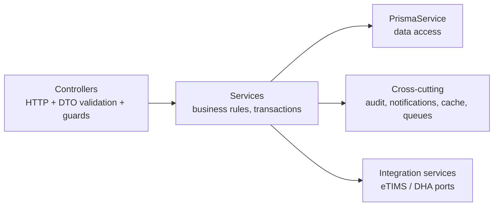
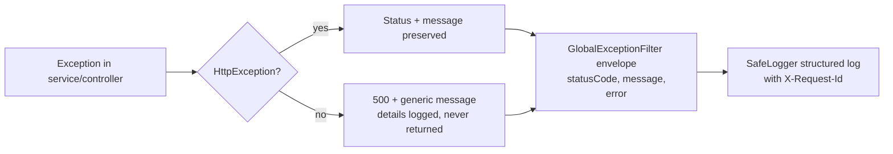

# Backend Documentation

NestJS 11 + TypeScript 5.7 + Prisma 6 REST API. Entry points:
[main.ts](../backend/src/main.ts) (web) and
[worker.ts](../backend/src/worker.ts) (queue worker).

## 1. Module inventory

44 feature modules registered in [app.module.ts](../backend/src/app.module.ts):

| Category | Modules | Responsibility |
| --- | --- | --- |
| Identity & access | `auth`, `user`, `role`, `staff`, `user-location`, `user-review` | Login, JWT, RBAC, staff registry, geo/session tracking |
| Tenancy | `facility`, `branch`, `department`, `clinic`, `facility-subscription` | Multi-tenant hierarchy, SaaS subscription enforcement |
| Patient journey | `patient`, `appointment`, `queue`, `triage`, `consultation`, `doctor-lab-review` | Registration → booking → queue → vitals → consult → result review |
| Diagnostics | `lab` | Test catalog, orders, results, lab queue |
| Medication | `prescription`, `prescription-item`, `pharmacy`, `pharmacy-stock` | Prescribing, dispensing, OTC sales, branch stock & movements |
| Inpatient | `ipd`, `ipd-clinical` | Wards, beds, admissions, vitals, treatment chart, discharge |
| Finance | `billing`, `sha-claims`, `reports` | Invoices, tariffs, payments (cash/M-PESA/SHA), claims, analytics |
| Government | `integration` (eTIMS + DHA) | Fiscalization and health-information exchange (see [INTEGRATIONS.md](INTEGRATIONS.md)) |
| Platform | `audit-log`, `notification`, `settings`, `operational-module`, `master-catalog`, `feedback`, `communication`, `enterprise`, `clinical-safety`, `patient-portal`, `data-outbox`, `ai-assistant`, `resilience`, `prisma` | Cross-cutting services |

`operational-module` is a generic record store powering the long tail of
departments (radiology, theatre, maternity, ICU, blood bank, mortuary,
CSSD, laundry, kitchen, etc.) with one configurable model
(`OperationalModuleRecord`) instead of 30 near-identical modules — the
frontend renders each from `lib/module-catalog.ts`.

## 2. Layering & patterns

- **Controllers** are thin: route + guard + DTO in, service call out. All
  341 routes are cataloged in [API_REFERENCE.md](API_REFERENCE.md).
- **Services** own business rules and Prisma access (repository layer and
  ORM are unified in Prisma; there is no separate repository tier).
  Multi-step financial operations use `prisma.$transaction`.
- **DTO validation**: global `ValidationPipe` with `whitelist`,
  `forbidNonWhitelisted`, `transform`, `stopAtFirstError`.
- **Dependency injection** throughout; the integration layer additionally
  uses token-bound interfaces (`ETIMS_CLIENT`, `DHA_CLIENT`) for
  adapter swapping.

## 3. Middleware, guards, interceptors, filters

| Stage | Component | Purpose |
| --- | --- | --- |
| Middleware | `RequestContextMiddleware` | Request ID assignment/propagation (`X-Request-Id`) |
| Middleware | `RateLimitMiddleware` + `RateLimitService` | Category-based limits (auth, search, dashboard, PDF, M-PESA, public verify) backed by Redis or memory |
| Middleware | `RequestLoggingMiddleware` | Structured request logs with latency; slow-request flagging |
| Guard | `AuthGuard('jwt')` (`JwtStrategy`) | Token verification + user hydration + session-version check |
| Guard | `RolesGuard` / `PermissionsGuard` | RBAC (see [AUTHORIZATION.md](AUTHORIZATION.md)) |
| Guard | `StepUpGuard` | Recent re-auth for sensitive actions |
| Interceptor | `RequestTimeoutInterceptor` | Per-request timeout (`REQUEST_TIMEOUT_MS`) |
| Interceptor | `AuditInterceptor` | Automatic audit rows for mutating requests |
| Interceptor | `UserLocationInterceptor` | IP/geo session tracking |
| Interceptor | `FacilitySubscriptionInterceptor` | Write-lock for lapsed subscriptions/compliance |
| Filter | `GlobalExceptionFilter` | Uniform error envelope; hides internals; logs with request ID |

## 4. Resilience layer (`src/resilience/`, global module)

- **`CacheService`** — Redis-first cache with bounded in-memory fallback;
  TTL tiers for reference data, dashboards, and defaults.
- **`JobQueueService`** — background jobs (`PDF_GENERATION`, `BULK_REPORT`,
  `SHA_CLAIM_BATCH`, `MPESA_RECONCILIATION`, …) on Redis lists with
  in-memory fallback, idempotency keys, and a dead-letter list; drained by
  the worker loop (`WORKER_MODE=true`).
- **`RedisConnectionService`** — single connection manager; every consumer
  degrades to memory when Redis is absent.
- **`SafeLoggerService`** — structured logging with aggressive secret
  redaction (bearer/basic tokens, passwords, keys, DB URLs) and payload
  truncation. All backend logging flows through it.
- **`HealthController`** — `/health/live` (liveness), `/health/ready`
  (DB reachability), `/health/deep` (DB + Redis + queue depth).

The **integration layer** adds a second, durable queue
(`integration_outbound_requests` table) for government traffic — retries
with exponential backoff survive restarts. Details in
[INTEGRATIONS.md](INTEGRATIONS.md).

## 5. Domain highlights & business rules

### Billing (`billing.service.ts`, ~4.4k lines — the financial core)

- Invoice lifecycle: `PENDING → PARTIALLY_PAID → PAID → CLOSED` with
  `recalculateInvoice` as the single balance authority.
- Auto-billing API (`addAutoInvoiceItem`) lets clinical modules post
  charges with `sourceModule`/`sourceEntityType`/`sourceEntityId`
  traceability; tariff resolution falls back
  branch → facility → service default price.
- Payments: cash (receipt numbers `CSH-…`), M-PESA STK push (Daraja OAuth,
  prompt locks, concurrency caps, status polling, callback idempotency),
  SHA coverage (linked to claims, including rejection-as-loss accounting).
- Every finalization path triggers eTIMS fiscalization through the
  integration layer (queued; never blocks billing).
- Revenue-integrity and cashier-close endpoints reconcile receipts against
  invoice movements per day/branch.

### Pharmacy & stock

- Prescription dispensing decrements `BranchMedicineStock` with movement
  journal rows (`PharmacyStockMovement`); OTC sales
  (`OtcSale`/`OtcSaleItem`/`OtcSalePayment`) support walk-in sales with
  their own payment records; buying-price tracking enables profit
  analytics.

### IPD

- `Ward → Bed → Admission` with bed-status transitions, daily bed-day
  charges posted to billing, clinical records (vitals, progress notes,
  doctor reviews, treatment chart) and discharge summaries.

### Reports

- Aggregated dashboards (billing, IPD clinical, module operations,
  profit analytics) with cache-backed queries. A native Rust engine
  (`backend/native/reports-engine`) exists as an optional foundation for
  future high-volume rollups — not on the request path.

### PDF engine (`common/pdf/hospital-pdf.ts`)

- PDFKit-based generator used for invoices, receipts, SHA claim forms,
  lab reports and discharge summaries, with facility branding, compact
  tables, and QR codes (`qrcode` package) for public verification links.

## 6. Background jobs & events

| Mechanism | Storage | Used for |
| --- | --- | --- |
| `JobQueueService` | Redis list (memory fallback) | PDFs, bulk reports, reconciliation, notifications |
| `IntegrationQueueService` | `integration_outbound_requests` table | eTIMS submissions, DHA claims/encounters/referrals |
| `DataOutboxService` | `data_outbox_events` table | Enterprise data-warehouse feed |
| Notifications | `notifications` table | In-app alerts (payments, stock, claims) |

## 7. Error handling pipeline

Domain code throws Nest HTTP exceptions (`BadRequestException`,
`NotFoundException`, …) with operator-actionable messages; unexpected
errors are logged with full context but return a sanitized envelope. See
[ERROR_HANDLING.md](ERROR_HANDLING.md).

## 8. Utilities & shared code

- `common/pagination` — cursor/offset pagination helpers used by all list
  endpoints (`parsePagination`, `paginatedResponse`).
- `common/storage` — compact JSON serialization for payload columns
  (byte-capped, truncation-safe).
- `common/facility-access.ts` — helpers for facility/branch assertions.
- `config/env.validation.ts` — startup validation of all environment
  variables (fails fast on unsafe production configuration).

## Related

- [DATABASE.md](DATABASE.md) — schema, ER diagrams, migrations
- [API_REFERENCE.md](API_REFERENCE.md) — all 341 endpoints
- [TESTING.md](TESTING.md) · [PERFORMANCE.md](PERFORMANCE.md) ·
  [MONITORING.md](MONITORING.md)
