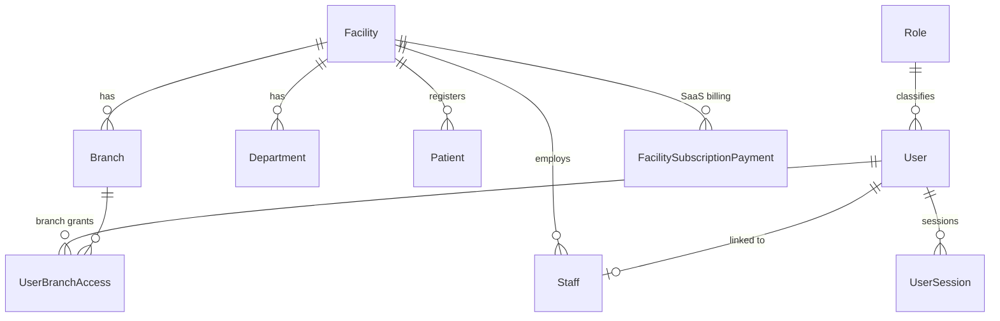
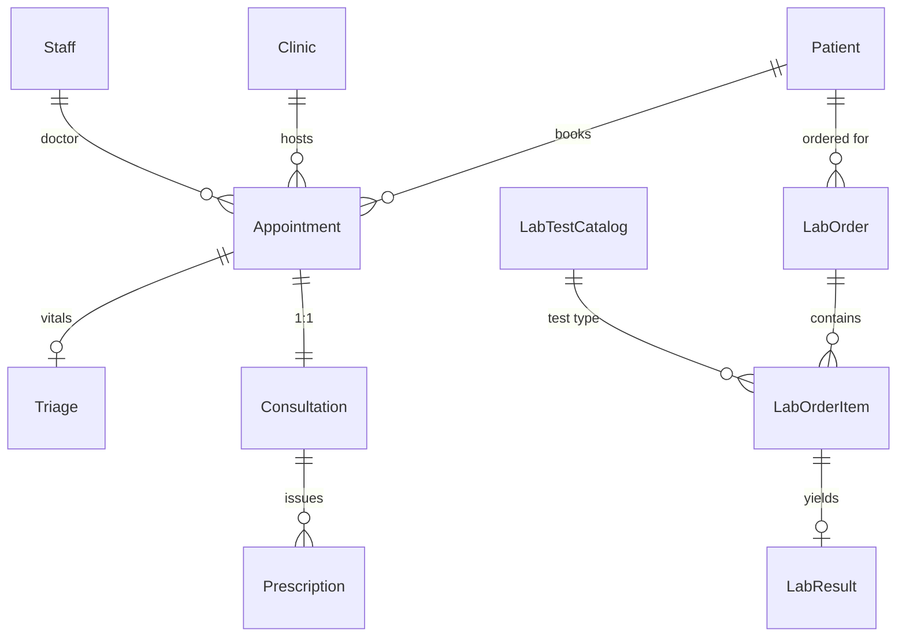
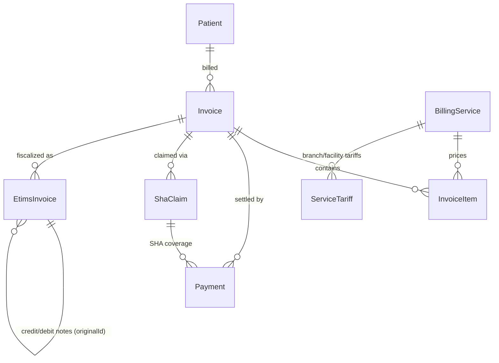
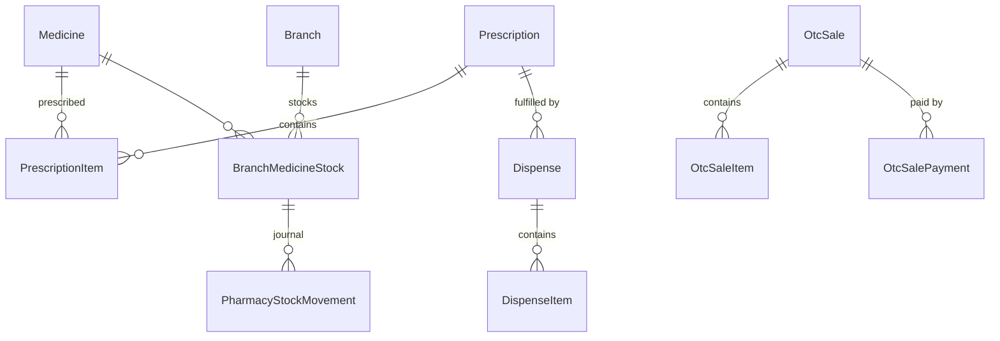
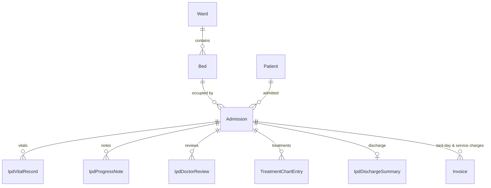
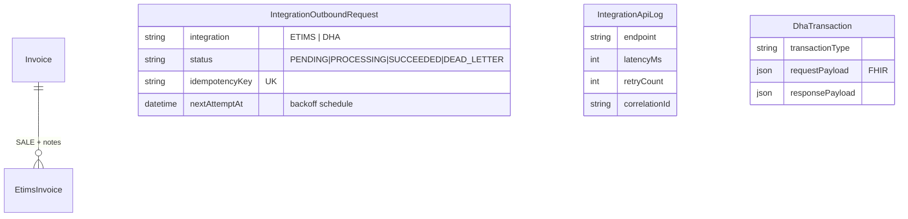
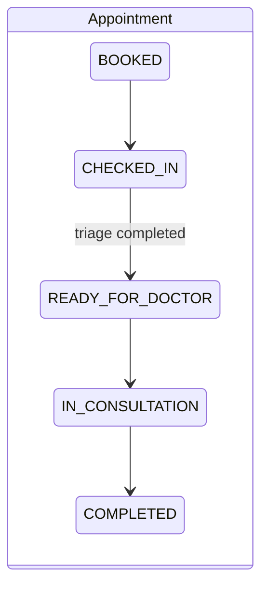
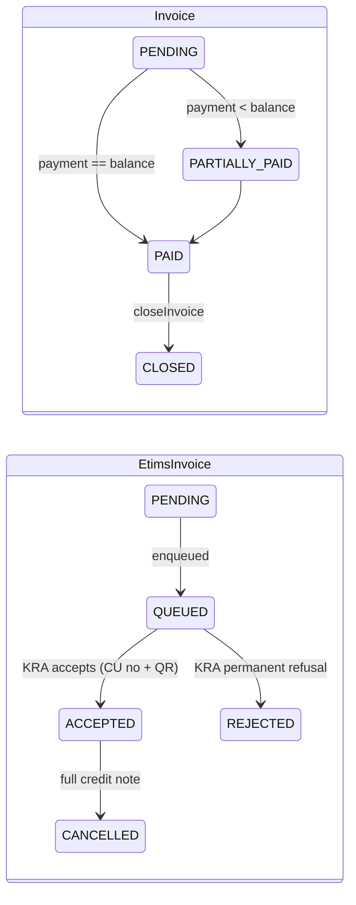
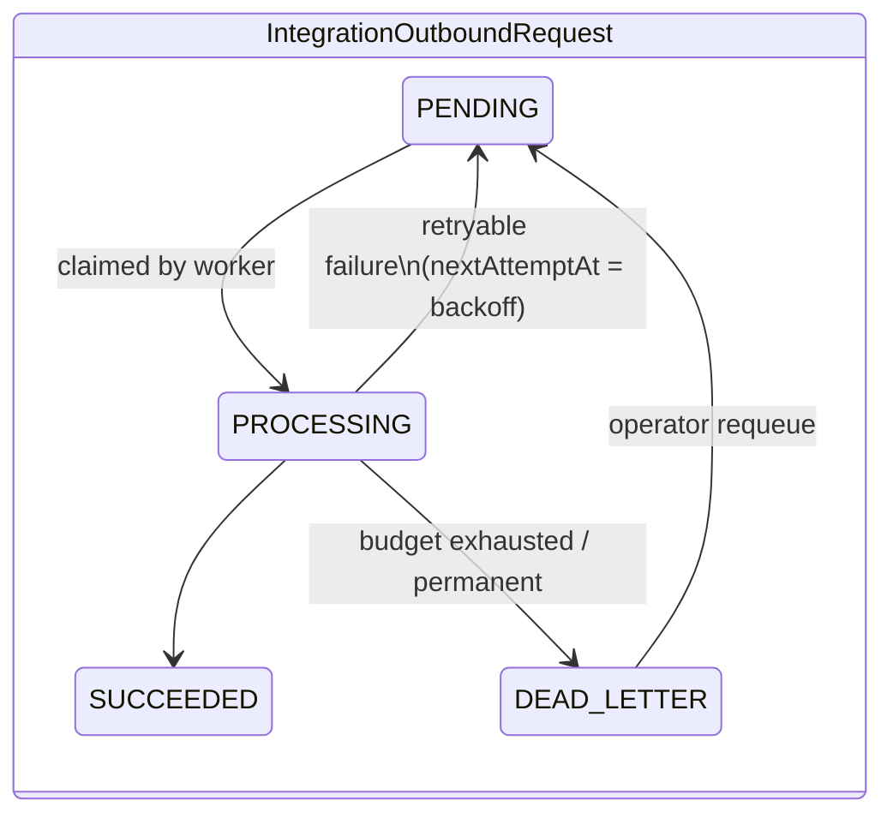

# Database Documentation

Prisma 6 ORM over a relational database. The **canonical schema** is
[`backend/prisma/schema.prisma`](../backend/prisma/schema.prisma) (MySQL);
a **PostgreSQL variant** is generated by
`npm run prisma:schema:postgres` into `backend/prisma-postgresql/` for the
Render production path (`DATABASE_PROVIDER` selects which schema and
migration set the Prisma config uses).

**57 models**, all mapped to `snake_case` tables via `@@map`.

## 1. Model inventory by domain

| Domain | Models |
| --- | --- |
| Tenancy & identity | `Facility`, `Branch`, `Department`, `Role`, `User`, `UserBranchAccess`, `Staff`, `UserSession`, `PasswordResetToken`, `UserReview`, `UserFeedback`, `FacilitySubscriptionPayment` |
| Patient journey | `Patient`, `Clinic`, `Appointment`, `Triage`, `Consultation` |
| Laboratory | `LabTestCatalog`, `LabOrder`, `LabOrderItem`, `LabResult` |
| Medication | `Medicine`, `Prescription`, `PrescriptionItem`, `Dispense`, `DispenseItem`, `BranchMedicineStock`, `PharmacyStockMovement`, `OtcSale`, `OtcSaleItem`, `OtcSalePayment` |
| Inpatient | `Ward`, `Bed`, `Admission`, `IpdProgressNote`, `IpdVitalRecord`, `IpdDoctorReview`, `TreatmentChartEntry`, `IpdDischargeSummary` |
| Finance | `BillingService`, `ServiceTariff`, `Invoice`, `InvoiceItem`, `Payment`, `ShaClaim` |
| Government integration | `EtimsInvoice`, `IntegrationOutboundRequest`, `IntegrationApiLog`, `DhaTransaction` |
| Platform | `AuditLog`, `SystemSetting`, `Notification`, `OperationalModuleRecord`, `DataOutboxEvent`, `IpGeolocationCache`, `UserLocationProfile`, `UserLocationEvent` |

## 2. Core ER diagrams

### Tenancy & access

### Patient journey (OPD)

### Billing & claims

`InvoiceItem.sourceModule` / `sourceEntityType` / `sourceEntityId` link
every auto-generated charge back to its clinical origin (consultation,
lab order, dispense, bed-day), forming the revenue-integrity audit chain.

### Pharmacy & inventory

### Inpatient

### Government integration

## 3. Conventions, keys, constraints, indexes

- **Primary keys**: autoincrement `Int` `id` everywhere except
  `UserSession` (string id).
- **Business keys**: unique human-readable numbers —
  `Patient.patientNumber`, `Invoice.invoiceNumber`,
  `Payment.receiptNumber`, `ShaClaim.claimNumber`, `OtcSale.saleNumber`,
  `EtimsInvoice.traderInvoiceNumber`,
  `IntegrationOutboundRequest.idempotencyKey`.
- **Foreign keys**: explicit Prisma relations with `RESTRICT` deletes for
  financial/clinical integrity and `SET NULL` for optional actor links.
  Integration bookkeeping tables (`integration_*`, `dha_transactions`)
  intentionally keep `facilityId`/`branchId` as plain scalars so audit rows
  never block core-entity maintenance.
- **Tenancy columns**: `facilityId` (required on nearly every domain
  table) + optional `branchId`; composite indexes
  (`facilityId, branchId, statusCode`, `facilityId, createdAt`) back the
  scoped list queries.
- **Status columns**: `statusCode VARCHAR` with per-domain vocabularies —
  deliberately strings (not enums) so operational statuses can evolve
  without migrations.
- **Timestamps**: `createdAt` default now, `updatedAt` auto-updated;
  domain events add explicit stamps (`issuedAt`, `settledAt`,
  `submittedAt`, `dispensedAt`, `dischargedAt`, …).
- **Money**: `Float` columns (`Double` in MySQL) with application-side
  2-dp rounding. *Known trade-off* — a future migration to `Decimal` is
  recommended for absolute cent precision (tracked in
  [ROADMAP.md](ROADMAP.md)).
- **Large payloads**: `Json` columns for API payloads/metadata;
  `LongText` for images/signatures stored as data URLs (with a storage
  audit script to monitor growth).
- **Hot-path indexes**: added deliberately in the
  `performance_resilience_indexes` and `fast_master_catalog_indexes`
  migrations (M-PESA lookups by `checkoutRequestId`, queue scans by
  `status, nextAttemptAt`, notification lists, catalog searches).

## 4. Migrations

MySQL migrations live in `backend/prisma/migrations/` (21 directories,
timestamped); PostgreSQL migrations in
`backend/prisma-postgresql/migrations/` (numbered baseline +
per-feature). The PostgreSQL schema file is **generated — never edit it
directly**; regenerate with `npm run prisma:schema:postgres` after
changing the canonical schema, and add a matching SQL migration to both
sets.

Highlights (chronological):

| Migration | Adds |
| --- | --- |
| `finalize_billing_and_invoice_tracking` | Billing core |
| `add_user_login_lockout`, `add_single_active_session` | Auth hardening |
| `add_service_tariffs`, `add_branch_stock_buying_price` | Pricing & margins |
| `sha_receipts_sessions_and_printouts`, `sha_claim_signatures…` | SHA claims |
| `facility_compliance_and_mpesa_credentials` | SaaS compliance + per-facility M-PESA |
| `performance_resilience_indexes`, `…list_indexes` | Hot-path indexes |
| `enterprise_patient_portal_outbox` | Portal + data outbox |
| `add_otc_sales_backend_foundation` | OTC pharmacy sales |
| `add_dha_etims_integration` | Government integration layer |

Apply with `npm run prisma:migrate:deploy` (MySQL) or
`npm run prisma:migrate:postgres` (PostgreSQL). Data-safety tooling:
`db:validate`, `db:seed:safe`, `db:storage:audit`, `db:cleanup:dry-run`,
`db:index:audit` (see `backend/package.json`).

## 5. Entity lifecycles

## 6. Data flow summary

Clinical writes → billing charges (`InvoiceItem` with source links) →
payments (`Payment`) → fiscalization (`EtimsInvoice`) and claims
(`ShaClaim` → `DhaTransaction`) → analytics (`reports` queries +
`DataOutboxEvent` warehouse feed) — with `AuditLog` rows at every
mutating step.

## Related

- [BACKEND.md](BACKEND.md) · [API_REFERENCE.md](API_REFERENCE.md) ·
  [database-storage-efficiency.md](database-storage-efficiency.md) ·
  [deployment/mysql-to-render-postgres.md](deployment/mysql-to-render-postgres.md)
