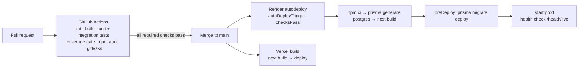

# Deployment Guide

Production topology: **backend on Render** (Node web service + managed
PostgreSQL 16, blueprint in [`render.yaml`](../render.yaml)) and
**frontend on Vercel**. MySQL remains supported for self-hosted
deployments; the PostgreSQL path is the managed-cloud default. There is
no Docker image in-repo — both platforms build from source (a
containerization task is listed in [ROADMAP.md](ROADMAP.md)).

## 1. Build & release pipeline



CI details in [.github/workflows/ci.yml](../.github/workflows/ci.yml):
backend lint/build/tests, integration suite with coverage thresholds,
security scanning, frontend build — the workflow fails if any required
check fails.

## 2. Render deployment (backend + PostgreSQL)

Provisioned by the blueprint:

- **Database** `invinceible-core-hms-postgres` (PostgreSQL 16, Frankfurt).
- **Web service** `invinceible-core-hms-api`: `rootDir: backend`,
  build `npm ci && npm run prisma:generate:postgres && npm run build`,
  pre-deploy `npm run prisma:migrate:postgres`, start
  `npm run start:prod`, health check `/health/live`.
- Env vars wired from the database (`DATABASE_URL`), generated
  (`JWT_SECRET`), or set manually (`FRONTEND_URL`, M-PESA + integration
  credentials, `TRUST_PROXY=true`).

Step-by-step runbook (custom domains, secrets, cutover from MySQL):
[deployment/render.md](deployment/render.md) and
[deployment/mysql-to-render-postgres.md](deployment/mysql-to-render-postgres.md).

### Optional worker process

For heavier facilities, add a second Render service running
`npm run start:prod:worker` (same env). Queue claiming is atomic, so web
+ worker can both process integrations safely; set
`INTEGRATION_WORKER_ENABLED=false` on web to dedicate integration traffic
to the worker.

## 3. Vercel deployment (frontend)

Set `NEXT_PUBLIC_API_BASE_URL` (backend URL) and `NEXT_PUBLIC_APP_URL`;
build command `npm run build`. Add every deployed frontend origin to the
backend `FRONTEND_ORIGINS`.

## 4. Self-hosted (MySQL) deployment

```bash
cd backend
npm ci
# .env with DATABASE_PROVIDER=mysql + DATABASE_URL + JWT_SECRET + FRONTEND_URL
npm run prisma:migrate:deploy
npm run build
npm run start:prod          # plus optionally start:prod:worker
cd ../frontend && npm ci && npm run build && npm run start
```

## 5. Scaling guidance

| Pressure | Lever |
| --- | --- |
| Request throughput | Scale Render instances horizontally (stateless API; provide `REDIS_URL` so rate limits/caches are shared) |
| Background load | Dedicated worker service; raise `QUEUE_CONCURRENCY`, `INTEGRATION_QUEUE_BATCH_SIZE` |
| Database | Render plan upgrade; hot-path indexes already in place; see [PERFORMANCE.md](PERFORMANCE.md) |
| Reports | Cache TTLs; future Rust engine for heavy rollups |

## 6. Monitoring, logging, health

- Health endpoints: `/health/live`, `/health/ready` (DB), `/health/deep`
  (DB + Redis + queues) — wire Render health checks and external uptime
  probes to these.
- Structured, secret-redacted logs to stdout (Render log streams);
  correlation via `X-Request-Id`.
- Operational dashboards & alert suggestions:
  [MONITORING.md](MONITORING.md), [operations-alerting.md](operations-alerting.md).

## 7. Backup & disaster recovery

- **Database**: Render managed daily snapshots + PITR per plan; for
  MySQL self-hosting use `mysqldump` on a schedule. Backup/restore notes
  generator: `npm run db:backup:notes`.
- **Recovery order**: restore DB → deploy backend (migrations are
  idempotent) → verify `/health/deep` → deploy frontend. Durable
  integration queue self-recovers stuck work after restart; dead letters
  are requeueable via the eTIMS admin endpoints.
- **RPO/RTO**: driven by snapshot cadence (≤24h RPO on daily snapshots;
  minutes-level with PITR). Test restores quarterly.
- **Configuration**: keep an encrypted copy of environment variables /
  secret-manager export alongside backups.

## 8. Deployment checklist

1. CI green on the release commit.
2. Migrations reviewed (both MySQL + PostgreSQL sets when schema changed).
3. New env vars added to Render/Vercel **before** deploy.
4. `/health/deep` green post-deploy; smoke: login, patient search,
   invoice + cash payment, M-PESA sandbox prompt.
5. Verify integration queue drains (`GET /integrations/etims/status`).
6. Release notes in [CHANGELOG.md](CHANGELOG.md); tag release per
   [release-checklist.md](release-checklist.md).
