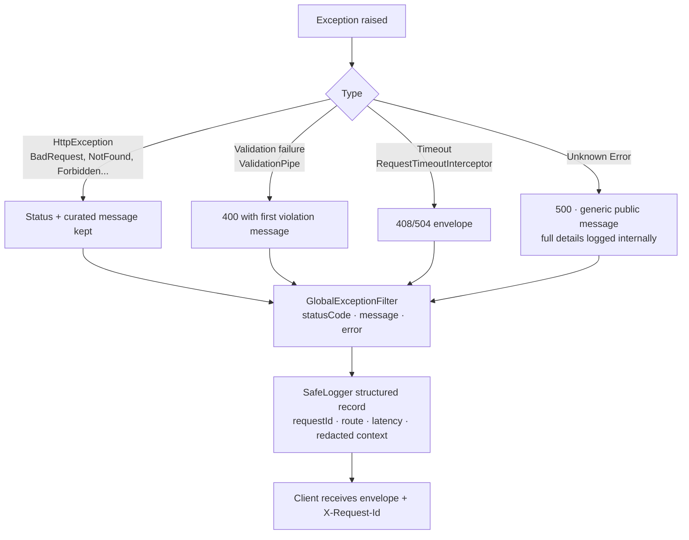

# Error Handling

## 1. Backend pipeline

Principles:

- **Never leak internals** — stack traces, SQL, and secrets never reach
  clients; the redacting logger scrubs them from logs too.
- **Operator-actionable messages** — domain services throw precise
  errors ("Payment exceeds outstanding balance of 1500", "Invoice has no
  accepted eTIMS sale to amend").
- **Correlation-first debugging** — every error log carries the request
  ID returned to the client, so a user report can be matched to logs and
  to `integration_api_logs` rows.

## 2. Status code conventions

| Code | Meaning here |
| --- | --- |
| 400 | Validation or domain rule violation |
| 401 | Missing/expired/invalidated JWT (client logs out) |
| 403 | RBAC, tenancy, step-up, or subscription write-lock refusal |
| 404 | Entity not found within the caller's scope |
| 409 | Uniqueness conflicts (duplicate receipt/invoice numbers) |
| 429 | Rate-limit categories exceeded |
| 5xx | Unexpected server fault (alerting-worthy) |

## 3. Failure isolation patterns

- **Billing vs integrations** — fiscalization/DHA triggers are wrapped so
  external failures *never* fail the financial operation; work lands in
  the durable retry queue instead ([INTEGRATIONS.md](INTEGRATIONS.md)).
- **Optional infrastructure** — Redis/AI/geo outages degrade to fallbacks
  with warnings, not errors.
- **External call taxonomy** — integration HTTP errors are classified
  `HTTP_ERROR` / `TIMEOUT` / `NETWORK_ERROR` with retryability rules
  (5xx/408/425/429 retry; other 4xx dead-letter).
- **Payment callbacks** — idempotent by provider request ID; replays and
  unknown callbacks are absorbed and audited, never 500.

## 4. Frontend handling

- `apiFetch` throws typed `ApiError { status, message }`; 401 triggers
  logout + redirect; 403 renders permission messaging; validation errors
  map onto form fields; other errors surface as toasts/inline alerts with
  the server message.
- Mutations don't auto-retry; queries retry conservatively. Skeletons and
  empty/error states are explicit per widget, so one failed panel never
  blanks a page.

## 5. Background job errors

| Mechanism | On failure |
| --- | --- |
| `JobQueueService` | Retry up to `maxAttempts`, then Redis dead-letter list; failures logged with job ID |
| Integration queue | Exponential backoff w/ jitter → `DEAD_LETTER` row; operator requeue endpoint; stuck `PROCESSING` rows auto-recovered after crash |
| Prisma transaction failures | Roll back atomically; caller receives domain error |
