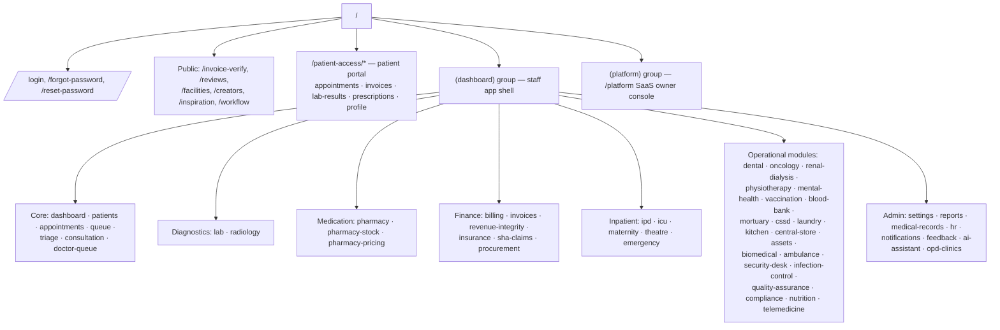
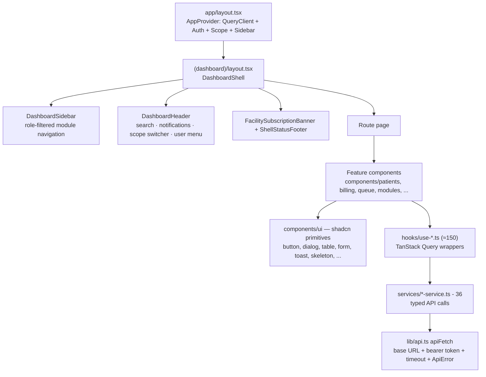

# Frontend Documentation

Next.js 16 (App Router) + React 19 + TypeScript, styled with Tailwind CSS 4
and shadcn/ui (Radix primitives). Deployed on Vercel. Source in
[`frontend/`](../frontend).

## 1. Technology stack

| Concern | Library |
| --- | --- |
| Framework / routing | Next.js 16 App Router (client-heavy dashboard) |
| Server state | TanStack Query 5 (+ devtools) |
| Tables | TanStack Table 8 |
| Forms | react-hook-form 7 + zod 4 resolvers |
| UI primitives | shadcn/ui on Radix UI, `class-variance-authority`, `tailwind-merge` |
| Charts | Recharts 3 |
| Icons / motion | lucide-react, framer-motion |
| QR codes | `qrcode` (invoice verification) |

## 2. Route map (94 pages)

Route groups:

- **`(dashboard)/`** — authenticated staff shell (sidebar + header);
  guarded client-side by `AuthProvider` (redirect to `/login`) and
  role/permission checks from the auth payload.
- **`(platform)/platform`** — SaaS owner console (facility onboarding,
  subscriptions, platform metrics).
- **`patient-access/`** — patient portal (separate lightweight login,
  feature-flagged backend).
- **Public** — invoice verification (`/invoice-verify` with QR deep link),
  reviews, marketing pages.

## 3. Component architecture

Conventions:

- **One hook per API operation** (`use-create-patient.ts`,
  `use-invoices.ts`, …) wrapping a typed function from the matching
  `services/<domain>-service.ts`. Mutations invalidate the relevant query
  keys; stale times are centralized in `lib/query-stale-times.ts`.
- **Feature components** live in `components/<domain>/`; generic operational
  departments are rendered by `components/modules/*` from the declarative
  catalog in `lib/module-catalog.ts` (title, fields, permissions per
  module) — adding a department is mostly configuration.
- **`components/ui/`** is the shadcn design-system layer (see
  [DESIGN_SYSTEM.md](DESIGN_SYSTEM.md)).

## 4. State management

| State | Owner | Notes |
| --- | --- | --- |
| Server data | TanStack Query | Query keys per domain; optimistic updates on selected mutations; devtools in development |
| Auth session | `AuthProvider` | Token in `localStorage` (`hms_access_token`); hydrates `/auth/me`; 20-minute inactivity auto-logout with 60s warning; deactivation acceptance flow; precise geolocation reporting |
| Tenant scope | `ScopeProvider` | Active facility/branch for multi-branch users; drives query params |
| UI chrome | `SidebarProvider`, component state | Sidebar collapse, dialogs, filters |

## 5. Forms, tables, charts, modals

- **Forms**: react-hook-form + zod schemas per feature; shared field
  primitives (`Input`, `Select`, `Textarea`, `DatePicker`) with inline
  validation messages; submit states disable buttons and show spinners.
- **Tables**: TanStack Table with server-driven pagination (matching the
  backend pagination contract), column filtering, and skeleton loaders
  while queries are pending.
- **Charts**: Recharts dashboards (billing, reports, profit analytics,
  IPD occupancy).
- **Modals/drawers**: Radix `Dialog`/`Sheet` via shadcn; confirmation
  dialogs for destructive actions.
- **Notifications**: toast system for API outcomes; `/notifications` page
  + header bell backed by the notifications API.
- **Loading UX**: per-widget skeleton loaders (`components/ui/skeleton`),
  suspense-free — loading states come from query flags.

## 6. Responsive design

Tailwind breakpoints with a mobile-first dashboard shell: the sidebar
collapses to a drawer below `lg`, tables gain horizontal scroll, and the
`use-mobile` hook adapts complex widgets. Mobile/tablet readiness notes:
[mobile-tablet-readiness.md](mobile-tablet-readiness.md).

## 7. Error & session handling

- `apiFetch` wraps every call: 25s timeout, JSON parsing, and typed
  `ApiError { status, message }`. 401 responses trigger logout;
  guard-refused deployments (localhost API from a deployed site) produce an
  actionable configuration error.
- React Query retries are conservative for mutations (none) and bounded
  for queries; error boundaries render inline alerts rather than blank
  screens.

## 8. Environment

| Variable | Purpose |
| --- | --- |
| `NEXT_PUBLIC_API_BASE_URL` | Backend base URL (required in deployment) |
| `NEXT_PUBLIC_APP_URL` | Canonical frontend URL (links in QR codes/receipts) |

## Related

- [UI_UX_GUIDE.md](UI_UX_GUIDE.md) — screen-by-screen documentation
- [DESIGN_SYSTEM.md](DESIGN_SYSTEM.md) — tokens, primitives, patterns
- [API_REFERENCE.md](API_REFERENCE.md) — the contract the services layer consumes
