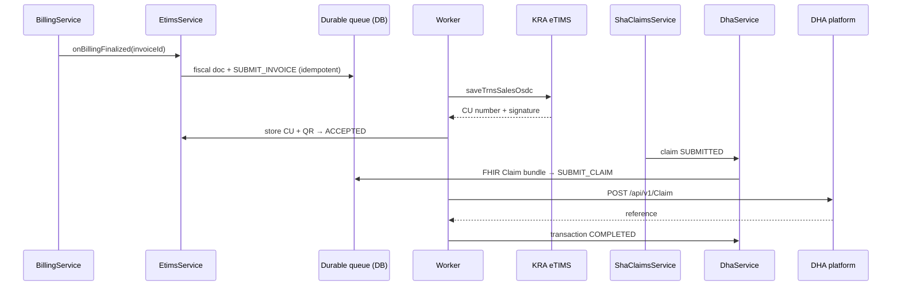
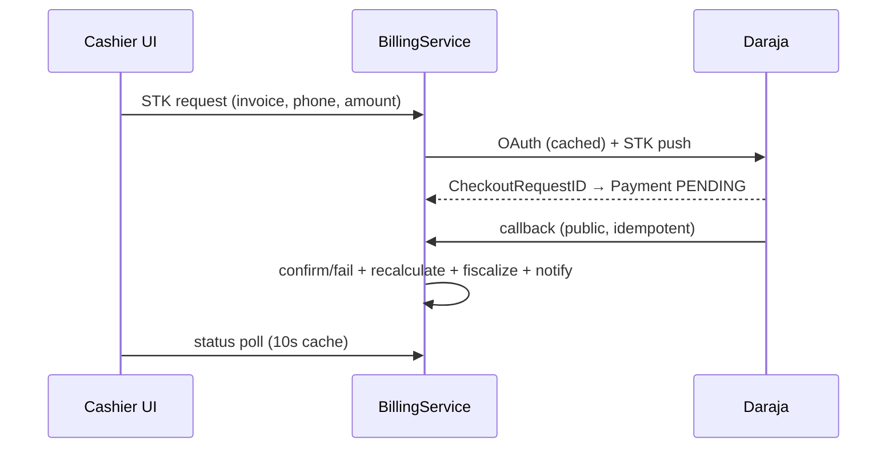

# Integrations

All external connectivity, current status, and extension points. The
government integration layer has its own deep-dive set under
[integrations/](integrations/README.md).

## 1. Integration map

| Integration | Status | Module | Isolation |
| --- | --- | --- | --- |
| KRA eTIMS (fiscalization) | ✅ Implemented — mock adapter default, OSCU HTTP adapter for sandbox/production | `backend/src/integration/etims` | Port `EtimsClientPort` behind `ETIMS_CLIENT` token; durable retry queue |
| DHA / SHA digital health platform | ✅ Implemented — mock adapter default, FHIR R4 + OAuth2 HTTP adapter awaiting official endpoints | `backend/src/integration/dha` | Port `DhaClientPort` behind `DHA_CLIENT` token; durable retry queue |
| SHA claims (manual workflow) | ✅ In production use | `backend/src/sha-claims` | Local claim lifecycle; submission auto-triggers the DHA connector |
| Safaricom M-PESA (Daraja STK) | ✅ In production use | `backend/src/billing` | OAuth token cache, prompt locks, idempotent callbacks, reconciliation job |
| PayHero (facility subscription payments) | ✅ Implemented | `backend/src/billing/payhero-billing.service.ts` | Callback controller + subscription updates |
| Google Gemini (AI assistant) | ✅ Feature-flagged (`AI_ENABLED`) | `backend/src/ai-assistant` | Backend-only key; safety guidance in [ai-assistant-safety.md](ai-assistant-safety.md) |
| IP geolocation | ✅ | `backend/src/user-location` | Cached (`IpGeolocationCache`); fail-soft |
| SMS / WhatsApp | 🔌 Extension point (`SMS_ENABLED`, `WHATSAPP_ENABLED` flags; `communication` module) | `backend/src/communication` | Provider adapter to be plugged in |
| Email | 🔌 Extension point | — | Password-reset delivery currently out-of-band; SMTP adapter planned |
| File/object storage | 🔌 Extension point | — | Binary assets stored as data-URLs today; object-storage offload planned |
| Auth providers (SSO) | 🔌 Extension point | `backend/src/auth` | Passport strategy slot; JWT issuance already centralized |

## 2. Architecture (government systems)

Core rule: **no business module calls an external API directly** —
billing/claims talk to `EtimsService`/`DhaService`, which validate,
persist, enqueue durably, and let the background worker deliver with
retries, exponential backoff, dead-lettering, and per-attempt audit
(`integration_api_logs`). Full diagrams:
[integrations/README.md](integrations/README.md).

## 3. M-PESA (Daraja) sequence

Operational guards: per-invoice prompt lock, global concurrency cap,
duplicate-receipt rejection, reconciliation job, per-facility credentials
(`facility-mpesa-billing.service.ts`). Setup:
[DARAJA_RAILWAY_SETUP.md](../DARAJA_RAILWAY_SETUP.md) and
[payments/](payments/) notes.

## 4. Extension recipe (adding a provider)

1. Define a port interface + DI token (pattern:
   `integration.constants.ts`).
2. Implement mock adapter first; bind by env mode in the module factory.
3. Route calls through a service that persists state and uses
   `IntegrationQueueService` for anything that must survive outages.
4. Log through `IntegrationLoggerService`; never log credentials.
5. Add env vars to validation + [CONFIGURATION.md](CONFIGURATION.md);
   tests with the in-memory harness; document here.

## Related

- [integrations/etims.md](integrations/etims.md) ·
  [integrations/dha.md](integrations/dha.md) ·
  [integrations/configuration.md](integrations/configuration.md) ·
  [integrations/deployment.md](integrations/deployment.md) ·
  [integrations/testing.md](integrations/testing.md) ·
  [integrations/troubleshooting.md](integrations/troubleshooting.md)
- [mpesa-reconciliation.md](mpesa-reconciliation.md) ·
  [sha-insurance-workflow.md](sha-insurance-workflow.md)
