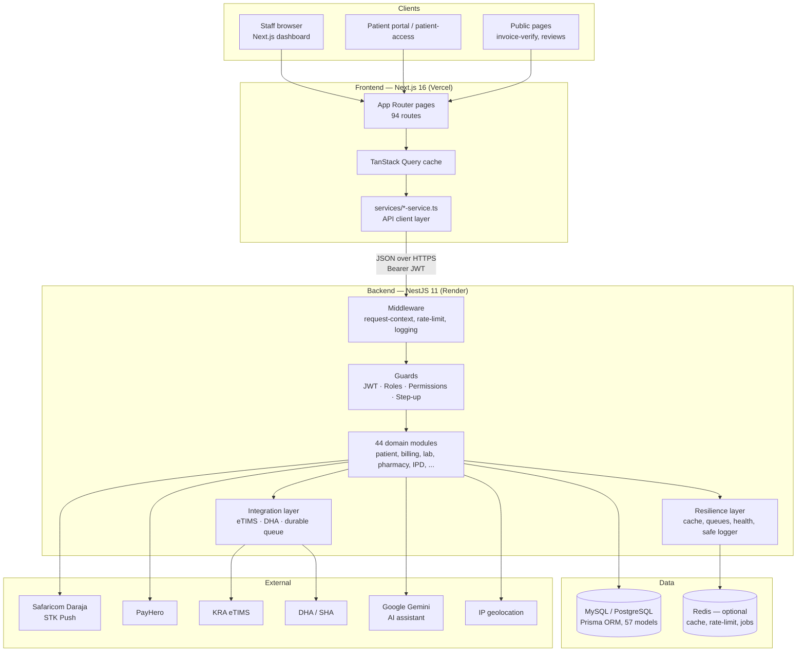
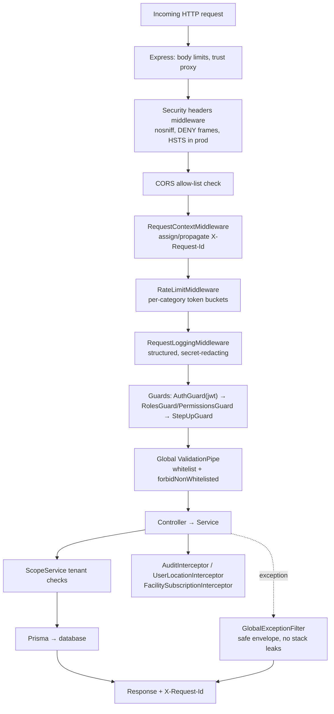
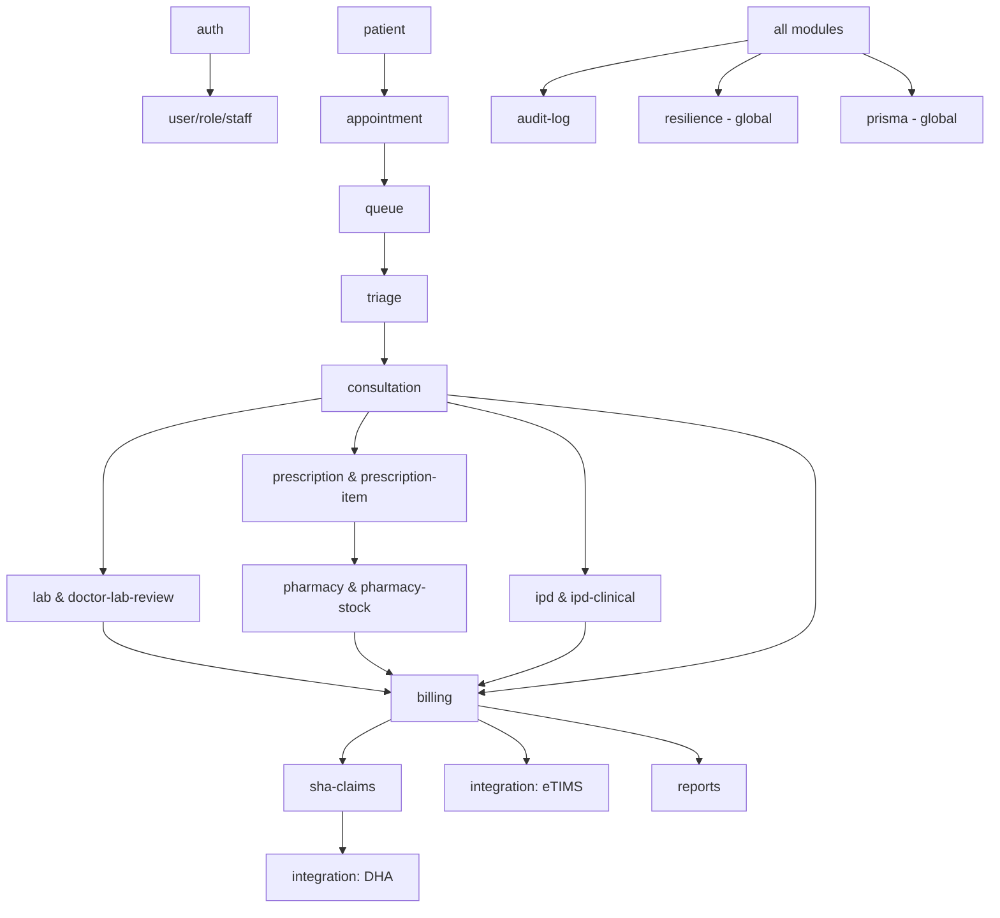
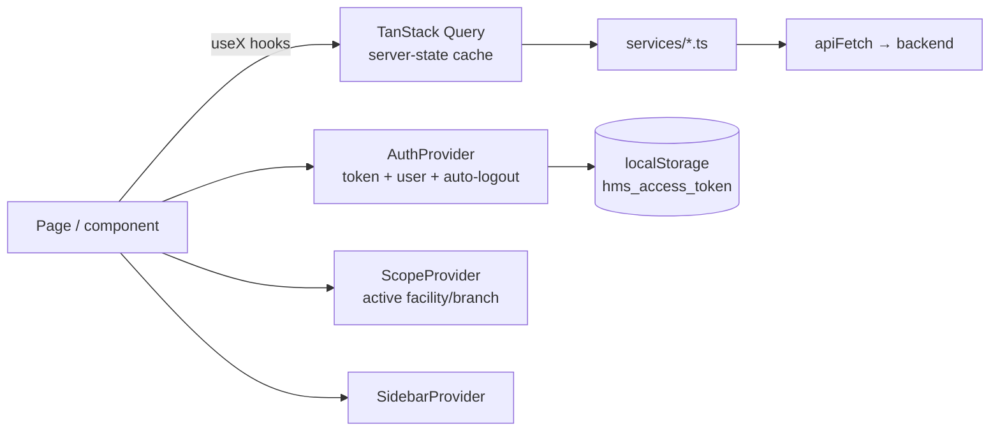

# System Architecture

Invinceible Core HMS is a multi-tenant Hospital Management Information
System for Kenyan healthcare facilities. It is a TypeScript monorepo with a
NestJS REST backend, a Next.js frontend, a Prisma-managed relational
database (MySQL canonical, PostgreSQL for Render production), and an
integration layer for government systems (KRA eTIMS, DHA/SHA) and payment
providers (Safaricom M-PESA Daraja, PayHero).

## 1. High-level architecture



Key properties:

- **Multi-tenant** — every clinical/financial record is scoped by
  `facilityId` (+ optional `branchId`); `ScopeService` enforces tenant
  isolation on every read/write (see
  [multi-tenant-facility-isolation.md](multi-tenant-facility-isolation.md)).
- **Stateless API** — authentication is a JWT bearer token; horizontal
  scaling requires no sticky sessions. Single-active-session is enforced
  via a session version stored per user.
- **Fail-soft infrastructure** — Redis, AI, SMS, geolocation, and
  government integrations are all optional; the system degrades gracefully
  (in-memory fallbacks, feature flags) rather than failing requests.
- **Async where it matters** — PDF generation, reconciliation, and all
  government API traffic run through queues, keeping the request path fast.

## 2. Repository layout

```text
invinceible_core_hms_v2/
├── backend/                  # NestJS API service
│   ├── src/
│   │   ├── app.module.ts     # Root module (44 feature modules)
│   │   ├── main.ts           # Bootstrap: CORS, security headers, pipes
│   │   ├── worker.ts         # Worker-mode entrypoint (queues)
│   │   ├── auth/             # JWT, guards, RBAC, step-up, scope
│   │   ├── billing/          # Invoices, tariffs, cash/M-PESA/SHA payments
│   │   ├── integration/      # eTIMS + DHA connectors (see INTEGRATIONS.md)
│   │   ├── resilience/       # Cache, rate limit, health, job queue, logger
│   │   ├── common/           # PDF engine, pagination, storage utils
│   │   ├── config/           # Environment validation
│   │   └── <domain>/         # patient, lab, pharmacy, ipd, reports, ...
│   ├── prisma/               # Canonical MySQL schema + migrations + seed
│   ├── prisma-postgresql/    # Generated PostgreSQL schema + migrations
│   ├── native/reports-engine # Optional Rust engine (not on request path)
│   ├── scripts/              # Ops & docs tooling (audits, API generator)
│   └── test/                 # Jest configs (integration coverage gate)
├── frontend/                 # Next.js 16 app
│   ├── app/                  # App Router: (dashboard), (platform), public
│   ├── components/           # ui/ (shadcn), layout/, feature components
│   ├── hooks/                # ~150 TanStack Query hooks (one per API op)
│   ├── services/             # 36 typed API service modules
│   ├── providers/            # auth, scope, sidebar, app providers
│   └── lib/                  # apiFetch client, auth storage, utils
├── services/rust-worker/     # Experimental Rust worker (future workloads)
├── docs/                     # This documentation set
├── load-tests/               # k6 critical-path load test
├── render.yaml               # Render blueprint (PostgreSQL production)
└── .github/workflows/ci.yml  # CI: lint, tests, coverage, security, build
```

## 3. Runtime architecture

Two backend process modes share one codebase:

- **Web process** (`npm run start:prod`) — serves HTTP; also runs the
  integration queue worker inline by default.
- **Worker process** (`npm run start:prod:worker`) — boots the same
  AppModule without HTTP and drains queues (`WORKER_MODE=true`). Optional;
  used to offload background work at scale.

```mermaid
flowchart LR
    subgraph Web process
        HTTP[HTTP server] --> APPM[AppModule]
        APPM --> IQW1[Integration queue worker\ninline poller]
    end
    subgraph Worker process (optional)
        APPM2[AppModule\nWORKER_MODE=true] --> JQ[JobQueueService loop]
        APPM2 --> IQW2[Integration queue worker]
    end
    IQW1 --> OUTBOX[(integration_outbound_requests)]
    IQW2 --> OUTBOX
    JQ --> REDISQ[(Redis lists / memory queue)]
```

Queue claiming is atomic (guarded row updates), so web and worker processes
can run the integration worker concurrently without double-processing.

## 4. Request lifecycle



Interceptors applied globally: request timeout, audit logging (mutating
routes), user-location tracking, and facility-subscription enforcement
(write-locks facilities with lapsed subscriptions or compliance holds).

## 5. Module dependency overview (backend)



Clinical modules never bill directly: they post charges through
`BillingService` (auto invoice items carry `sourceModule` /
`sourceEntityId` for traceability), and billing alone talks to the
integration layer.

## 6. State management (frontend)



Server state lives exclusively in TanStack Query (per-operation hooks with
tuned `staleTime`s in `lib/query-stale-times.ts`); client state is limited
to auth/session, scope selection, and UI chrome via React context.

## 7. Event and data flow

- **Synchronous**: REST request/response between frontend and backend.
- **Asynchronous**: durable DB outbox for government integrations
  (`integration_outbound_requests`), Redis/in-memory job queue for
  PDF/report/reconciliation jobs (`JobQueueService`), and a
  `data_outbox_events` table for the enterprise data-warehouse feed.
- **Notifications**: `notification` module persists in-app notifications;
  M-PESA/PayHero callbacks and billing events raise them server-side.
- **Audit**: `AuditInterceptor` + explicit `AuditLogService.create` calls
  write immutable audit rows with actor/facility/before/after context.

## 8. Deployment architecture

```mermaid
flowchart TD
    DEV[GitHub repository] -->|push / PR| CI[GitHub Actions CI]
    CI -->|checksPass| RENDER[Render autodeploy]
    subgraph Render (Frankfurt)
        API[Web service: backend\nhealthCheckPath /health/live]
        PG[(Managed PostgreSQL 16)]
        API --> PG
    end
    subgraph Vercel
        FE[Next.js frontend\nNEXT_PUBLIC_API_BASE_URL → API]
    end
    USERS[Hospital users] --> FE --> API
    CALLBACKS[M-PESA / PayHero callbacks] --> API
    API --> EXT[KRA eTIMS · DHA · Daraja · Gemini]
```

See [DEPLOYMENT.md](DEPLOYMENT.md) for the full pipeline, environment
variables, scaling, and disaster-recovery guidance.

## 9. Network & trust boundaries

| Boundary | Control |
| --- | --- |
| Browser ↔ Frontend | HTTPS (Vercel); no secrets in the client bundle |
| Frontend ↔ Backend | HTTPS, CORS allow-list, JWT bearer, rate limits |
| Backend ↔ Database | Private connection string; Prisma parameterized queries |
| Backend ↔ Government APIs | Egress only, credentialed, isolated in the integration layer |
| Payment callbacks → Backend | Public endpoints hardened: idempotent, validated against stored request IDs, rate-limited |

## 10. Naming conventions & coding patterns

- **Backend**: one Nest module per domain (`<domain>/<domain>.module.ts`,
  `.controller.ts`, `.service.ts`, `dto/`); DTO classes validated with
  class-validator; services own business rules; Prisma models map to
  `snake_case` tables via `@@map`; money kept as `Float` with 2-dp rounding
  helpers (see technical debt notes in
  [PERFORMANCE.md](PERFORMANCE.md) and the code quality report in
  [DEVELOPMENT_GUIDE.md](DEVELOPMENT_GUIDE.md)).
- **Frontend**: `use-<operation>.ts` hook per API operation;
  `<domain>-service.ts` per backend module; shadcn/ui primitives under
  `components/ui`; feature components grouped by domain folder.
- **Status fields**: string `statusCode` columns with UPPER_SNAKE domain
  vocabularies (e.g. appointments `BOOKED → CHECKED_IN → READY_FOR_DOCTOR →
  IN_CONSULTATION → COMPLETED`).

## Related documents

- [BACKEND.md](BACKEND.md) · [FRONTEND.md](FRONTEND.md) ·
  [DATABASE.md](DATABASE.md) · [API_REFERENCE.md](API_REFERENCE.md)
- [WORKFLOWS.md](WORKFLOWS.md) — 21 clinical & operational flowcharts
- [AUTHENTICATION.md](AUTHENTICATION.md) ·
  [AUTHORIZATION.md](AUTHORIZATION.md) · [SECURITY.md](SECURITY.md)
- [INTEGRATIONS.md](INTEGRATIONS.md) · [DEPLOYMENT.md](DEPLOYMENT.md)
