# Clinical & Operational Workflows

Business-level flowcharts for every major HMS process. Each references the
backend module that implements it and the screens in
[UI_UX_GUIDE.md](UI_UX_GUIDE.md).

## 1. Patient registration (`patient` module)

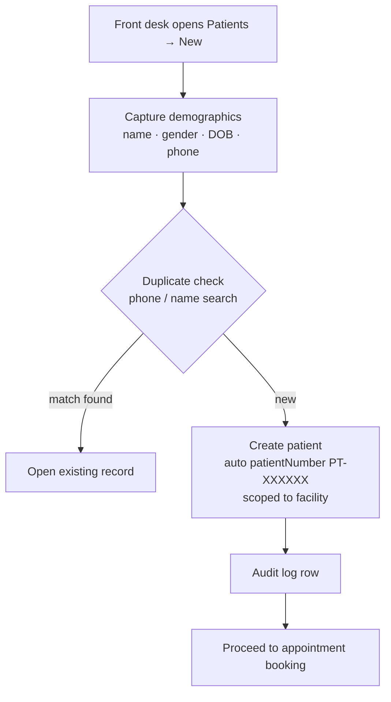
```mermaid
flowchart TD
    A[Front desk opens Patients → New] --> B[Capture demographics\nname · gender · DOB · phone]
    B --> C{Duplicate check\nphone / name search}
    C -->|match found| D[Open existing record]
    C -->|new| E[Create patient\nauto patientNumber PT-XXXXXX\nscoped to facility]
    E --> F[Audit log row]
    F --> G[Proceed to appointment booking]
```

## 2. Appointment booking (`appointment`)

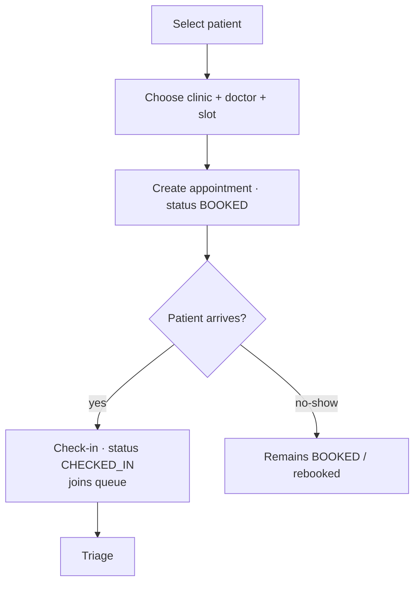
```mermaid
flowchart TD
    A[Select patient] --> B[Choose clinic + doctor + slot]
    B --> C[Create appointment · status BOOKED]
    C --> D{Patient arrives?}
    D -->|yes| E[Check-in · status CHECKED_IN\njoins queue]
    D -->|no-show| F[Remains BOOKED / rebooked]
    E --> G[Triage]
```

## 3. Queue management (`queue`)

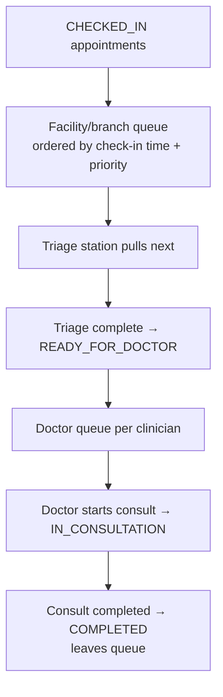
```mermaid
flowchart TD
    A[CHECKED_IN appointments] --> B[Facility/branch queue\nordered by check-in time + priority]
    B --> C[Triage station pulls next]
    C --> D[Triage complete → READY_FOR_DOCTOR]
    D --> E[Doctor queue per clinician]
    E --> F[Doctor starts consult → IN_CONSULTATION]
    F --> G[Consult completed → COMPLETED\nleaves queue]
```

## 4. Triage (`triage`)

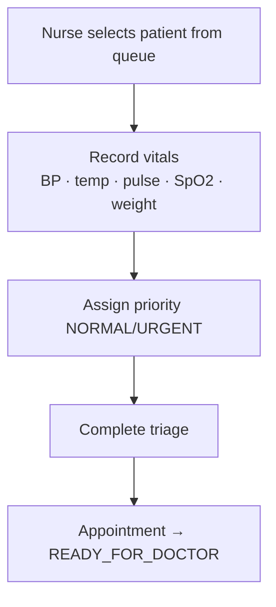
```mermaid
flowchart TD
    A[Nurse selects patient from queue] --> B[Record vitals\nBP · temp · pulse · SpO2 · weight]
    B --> C[Assign priority NORMAL/URGENT]
    C --> D[Complete triage]
    D --> E[Appointment → READY_FOR_DOCTOR]
```

## 5. Consultation (`consultation`)

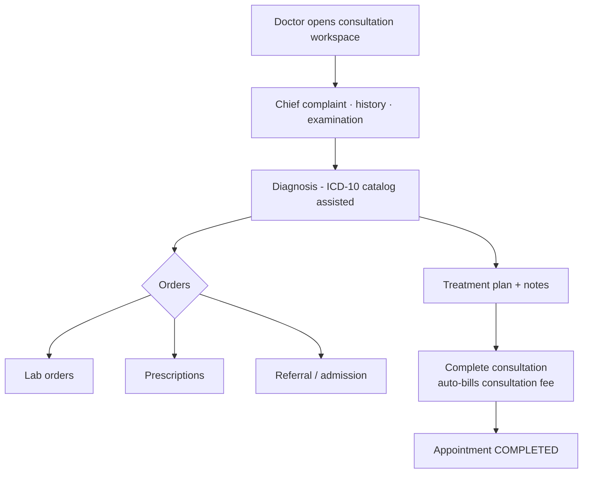
```mermaid
flowchart TD
    A[Doctor opens consultation workspace] --> B[Chief complaint · history · examination]
    B --> C[Diagnosis - ICD-10 catalog assisted]
    C --> D{Orders}
    D --> E[Lab orders]
    D --> F[Prescriptions]
    D --> G[Referral / admission]
    C --> H[Treatment plan + notes]
    H --> I[Complete consultation\nauto-bills consultation fee]
    I --> J[Appointment COMPLETED]
```

## 6. Laboratory workflow (`lab`, `doctor-lab-review`)

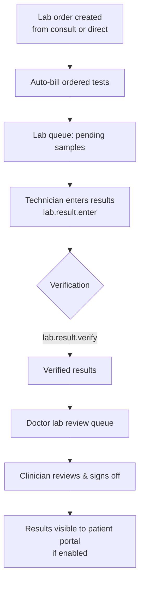
```mermaid
flowchart TD
    A[Lab order created\nfrom consult or direct] --> B[Auto-bill ordered tests]
    B --> C[Lab queue: pending samples]
    C --> D[Technician enters results\nlab.result.enter]
    D --> E{Verification}
    E -->|lab.result.verify| F[Verified results]
    F --> G[Doctor lab review queue]
    G --> H[Clinician reviews & signs off]
    H --> I[Results visible to patient portal\nif enabled]
```

## 7. Radiology workflow (`operational-module`)

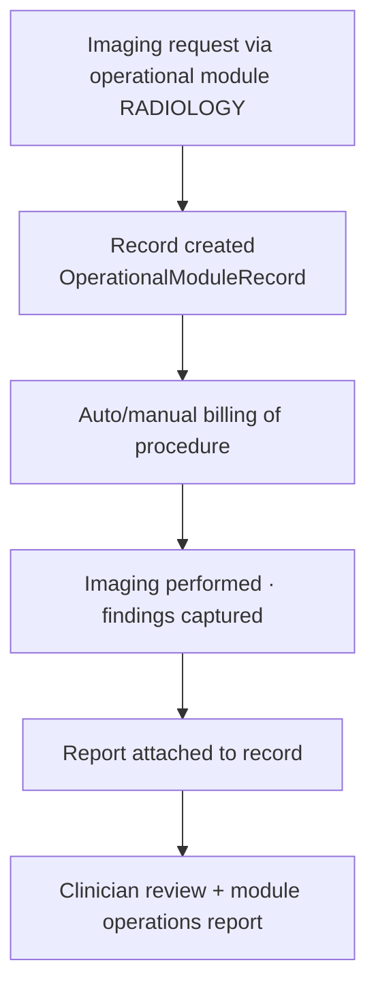
```mermaid
flowchart TD
    A[Imaging request via operational module RADIOLOGY] --> B[Record created\nOperationalModuleRecord]
    B --> C[Auto/manual billing of procedure]
    C --> D[Imaging performed · findings captured]
    D --> E[Report attached to record]
    E --> F[Clinician review + module operations report]
```

## 8. Pharmacy workflow (`prescription`, `pharmacy`, `pharmacy-stock`)

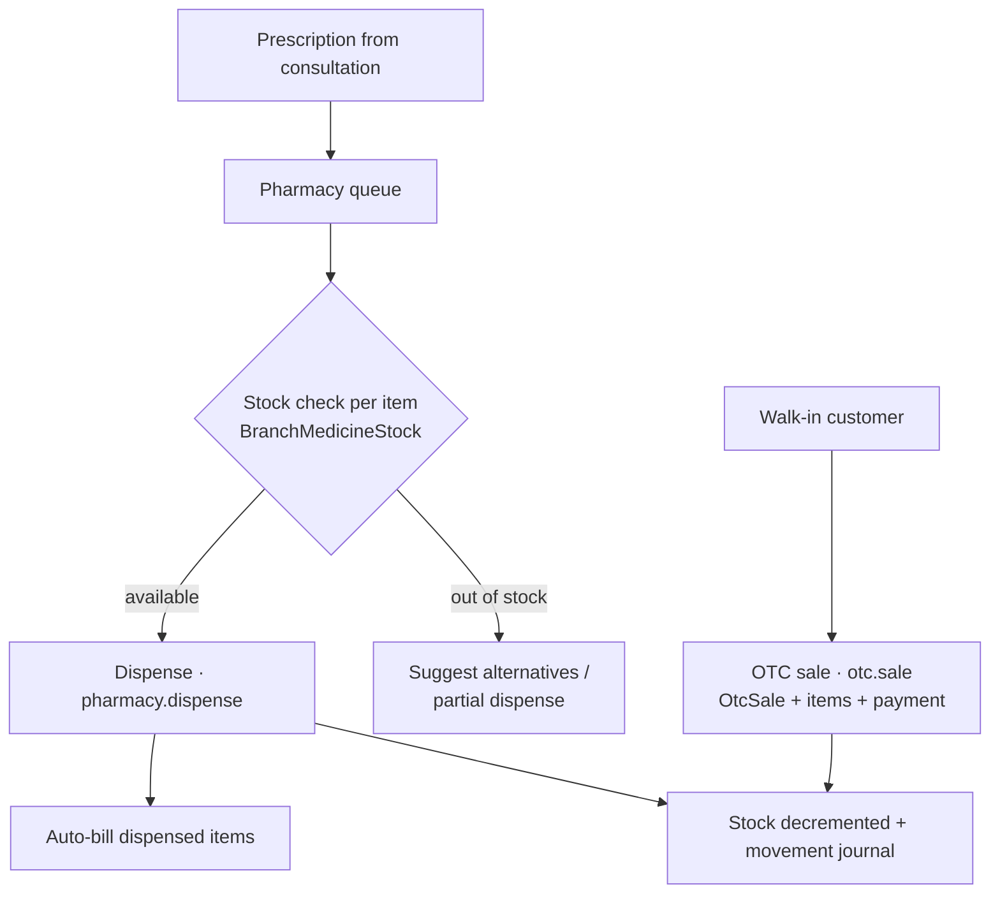
```mermaid
flowchart TD
    A[Prescription from consultation] --> B[Pharmacy queue]
    B --> C{Stock check per item\nBranchMedicineStock}
    C -->|out of stock| D[Suggest alternatives /\npartial dispense]
    C -->|available| E[Dispense · pharmacy.dispense]
    E --> F[Stock decremented + movement journal]
    E --> G[Auto-bill dispensed items]
    H[Walk-in customer] --> I[OTC sale · otc.sale\nOtcSale + items + payment]
    I --> F
```

## 9. Billing (`billing`)

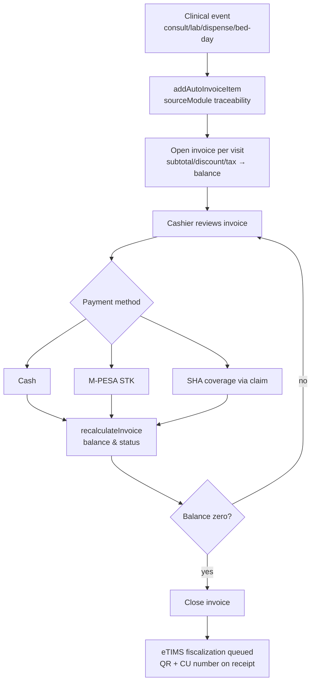
```mermaid
flowchart TD
    A[Clinical event\nconsult/lab/dispense/bed-day] --> B[addAutoInvoiceItem\nsourceModule traceability]
    B --> C[Open invoice per visit\nsubtotal/discount/tax → balance]
    C --> D[Cashier reviews invoice]
    D --> E{Payment method}
    E --> F[Cash]
    E --> G[M-PESA STK]
    E --> H[SHA coverage via claim]
    F & G & H --> I[recalculateInvoice\nbalance & status]
    I --> J{Balance zero?}
    J -->|yes| K[Close invoice]
    J -->|no| D
    K --> L[eTIMS fiscalization queued\nQR + CU number on receipt]
```

## 10. Payment processing (M-PESA detail)

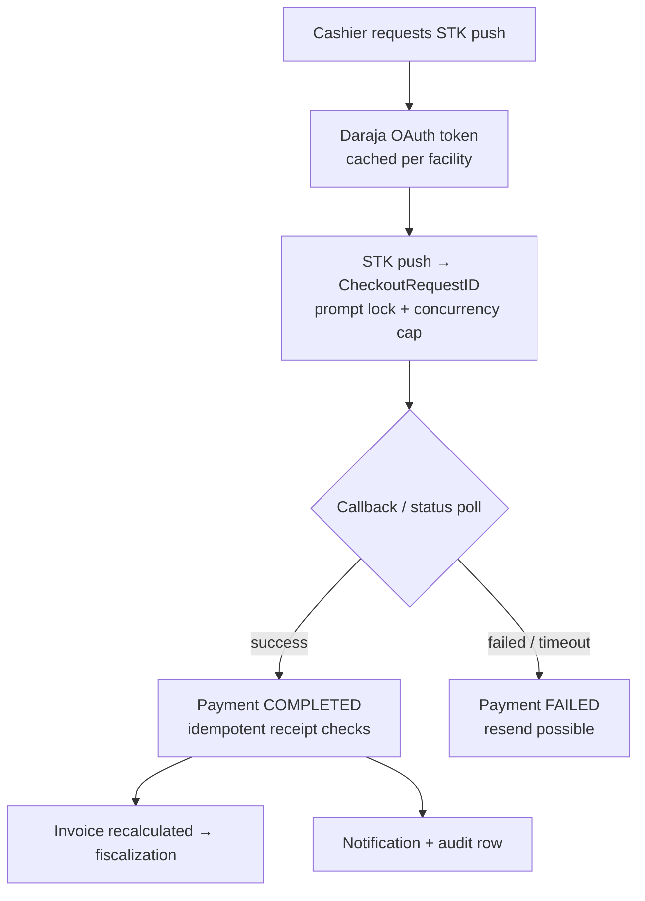
```mermaid
flowchart TD
    A[Cashier requests STK push] --> B[Daraja OAuth token\ncached per facility]
    B --> C[STK push → CheckoutRequestID\nprompt lock + concurrency cap]
    C --> D{Callback / status poll}
    D -->|success| E[Payment COMPLETED\nidempotent receipt checks]
    D -->|failed / timeout| F[Payment FAILED\nresend possible]
    E --> G[Invoice recalculated → fiscalization]
    E --> H[Notification + audit row]
```

## 11. Inventory (`pharmacy-stock`, `master-catalog`)

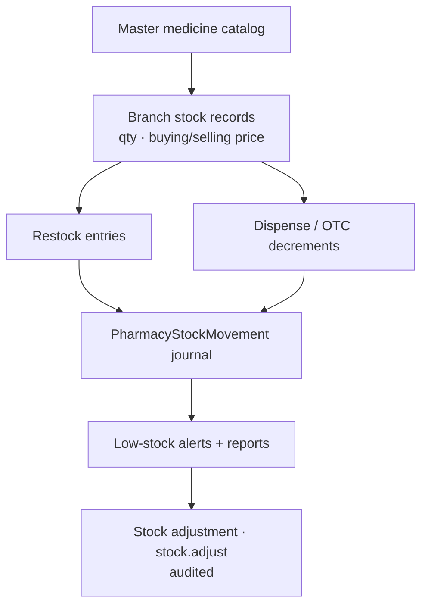
```mermaid
flowchart TD
    A[Master medicine catalog] --> B[Branch stock records\nqty · buying/selling price]
    B --> C[Restock entries]
    B --> D[Dispense / OTC decrements]
    C & D --> E[PharmacyStockMovement journal]
    E --> F[Low-stock alerts + reports]
    F --> G[Stock adjustment · stock.adjust\naudited]
```

## 12. Procurement (`operational-module` + central store)

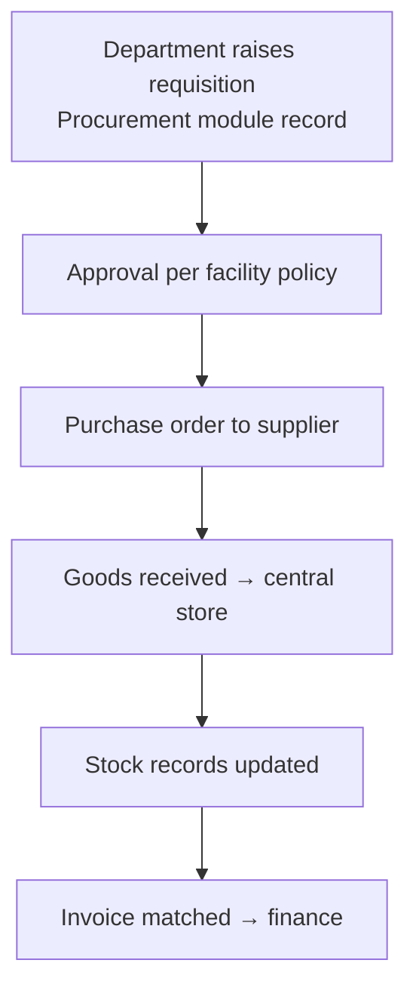
```mermaid
flowchart TD
    A[Department raises requisition\nProcurement module record] --> B[Approval per facility policy]
    B --> C[Purchase order to supplier]
    C --> D[Goods received → central store]
    D --> E[Stock records updated]
    E --> F[Invoice matched → finance]
```

## 13. Admission (`ipd`)

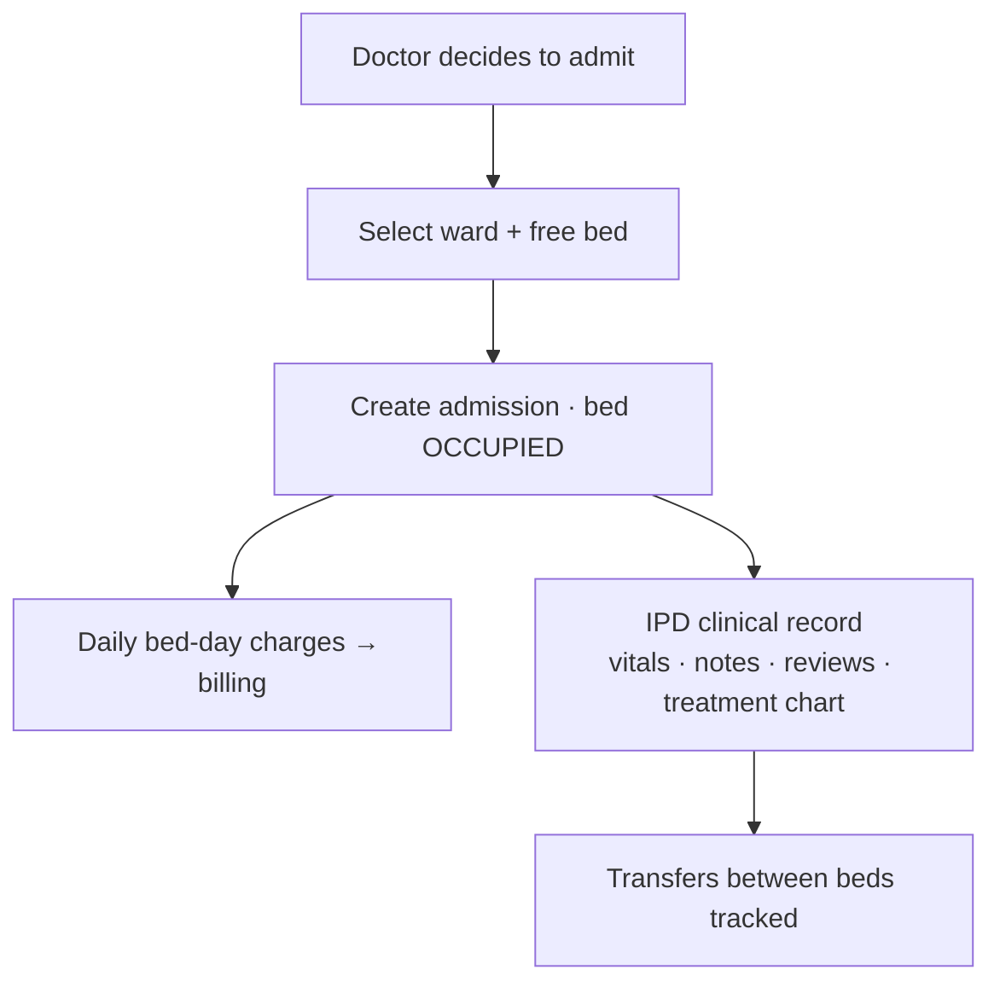
```mermaid
flowchart TD
    A[Doctor decides to admit] --> B[Select ward + free bed]
    B --> C[Create admission · bed OCCUPIED]
    C --> D[Daily bed-day charges → billing]
    C --> E[IPD clinical record\nvitals · notes · reviews · treatment chart]
    E --> F[Transfers between beds tracked]
```

## 14. Discharge (`ipd`, `ipd-clinical`)

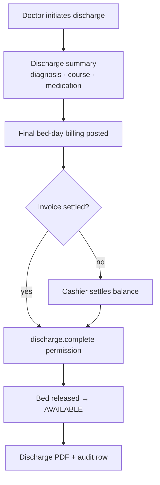
```mermaid
flowchart TD
    A[Doctor initiates discharge] --> B[Discharge summary\ndiagnosis · course · medication]
    B --> C[Final bed-day billing posted]
    C --> D{Invoice settled?}
    D -->|no| E[Cashier settles balance]
    D -->|yes| F[discharge.complete permission]
    E --> F
    F --> G[Bed released → AVAILABLE]
    G --> H[Discharge PDF + audit row]
```

## 15. User authentication (`auth`)

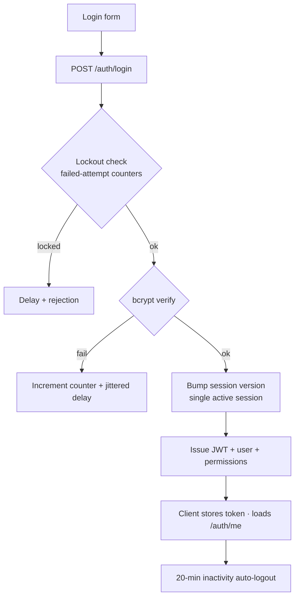
```mermaid
flowchart TD
    A[Login form] --> B[POST /auth/login]
    B --> C{Lockout check\nfailed-attempt counters}
    C -->|locked| D[Delay + rejection]
    C -->|ok| E{bcrypt verify}
    E -->|fail| F[Increment counter + jittered delay]
    E -->|ok| G[Bump session version\nsingle active session]
    G --> H[Issue JWT + user + permissions]
    H --> I[Client stores token · loads /auth/me]
    I --> J[20-min inactivity auto-logout]
```

## 16. Role-based access control

```mermaid
flowchart TD
    A[Request with JWT] --> B[JwtStrategy validates token\n+ session version]
    B --> C[RolesGuard\nroute @Roles vs user role]
    C --> D[PermissionsGuard\n@Permissions vs ROLE_PERMISSIONS matrix]
    D --> E[StepUpGuard for sensitive routes]
    E --> F[ScopeService\nfacility/branch tenancy filter]
    F --> G[Handler executes]
    C & D & E -->|deny| X[403 Forbidden]
```

## 17. Notifications (`notification`)

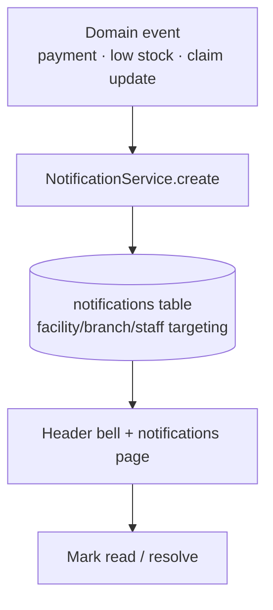
```mermaid
flowchart TD
    A[Domain event\npayment · low stock · claim update] --> B[NotificationService.create]
    B --> C[(notifications table\nfacility/branch/staff targeting)]
    C --> D[Header bell + notifications page]
    D --> E[Mark read / resolve]
```

## 18. Reports (`reports`)

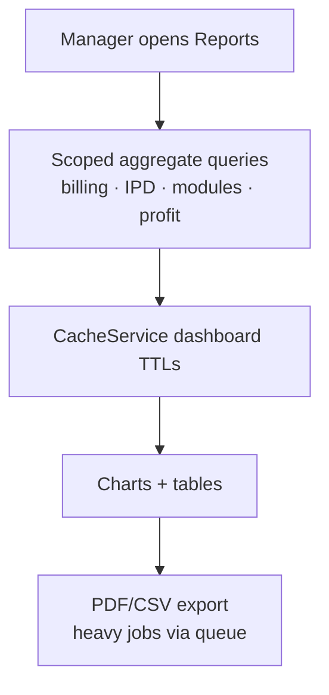
```mermaid
flowchart TD
    A[Manager opens Reports] --> B[Scoped aggregate queries\nbilling · IPD · modules · profit]
    B --> C[CacheService dashboard TTLs]
    C --> D[Charts + tables]
    D --> E[PDF/CSV export\nheavy jobs via queue]
```

## 19. Audit logging (`audit-log`)

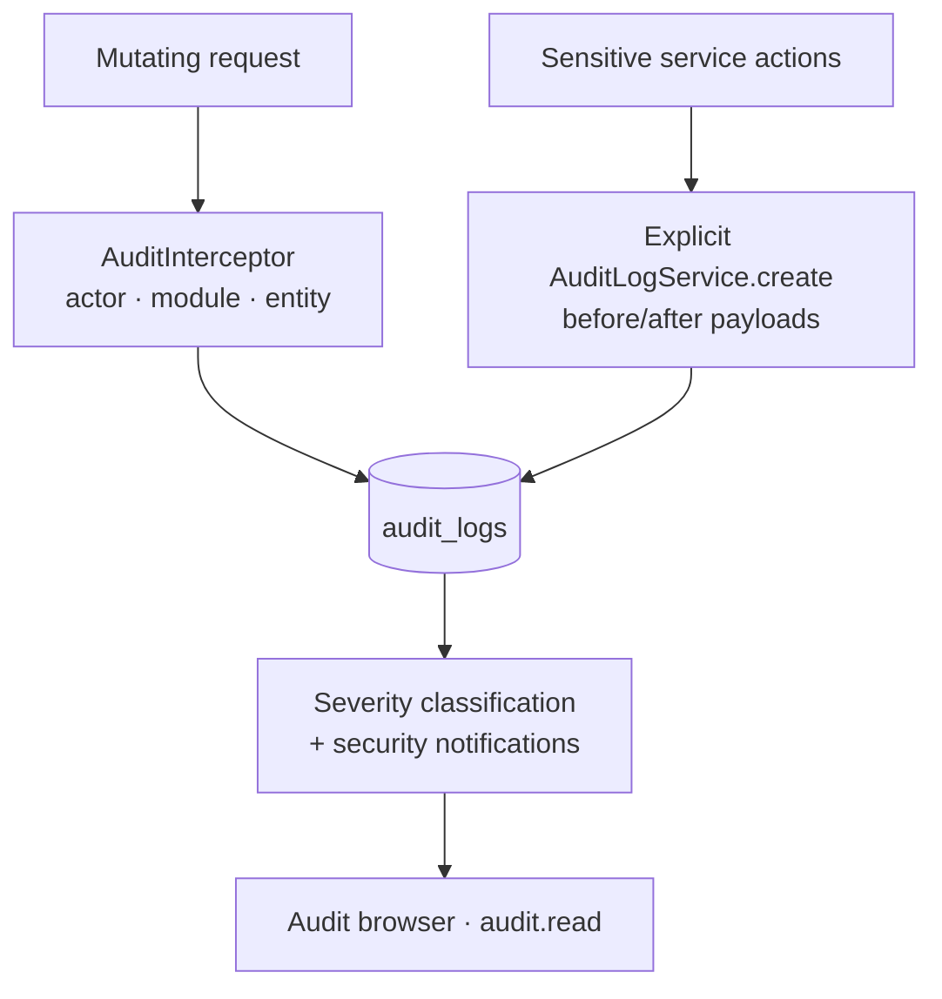
```mermaid
flowchart TD
    A[Mutating request] --> B[AuditInterceptor\nactor · module · entity]
    C[Sensitive service actions] --> D[Explicit AuditLogService.create\nbefore/after payloads]
    B & D --> E[(audit_logs)]
    E --> F[Severity classification\n+ security notifications]
    F --> G[Audit browser · audit.read]
```

## 20. System startup

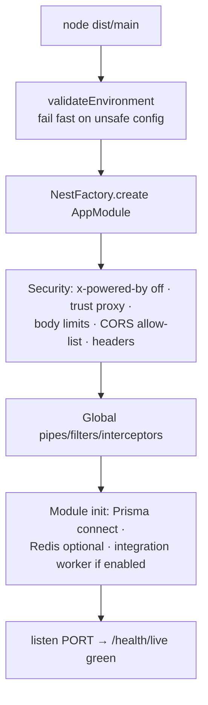
```mermaid
flowchart TD
    A[node dist/main] --> B[validateEnvironment\nfail fast on unsafe config]
    B --> C[NestFactory.create AppModule]
    C --> D[Security: x-powered-by off · trust proxy ·\nbody limits · CORS allow-list · headers]
    D --> E[Global pipes/filters/interceptors]
    E --> F[Module init: Prisma connect ·\nRedis optional · integration worker if enabled]
    F --> G[listen PORT → /health/live green]
```

## 21. Exception handling

```mermaid
flowchart TD
    A[Throw in handler/service] --> B{HttpException?}
    B -->|yes| C[Preserve status + message]
    B -->|no| D[Wrap as 500\ngeneric public message]
    C & D --> E[GlobalExceptionFilter envelope]
    E --> F[SafeLogger with X-Request-Id\nsecrets redacted]
    F --> G[Client shows toast/inline error\n401 → logout]
```

## Related

- [SYSTEM_ARCHITECTURE.md](SYSTEM_ARCHITECTURE.md) — request lifecycle
- [INTEGRATIONS.md](INTEGRATIONS.md) — eTIMS/DHA sequence diagrams
- [clinical-workflow.md](clinical-workflow.md) — narrative clinical guide
