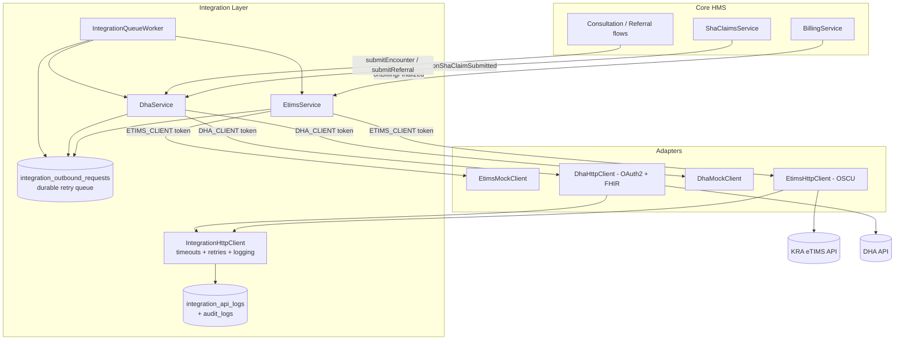
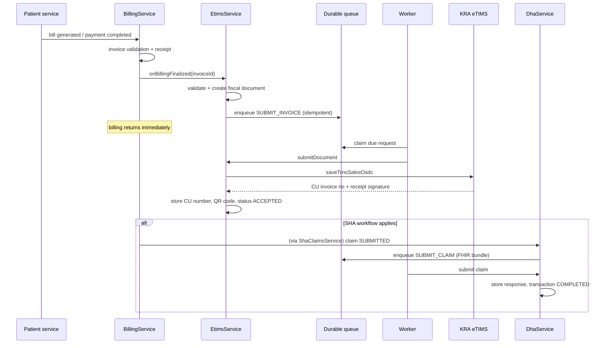

# Government Integrations: DHA & KRA eTIMS

This HMS ships with an **integration layer** that connects billing and
claims workflows to two external government systems:

- **KRA eTIMS** — electronic Tax Invoice Management System (fiscalization of
  patient invoices, credit/debit notes, CU invoice numbers, QR receipts).
- **DHA** — Digital Health Agency interoperability (patient/practitioner/
  facility verification, eligibility, encounters, referrals, consent,
  health-record exchange, SHA claim submission) using FHIR R4 payloads.

Both integrations are **disabled by default** and are feature-flagged, so
existing deployments behave exactly as before until they are switched on.

## Architecture

No business module talks to a government API directly. Everything flows
through service abstractions bound to swappable adapters:



Key design points:

- **Ports and adapters.** `EtimsClientPort` / `DhaClientPort` interfaces are
  bound to the `ETIMS_CLIENT` / `DHA_CLIENT` DI tokens. `ETIMS_MODE` /
  `DHA_MODE` select the adapter (`mock`, `sandbox`, `production`) — swapping
  a mock for the real API is a configuration change, never a code change.
- **Durable offline queue.** Outbound work is stored in the
  `integration_outbound_requests` table. Rows survive restarts, retry with
  exponential backoff + jitter, and dead-letter after the retry budget (with
  an operator requeue endpoint). KRA/DHA downtime never blocks billing.
- **Structured audit.** Every external HTTP attempt writes an
  `integration_api_logs` row (endpoint, request id, correlation id, HTTP
  status, latency, retry count, outcome). Request/response bodies and
  credentials are never logged. Business events (fiscalization accepted,
  claim queued, cancellations) go to the existing `audit_logs` table.

## Billing workflow



Reliability loop for every outbound request:

```
request -> validate -> queue -> send -> success? -> store response -> complete
                                  |no
                                  v
              retry with exponential backoff (jittered)
                                  |budget exhausted
                                  v
              DEAD_LETTER -> operator requeue or automatic
              recovery of stuck rows after crash
```

## Module map

| Path (under `backend/src/integration/`) | Purpose |
| --- | --- |
| `integration.module.ts` | DI wiring; adapter selection by mode |
| `integration.constants.ts` / `integration.types.ts` | Tokens, enums, shared contracts |
| `integration-config.service.ts` | Typed env access (secrets never logged) |
| `integration-logger.service.ts` / `integration-audit.service.ts` | Structured logs + persisted audit trail |
| `http/` | Resilient HTTP client + retry/backoff policy |
| `queue/` | Durable outbound queue + background worker |
| `token/` | Cached single-flight OAuth token manager |
| `etims/` | eTIMS service, invoice builder, tax utils, controller, adapters |
| `dha/` | DHA service, FHIR types + mapper, controller, adapters |
| `testing/` | In-memory Prisma stub and shared test fakes |

## REST endpoints

All endpoints require a JWT and the listed permission.

| Endpoint | Permission | Purpose |
| --- | --- | --- |
| `GET /integrations/etims/status` | `billing.read` | Flag, mode, queue stats |
| `GET /integrations/etims/invoices/:invoiceId` | `billing.read` | Fiscal documents + QR for an invoice |
| `POST /integrations/etims/invoices/:invoiceId/submit` | `billing.write` | Manual fiscalization |
| `POST /integrations/etims/invoices/:invoiceId/credit-note` | `billing.write` | Credit note (full or `itemIds` subset) |
| `POST /integrations/etims/invoices/:invoiceId/debit-note` | `billing.write` | Debit note |
| `POST /integrations/etims/invoices/:invoiceId/cancel` | `billing.write` | Cancel via full credit note |
| `POST /integrations/etims/sync` | `billing.write` | Drain one queue batch now |
| `GET /integrations/etims/queue/dead-letters` | `billing.read` | Inspect dead letters |
| `POST /integrations/etims/queue/:requestId/requeue` | `billing.write` | Requeue a dead letter |
| `GET /integrations/dha/status` | `billing.read` | Flag, mode, API version, queue stats |
| `POST /integrations/dha/patients/verify` | `patient.read` | Patient verification |
| `POST /integrations/dha/practitioners/verify` | `users.manage` | Practitioner verification |
| `POST /integrations/dha/facilities/verify` | `billing.read` | Facility verification |
| `POST /integrations/dha/eligibility` | `billing.read` | SHA eligibility check |
| `POST /integrations/dha/consent` | `patient.write` | Record consent |
| `POST /integrations/dha/referrals` | `consultation.write` | Submit a referral |
| `POST /integrations/dha/encounters/consultation/:id` | `consultation.write` | Submit an encounter bundle |
| `GET /integrations/dha/transactions` | `billing.read` | DHA transaction trail |

## Further reading

- [Configuration guide & environment variables](configuration.md)
- [KRA eTIMS integration details](etims.md)
- [DHA integration details](dha.md)
- [Testing guide](testing.md)
- [Deployment guide](deployment.md)
- [Troubleshooting](troubleshooting.md)
