# Invinceible Core HMS
## Complete System Documentation

**Enterprise-grade Hospital Management Information System**
Multi-tenant · NestJS + Next.js + Prisma · KRA eTIMS & DHA ready

| | |
| --- | --- |
| Repository | Owinovative/invinceible_core_hms_v2 |
| Version | 2.x (see Changelog) |
| Generated | 2026-07-02 |
| Audience | Enterprise clients · Hospital administrators · Developers · DevOps · Architects · Auditors · Certification bodies · Investors |
| Source of truth | The repository code; regenerate via `node backend/scripts/build-master-doc.mjs` |

---

## Table of Contents

**Part I — Architecture**

- [System Architecture](#system-architecture)
- [Backend](#backend)
- [Frontend](#frontend)
- [Database](#database)
- [Clinical & Operational Workflows](#clinical-operational-workflows)

**Part II — API**

- [API Reference](#api-reference)

**Part III — Security & Access**

- [Authentication](#authentication)
- [Authorization](#authorization)
- [Security](#security)

**Part IV — Integrations**

- [Integrations Overview](#integrations-overview)
- [Government Integrations: DHA & KRA eTIMS](#government-integrations-dha-kra-etims)
- [KRA eTIMS Details](#kra-etims-details)
- [DHA Details](#dha-details)
- [Integration Configuration](#integration-configuration)

**Part V — Operations**

- [Deployment](#deployment)
- [Configuration Reference](#configuration-reference)
- [Monitoring & Observability](#monitoring-observability)
- [Error Handling](#error-handling)
- [Performance & Scalability](#performance-scalability)

**Part VI — Development & Quality**

- [Development Guide & Code Quality Report](#development-guide-code-quality-report)
- [Contributing](#contributing)
- [Testing](#testing)

**Part VII — Product**

- [UI / UX Guide](#ui-ux-guide)
- [Design System](#design-system)
- [Roadmap](#roadmap)
- [Changelog](#changelog)

**Appendices**

- [Glossary](#glossary)
- [Index](#index)

---

# Part I — Architecture

## System Architecture

Invinceible Core HMS is a multi-tenant Hospital Management Information
System for Kenyan healthcare facilities. It is a TypeScript monorepo with a
NestJS REST backend, a Next.js frontend, a Prisma-managed relational
database (MySQL canonical, PostgreSQL for Render production), and an
integration layer for government systems (KRA eTIMS, DHA/SHA) and payment
providers (Safaricom M-PESA Daraja, PayHero).

### 1. High-level architecture

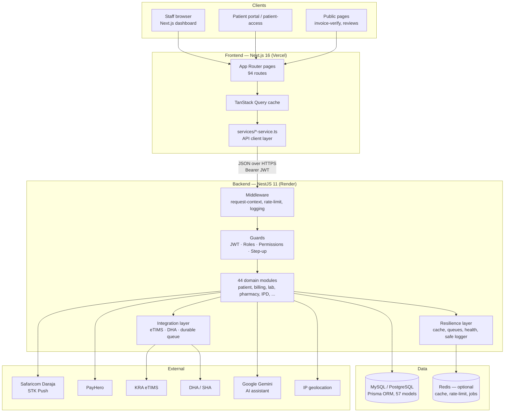

Key properties:

- **Multi-tenant** — every clinical/financial record is scoped by
  `facilityId` (+ optional `branchId`); `ScopeService` enforces tenant
  isolation on every read/write (see
  [multi-tenant-facility-isolation.md](../multi-tenant-facility-isolation.md)).
- **Stateless API** — authentication is a JWT bearer token; horizontal
  scaling requires no sticky sessions. Single-active-session is enforced
  via a session version stored per user.
- **Fail-soft infrastructure** — Redis, AI, SMS, geolocation, and
  government integrations are all optional; the system degrades gracefully
  (in-memory fallbacks, feature flags) rather than failing requests.
- **Async where it matters** — PDF generation, reconciliation, and all
  government API traffic run through queues, keeping the request path fast.

### 2. Repository layout

```text
invinceible_core_hms_v2/
├── backend/                  # NestJS API service
│   ├── src/
│   │   ├── app.module.ts     # Root module (44 feature modules)
│   │   ├── main.ts           # Bootstrap: CORS, security headers, pipes
│   │   ├── worker.ts         # Worker-mode entrypoint (queues)
│   │   ├── auth/             # JWT, guards, RBAC, step-up, scope
│   │   ├── billing/          # Invoices, tariffs, cash/M-PESA/SHA payments
│   │   ├── integration/      # eTIMS + DHA connectors (see INTEGRATIONS.md)
│   │   ├── resilience/       # Cache, rate limit, health, job queue, logger
│   │   ├── common/           # PDF engine, pagination, storage utils
│   │   ├── config/           # Environment validation
│   │   └── <domain>/         # patient, lab, pharmacy, ipd, reports, ...
│   ├── prisma/               # Canonical MySQL schema + migrations + seed
│   ├── prisma-postgresql/    # Generated PostgreSQL schema + migrations
│   ├── native/reports-engine # Optional Rust engine (not on request path)
│   ├── scripts/              # Ops & docs tooling (audits, API generator)
│   └── test/                 # Jest configs (integration coverage gate)
├── frontend/                 # Next.js 16 app
│   ├── app/                  # App Router: (dashboard), (platform), public
│   ├── components/           # ui/ (shadcn), layout/, feature components
│   ├── hooks/                # ~150 TanStack Query hooks (one per API op)
│   ├── services/             # 36 typed API service modules
│   ├── providers/            # auth, scope, sidebar, app providers
│   └── lib/                  # apiFetch client, auth storage, utils
├── services/rust-worker/     # Experimental Rust worker (future workloads)
├── docs/                     # This documentation set
├── load-tests/               # k6 critical-path load test
├── render.yaml               # Render blueprint (PostgreSQL production)
└── .github/workflows/ci.yml  # CI: lint, tests, coverage, security, build
```

### 3. Runtime architecture

Two backend process modes share one codebase:

- **Web process** (`npm run start:prod`) — serves HTTP; also runs the
  integration queue worker inline by default.
- **Worker process** (`npm run start:prod:worker`) — boots the same
  AppModule without HTTP and drains queues (`WORKER_MODE=true`). Optional;
  used to offload background work at scale.

```mermaid
flowchart LR
    subgraph Web process
        HTTP[HTTP server] --> APPM[AppModule]
        APPM --> IQW1[Integration queue worker\ninline poller]
    end
    subgraph Worker process (optional)
        APPM2[AppModule\nWORKER_MODE=true] --> JQ[JobQueueService loop]
        APPM2 --> IQW2[Integration queue worker]
    end
    IQW1 --> OUTBOX[(integration_outbound_requests)]
    IQW2 --> OUTBOX
    JQ --> REDISQ[(Redis lists / memory queue)]
```

Queue claiming is atomic (guarded row updates), so web and worker processes
can run the integration worker concurrently without double-processing.

### 4. Request lifecycle

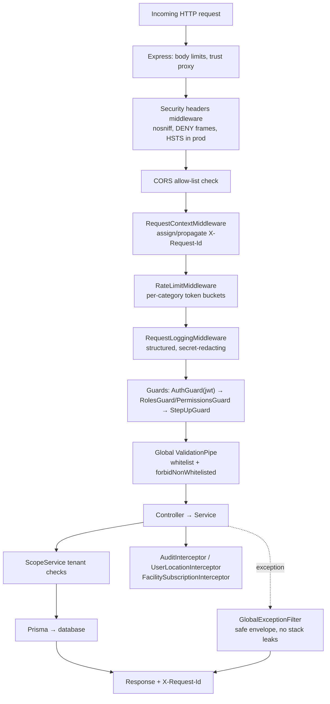

Interceptors applied globally: request timeout, audit logging (mutating
routes), user-location tracking, and facility-subscription enforcement
(write-locks facilities with lapsed subscriptions or compliance holds).

### 5. Module dependency overview (backend)

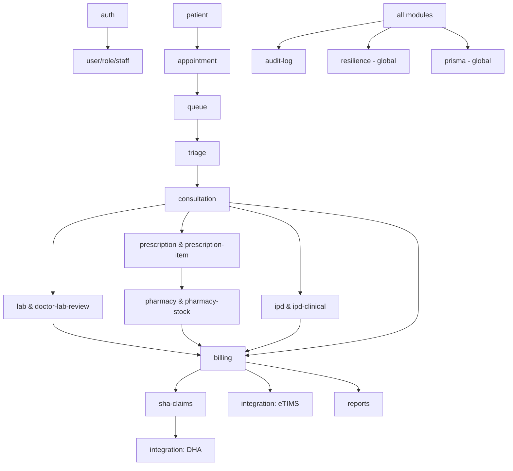

Clinical modules never bill directly: they post charges through
`BillingService` (auto invoice items carry `sourceModule` /
`sourceEntityId` for traceability), and billing alone talks to the
integration layer.

### 6. State management (frontend)

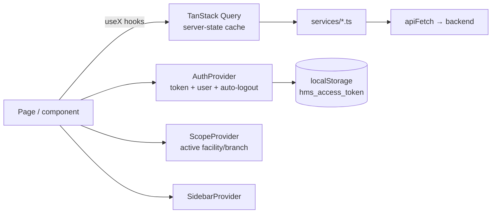

Server state lives exclusively in TanStack Query (per-operation hooks with
tuned `staleTime`s in `lib/query-stale-times.ts`); client state is limited
to auth/session, scope selection, and UI chrome via React context.

### 7. Event and data flow

- **Synchronous**: REST request/response between frontend and backend.
- **Asynchronous**: durable DB outbox for government integrations
  (`integration_outbound_requests`), Redis/in-memory job queue for
  PDF/report/reconciliation jobs (`JobQueueService`), and a
  `data_outbox_events` table for the enterprise data-warehouse feed.
- **Notifications**: `notification` module persists in-app notifications;
  M-PESA/PayHero callbacks and billing events raise them server-side.
- **Audit**: `AuditInterceptor` + explicit `AuditLogService.create` calls
  write immutable audit rows with actor/facility/before/after context.

### 8. Deployment architecture

```mermaid
flowchart TD
    DEV[GitHub repository] -->|push / PR| CI[GitHub Actions CI]
    CI -->|checksPass| RENDER[Render autodeploy]
    subgraph Render (Frankfurt)
        API[Web service: backend\nhealthCheckPath /health/live]
        PG[(Managed PostgreSQL 16)]
        API --> PG
    end
    subgraph Vercel
        FE[Next.js frontend\nNEXT_PUBLIC_API_BASE_URL → API]
    end
    USERS[Hospital users] --> FE --> API
    CALLBACKS[M-PESA / PayHero callbacks] --> API
    API --> EXT[KRA eTIMS · DHA · Daraja · Gemini]
```

See [DEPLOYMENT.md](#deployment) for the full pipeline, environment
variables, scaling, and disaster-recovery guidance.

### 9. Network & trust boundaries

| Boundary | Control |
| --- | --- |
| Browser ↔ Frontend | HTTPS (Vercel); no secrets in the client bundle |
| Frontend ↔ Backend | HTTPS, CORS allow-list, JWT bearer, rate limits |
| Backend ↔ Database | Private connection string; Prisma parameterized queries |
| Backend ↔ Government APIs | Egress only, credentialed, isolated in the integration layer |
| Payment callbacks → Backend | Public endpoints hardened: idempotent, validated against stored request IDs, rate-limited |

### 10. Naming conventions & coding patterns

- **Backend**: one Nest module per domain (`<domain>/<domain>.module.ts`,
  `.controller.ts`, `.service.ts`, `dto/`); DTO classes validated with
  class-validator; services own business rules; Prisma models map to
  `snake_case` tables via `@@map`; money kept as `Float` with 2-dp rounding
  helpers (see technical debt notes in
  [PERFORMANCE.md](#performance-scalability) and the code quality report in
  [DEVELOPMENT_GUIDE.md](#development-guide-code-quality-report)).
- **Frontend**: `use-<operation>.ts` hook per API operation;
  `<domain>-service.ts` per backend module; shadcn/ui primitives under
  `components/ui`; feature components grouped by domain folder.
- **Status fields**: string `statusCode` columns with UPPER_SNAKE domain
  vocabularies (e.g. appointments `BOOKED → CHECKED_IN → READY_FOR_DOCTOR →
  IN_CONSULTATION → COMPLETED`).

### Related documents

- [BACKEND.md](#backend) · [FRONTEND.md](#frontend) ·
  [DATABASE.md](#database) · [API_REFERENCE.md](#api-reference)
- [WORKFLOWS.md](#clinical-operational-workflows) — 21 clinical & operational flowcharts
- [AUTHENTICATION.md](#authentication) ·
  [AUTHORIZATION.md](#authorization) · [SECURITY.md](#security)
- [INTEGRATIONS.md](#integrations-overview) · [DEPLOYMENT.md](#deployment)


---

## Backend

NestJS 11 + TypeScript 5.7 + Prisma 6 REST API. Entry points:
[main.ts](../../backend/src/main.ts) (web) and
[worker.ts](../../backend/src/worker.ts) (queue worker).

### 1. Module inventory

44 feature modules registered in [app.module.ts](../../backend/src/app.module.ts):

| Category | Modules | Responsibility |
| --- | --- | --- |
| Identity & access | `auth`, `user`, `role`, `staff`, `user-location`, `user-review` | Login, JWT, RBAC, staff registry, geo/session tracking |
| Tenancy | `facility`, `branch`, `department`, `clinic`, `facility-subscription` | Multi-tenant hierarchy, SaaS subscription enforcement |
| Patient journey | `patient`, `appointment`, `queue`, `triage`, `consultation`, `doctor-lab-review` | Registration → booking → queue → vitals → consult → result review |
| Diagnostics | `lab` | Test catalog, orders, results, lab queue |
| Medication | `prescription`, `prescription-item`, `pharmacy`, `pharmacy-stock` | Prescribing, dispensing, OTC sales, branch stock & movements |
| Inpatient | `ipd`, `ipd-clinical` | Wards, beds, admissions, vitals, treatment chart, discharge |
| Finance | `billing`, `sha-claims`, `reports` | Invoices, tariffs, payments (cash/M-PESA/SHA), claims, analytics |
| Government | `integration` (eTIMS + DHA) | Fiscalization and health-information exchange (see [INTEGRATIONS.md](#integrations-overview)) |
| Platform | `audit-log`, `notification`, `settings`, `operational-module`, `master-catalog`, `feedback`, `communication`, `enterprise`, `clinical-safety`, `patient-portal`, `data-outbox`, `ai-assistant`, `resilience`, `prisma` | Cross-cutting services |

`operational-module` is a generic record store powering the long tail of
departments (radiology, theatre, maternity, ICU, blood bank, mortuary,
CSSD, laundry, kitchen, etc.) with one configurable model
(`OperationalModuleRecord`) instead of 30 near-identical modules — the
frontend renders each from `lib/module-catalog.ts`.

### 2. Layering & patterns

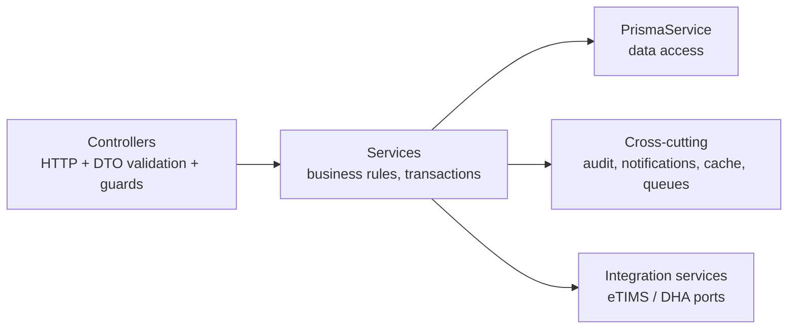

- **Controllers** are thin: route + guard + DTO in, service call out. All
  341 routes are cataloged in [API_REFERENCE.md](#api-reference).
- **Services** own business rules and Prisma access (repository layer and
  ORM are unified in Prisma; there is no separate repository tier).
  Multi-step financial operations use `prisma.$transaction`.
- **DTO validation**: global `ValidationPipe` with `whitelist`,
  `forbidNonWhitelisted`, `transform`, `stopAtFirstError`.
- **Dependency injection** throughout; the integration layer additionally
  uses token-bound interfaces (`ETIMS_CLIENT`, `DHA_CLIENT`) for
  adapter swapping.

### 3. Middleware, guards, interceptors, filters

| Stage | Component | Purpose |
| --- | --- | --- |
| Middleware | `RequestContextMiddleware` | Request ID assignment/propagation (`X-Request-Id`) |
| Middleware | `RateLimitMiddleware` + `RateLimitService` | Category-based limits (auth, search, dashboard, PDF, M-PESA, public verify) backed by Redis or memory |
| Middleware | `RequestLoggingMiddleware` | Structured request logs with latency; slow-request flagging |
| Guard | `AuthGuard('jwt')` (`JwtStrategy`) | Token verification + user hydration + session-version check |
| Guard | `RolesGuard` / `PermissionsGuard` | RBAC (see [AUTHORIZATION.md](#authorization)) |
| Guard | `StepUpGuard` | Recent re-auth for sensitive actions |
| Interceptor | `RequestTimeoutInterceptor` | Per-request timeout (`REQUEST_TIMEOUT_MS`) |
| Interceptor | `AuditInterceptor` | Automatic audit rows for mutating requests |
| Interceptor | `UserLocationInterceptor` | IP/geo session tracking |
| Interceptor | `FacilitySubscriptionInterceptor` | Write-lock for lapsed subscriptions/compliance |
| Filter | `GlobalExceptionFilter` | Uniform error envelope; hides internals; logs with request ID |

### 4. Resilience layer (`src/resilience/`, global module)

- **`CacheService`** — Redis-first cache with bounded in-memory fallback;
  TTL tiers for reference data, dashboards, and defaults.
- **`JobQueueService`** — background jobs (`PDF_GENERATION`, `BULK_REPORT`,
  `SHA_CLAIM_BATCH`, `MPESA_RECONCILIATION`, …) on Redis lists with
  in-memory fallback, idempotency keys, and a dead-letter list; drained by
  the worker loop (`WORKER_MODE=true`).
- **`RedisConnectionService`** — single connection manager; every consumer
  degrades to memory when Redis is absent.
- **`SafeLoggerService`** — structured logging with aggressive secret
  redaction (bearer/basic tokens, passwords, keys, DB URLs) and payload
  truncation. All backend logging flows through it.
- **`HealthController`** — `/health/live` (liveness), `/health/ready`
  (DB reachability), `/health/deep` (DB + Redis + queue depth).

The **integration layer** adds a second, durable queue
(`integration_outbound_requests` table) for government traffic — retries
with exponential backoff survive restarts. Details in
[INTEGRATIONS.md](#integrations-overview).

### 5. Domain highlights & business rules

#### Billing (`billing.service.ts`, ~4.4k lines — the financial core)

- Invoice lifecycle: `PENDING → PARTIALLY_PAID → PAID → CLOSED` with
  `recalculateInvoice` as the single balance authority.
- Auto-billing API (`addAutoInvoiceItem`) lets clinical modules post
  charges with `sourceModule`/`sourceEntityType`/`sourceEntityId`
  traceability; tariff resolution falls back
  branch → facility → service default price.
- Payments: cash (receipt numbers `CSH-…`), M-PESA STK push (Daraja OAuth,
  prompt locks, concurrency caps, status polling, callback idempotency),
  SHA coverage (linked to claims, including rejection-as-loss accounting).
- Every finalization path triggers eTIMS fiscalization through the
  integration layer (queued; never blocks billing).
- Revenue-integrity and cashier-close endpoints reconcile receipts against
  invoice movements per day/branch.

#### Pharmacy & stock

- Prescription dispensing decrements `BranchMedicineStock` with movement
  journal rows (`PharmacyStockMovement`); OTC sales
  (`OtcSale`/`OtcSaleItem`/`OtcSalePayment`) support walk-in sales with
  their own payment records; buying-price tracking enables profit
  analytics.

#### IPD

- `Ward → Bed → Admission` with bed-status transitions, daily bed-day
  charges posted to billing, clinical records (vitals, progress notes,
  doctor reviews, treatment chart) and discharge summaries.

#### Reports

- Aggregated dashboards (billing, IPD clinical, module operations,
  profit analytics) with cache-backed queries. A native Rust engine
  (`backend/native/reports-engine`) exists as an optional foundation for
  future high-volume rollups — not on the request path.

#### PDF engine (`common/pdf/hospital-pdf.ts`)

- PDFKit-based generator used for invoices, receipts, SHA claim forms,
  lab reports and discharge summaries, with facility branding, compact
  tables, and QR codes (`qrcode` package) for public verification links.

### 6. Background jobs & events

| Mechanism | Storage | Used for |
| --- | --- | --- |
| `JobQueueService` | Redis list (memory fallback) | PDFs, bulk reports, reconciliation, notifications |
| `IntegrationQueueService` | `integration_outbound_requests` table | eTIMS submissions, DHA claims/encounters/referrals |
| `DataOutboxService` | `data_outbox_events` table | Enterprise data-warehouse feed |
| Notifications | `notifications` table | In-app alerts (payments, stock, claims) |

### 7. Error handling pipeline

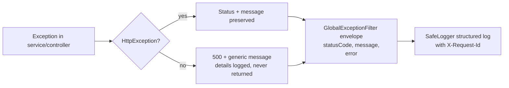

Domain code throws Nest HTTP exceptions (`BadRequestException`,
`NotFoundException`, …) with operator-actionable messages; unexpected
errors are logged with full context but return a sanitized envelope. See
[ERROR_HANDLING.md](#error-handling).

### 8. Utilities & shared code

- `common/pagination` — cursor/offset pagination helpers used by all list
  endpoints (`parsePagination`, `paginatedResponse`).
- `common/storage` — compact JSON serialization for payload columns
  (byte-capped, truncation-safe).
- `common/facility-access.ts` — helpers for facility/branch assertions.
- `config/env.validation.ts` — startup validation of all environment
  variables (fails fast on unsafe production configuration).

### Related

- [DATABASE.md](#database) — schema, ER diagrams, migrations
- [API_REFERENCE.md](#api-reference) — all 341 endpoints
- [TESTING.md](#testing) · [PERFORMANCE.md](#performance-scalability) ·
  [MONITORING.md](#monitoring-observability)


---

## Frontend

Next.js 16 (App Router) + React 19 + TypeScript, styled with Tailwind CSS 4
and shadcn/ui (Radix primitives). Deployed on Vercel. Source in
[`frontend/`](../../frontend).

### 1. Technology stack

| Concern | Library |
| --- | --- |
| Framework / routing | Next.js 16 App Router (client-heavy dashboard) |
| Server state | TanStack Query 5 (+ devtools) |
| Tables | TanStack Table 8 |
| Forms | react-hook-form 7 + zod 4 resolvers |
| UI primitives | shadcn/ui on Radix UI, `class-variance-authority`, `tailwind-merge` |
| Charts | Recharts 3 |
| Icons / motion | lucide-react, framer-motion |
| QR codes | `qrcode` (invoice verification) |

### 2. Route map (94 pages)

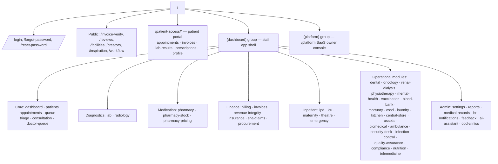

Route groups:

- **`(dashboard)/`** — authenticated staff shell (sidebar + header);
  guarded client-side by `AuthProvider` (redirect to `/login`) and
  role/permission checks from the auth payload.
- **`(platform)/platform`** — SaaS owner console (facility onboarding,
  subscriptions, platform metrics).
- **`patient-access/`** — patient portal (separate lightweight login,
  feature-flagged backend).
- **Public** — invoice verification (`/invoice-verify` with QR deep link),
  reviews, marketing pages.

### 3. Component architecture

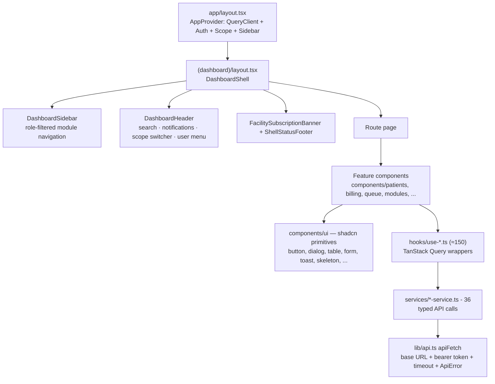

Conventions:

- **One hook per API operation** (`use-create-patient.ts`,
  `use-invoices.ts`, …) wrapping a typed function from the matching
  `services/<domain>-service.ts`. Mutations invalidate the relevant query
  keys; stale times are centralized in `lib/query-stale-times.ts`.
- **Feature components** live in `components/<domain>/`; generic operational
  departments are rendered by `components/modules/*` from the declarative
  catalog in `lib/module-catalog.ts` (title, fields, permissions per
  module) — adding a department is mostly configuration.
- **`components/ui/`** is the shadcn design-system layer (see
  [DESIGN_SYSTEM.md](#design-system)).

### 4. State management

| State | Owner | Notes |
| --- | --- | --- |
| Server data | TanStack Query | Query keys per domain; optimistic updates on selected mutations; devtools in development |
| Auth session | `AuthProvider` | Token in `localStorage` (`hms_access_token`); hydrates `/auth/me`; 20-minute inactivity auto-logout with 60s warning; deactivation acceptance flow; precise geolocation reporting |
| Tenant scope | `ScopeProvider` | Active facility/branch for multi-branch users; drives query params |
| UI chrome | `SidebarProvider`, component state | Sidebar collapse, dialogs, filters |

### 5. Forms, tables, charts, modals

- **Forms**: react-hook-form + zod schemas per feature; shared field
  primitives (`Input`, `Select`, `Textarea`, `DatePicker`) with inline
  validation messages; submit states disable buttons and show spinners.
- **Tables**: TanStack Table with server-driven pagination (matching the
  backend pagination contract), column filtering, and skeleton loaders
  while queries are pending.
- **Charts**: Recharts dashboards (billing, reports, profit analytics,
  IPD occupancy).
- **Modals/drawers**: Radix `Dialog`/`Sheet` via shadcn; confirmation
  dialogs for destructive actions.
- **Notifications**: toast system for API outcomes; `/notifications` page
  + header bell backed by the notifications API.
- **Loading UX**: per-widget skeleton loaders (`components/ui/skeleton`),
  suspense-free — loading states come from query flags.

### 6. Responsive design

Tailwind breakpoints with a mobile-first dashboard shell: the sidebar
collapses to a drawer below `lg`, tables gain horizontal scroll, and the
`use-mobile` hook adapts complex widgets. Mobile/tablet readiness notes:
[mobile-tablet-readiness.md](../mobile-tablet-readiness.md).

### 7. Error & session handling

- `apiFetch` wraps every call: 25s timeout, JSON parsing, and typed
  `ApiError { status, message }`. 401 responses trigger logout;
  guard-refused deployments (localhost API from a deployed site) produce an
  actionable configuration error.
- React Query retries are conservative for mutations (none) and bounded
  for queries; error boundaries render inline alerts rather than blank
  screens.

### 8. Environment

| Variable | Purpose |
| --- | --- |
| `NEXT_PUBLIC_API_BASE_URL` | Backend base URL (required in deployment) |
| `NEXT_PUBLIC_APP_URL` | Canonical frontend URL (links in QR codes/receipts) |

### Related

- [UI_UX_GUIDE.md](#ui-ux-guide) — screen-by-screen documentation
- [DESIGN_SYSTEM.md](#design-system) — tokens, primitives, patterns
- [API_REFERENCE.md](#api-reference) — the contract the services layer consumes


---

## Database

Prisma 6 ORM over a relational database. The **canonical schema** is
[`backend/prisma/schema.prisma`](../../backend/prisma/schema.prisma) (MySQL);
a **PostgreSQL variant** is generated by
`npm run prisma:schema:postgres` into `backend/prisma-postgresql/` for the
Render production path (`DATABASE_PROVIDER` selects which schema and
migration set the Prisma config uses).

**57 models**, all mapped to `snake_case` tables via `@@map`.

### 1. Model inventory by domain

| Domain | Models |
| --- | --- |
| Tenancy & identity | `Facility`, `Branch`, `Department`, `Role`, `User`, `UserBranchAccess`, `Staff`, `UserSession`, `PasswordResetToken`, `UserReview`, `UserFeedback`, `FacilitySubscriptionPayment` |
| Patient journey | `Patient`, `Clinic`, `Appointment`, `Triage`, `Consultation` |
| Laboratory | `LabTestCatalog`, `LabOrder`, `LabOrderItem`, `LabResult` |
| Medication | `Medicine`, `Prescription`, `PrescriptionItem`, `Dispense`, `DispenseItem`, `BranchMedicineStock`, `PharmacyStockMovement`, `OtcSale`, `OtcSaleItem`, `OtcSalePayment` |
| Inpatient | `Ward`, `Bed`, `Admission`, `IpdProgressNote`, `IpdVitalRecord`, `IpdDoctorReview`, `TreatmentChartEntry`, `IpdDischargeSummary` |
| Finance | `BillingService`, `ServiceTariff`, `Invoice`, `InvoiceItem`, `Payment`, `ShaClaim` |
| Government integration | `EtimsInvoice`, `IntegrationOutboundRequest`, `IntegrationApiLog`, `DhaTransaction` |
| Platform | `AuditLog`, `SystemSetting`, `Notification`, `OperationalModuleRecord`, `DataOutboxEvent`, `IpGeolocationCache`, `UserLocationProfile`, `UserLocationEvent` |

### 2. Core ER diagrams

#### Tenancy & access

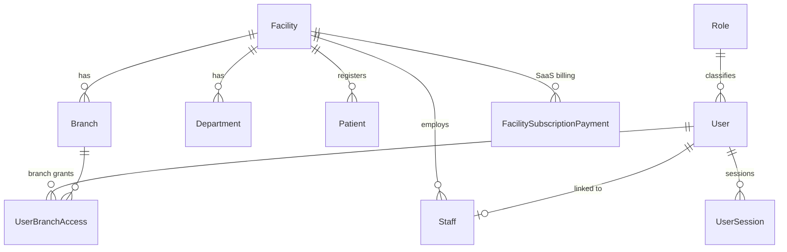

#### Patient journey (OPD)

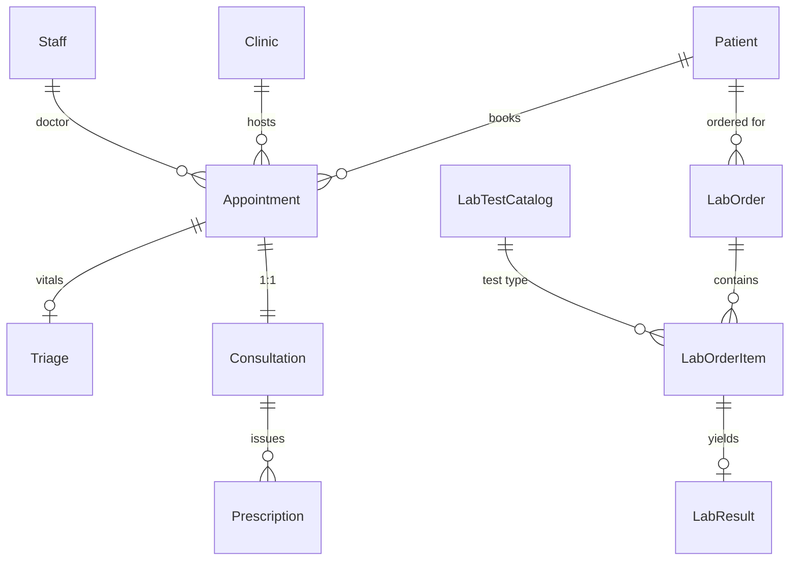

#### Billing & claims

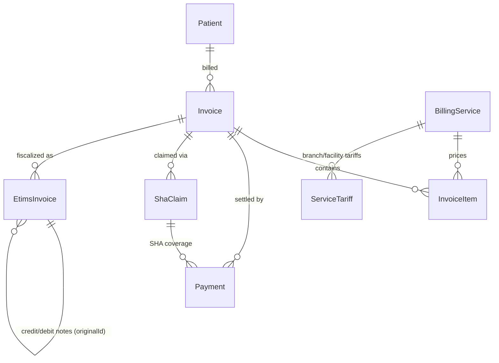

`InvoiceItem.sourceModule` / `sourceEntityType` / `sourceEntityId` link
every auto-generated charge back to its clinical origin (consultation,
lab order, dispense, bed-day), forming the revenue-integrity audit chain.

#### Pharmacy & inventory

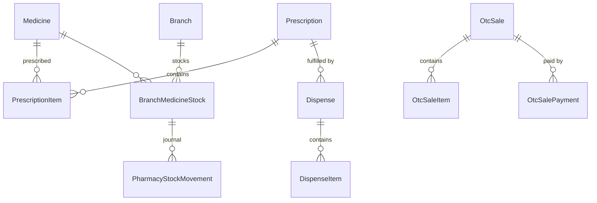

#### Inpatient

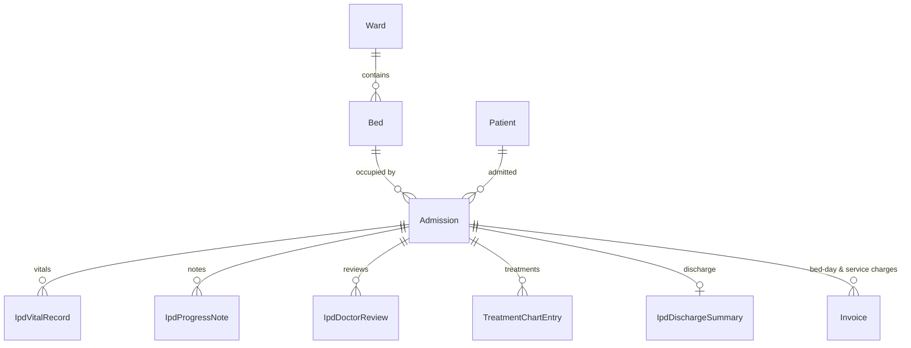

#### Government integration

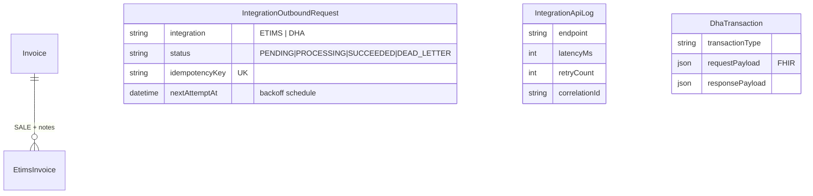

### 3. Conventions, keys, constraints, indexes

- **Primary keys**: autoincrement `Int` `id` everywhere except
  `UserSession` (string id).
- **Business keys**: unique human-readable numbers —
  `Patient.patientNumber`, `Invoice.invoiceNumber`,
  `Payment.receiptNumber`, `ShaClaim.claimNumber`, `OtcSale.saleNumber`,
  `EtimsInvoice.traderInvoiceNumber`,
  `IntegrationOutboundRequest.idempotencyKey`.
- **Foreign keys**: explicit Prisma relations with `RESTRICT` deletes for
  financial/clinical integrity and `SET NULL` for optional actor links.
  Integration bookkeeping tables (`integration_*`, `dha_transactions`)
  intentionally keep `facilityId`/`branchId` as plain scalars so audit rows
  never block core-entity maintenance.
- **Tenancy columns**: `facilityId` (required on nearly every domain
  table) + optional `branchId`; composite indexes
  (`facilityId, branchId, statusCode`, `facilityId, createdAt`) back the
  scoped list queries.
- **Status columns**: `statusCode VARCHAR` with per-domain vocabularies —
  deliberately strings (not enums) so operational statuses can evolve
  without migrations.
- **Timestamps**: `createdAt` default now, `updatedAt` auto-updated;
  domain events add explicit stamps (`issuedAt`, `settledAt`,
  `submittedAt`, `dispensedAt`, `dischargedAt`, …).
- **Money**: `Float` columns (`Double` in MySQL) with application-side
  2-dp rounding. *Known trade-off* — a future migration to `Decimal` is
  recommended for absolute cent precision (tracked in
  [ROADMAP.md](#roadmap)).
- **Large payloads**: `Json` columns for API payloads/metadata;
  `LongText` for images/signatures stored as data URLs (with a storage
  audit script to monitor growth).
- **Hot-path indexes**: added deliberately in the
  `performance_resilience_indexes` and `fast_master_catalog_indexes`
  migrations (M-PESA lookups by `checkoutRequestId`, queue scans by
  `status, nextAttemptAt`, notification lists, catalog searches).

### 4. Migrations

MySQL migrations live in `backend/prisma/migrations/` (21 directories,
timestamped); PostgreSQL migrations in
`backend/prisma-postgresql/migrations/` (numbered baseline +
per-feature). The PostgreSQL schema file is **generated — never edit it
directly**; regenerate with `npm run prisma:schema:postgres` after
changing the canonical schema, and add a matching SQL migration to both
sets.

Highlights (chronological):

| Migration | Adds |
| --- | --- |
| `finalize_billing_and_invoice_tracking` | Billing core |
| `add_user_login_lockout`, `add_single_active_session` | Auth hardening |
| `add_service_tariffs`, `add_branch_stock_buying_price` | Pricing & margins |
| `sha_receipts_sessions_and_printouts`, `sha_claim_signatures…` | SHA claims |
| `facility_compliance_and_mpesa_credentials` | SaaS compliance + per-facility M-PESA |
| `performance_resilience_indexes`, `…list_indexes` | Hot-path indexes |
| `enterprise_patient_portal_outbox` | Portal + data outbox |
| `add_otc_sales_backend_foundation` | OTC pharmacy sales |
| `add_dha_etims_integration` | Government integration layer |

Apply with `npm run prisma:migrate:deploy` (MySQL) or
`npm run prisma:migrate:postgres` (PostgreSQL). Data-safety tooling:
`db:validate`, `db:seed:safe`, `db:storage:audit`, `db:cleanup:dry-run`,
`db:index:audit` (see `backend/package.json`).

### 5. Entity lifecycles

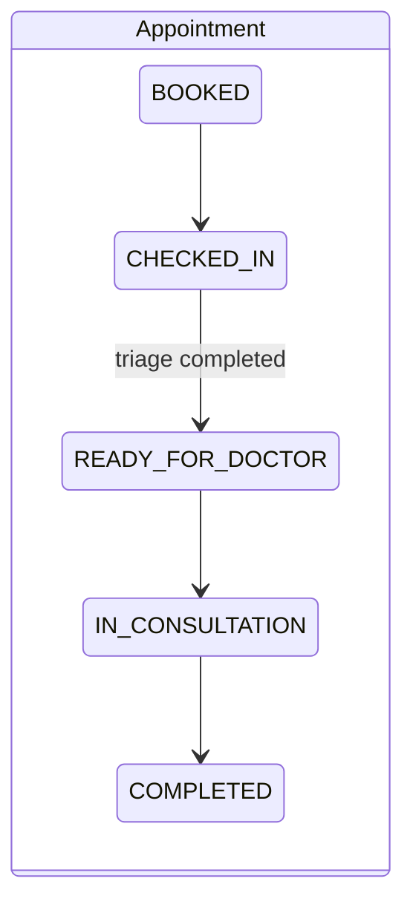

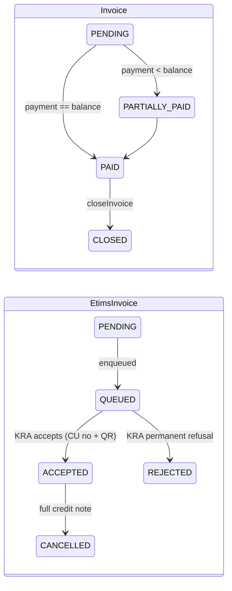

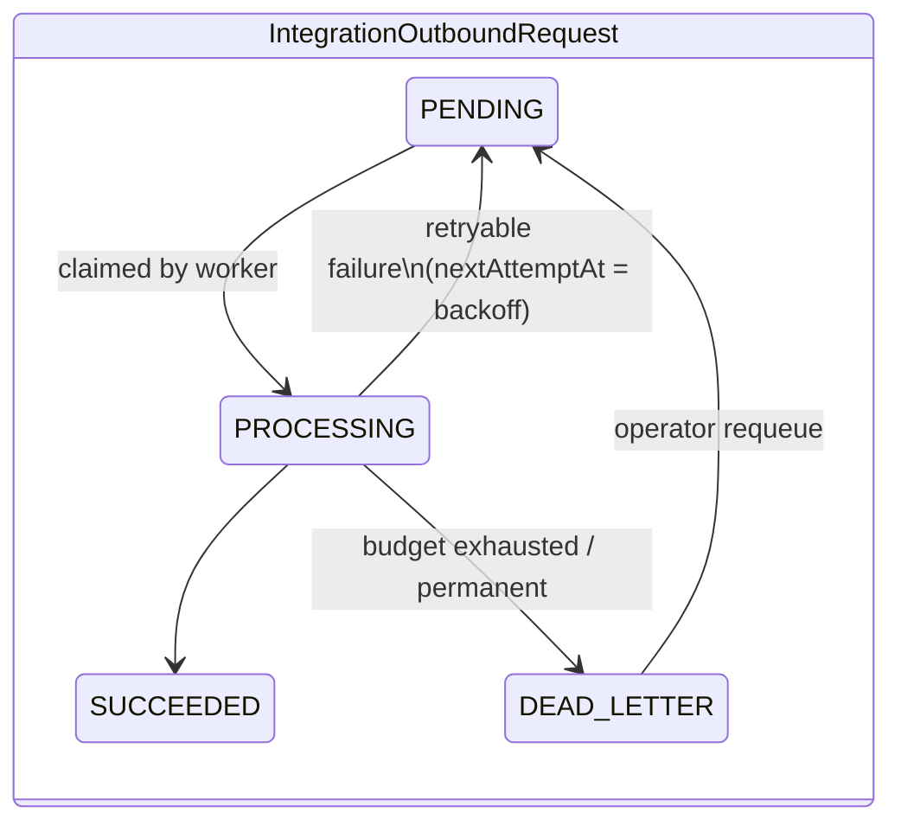

### 6. Data flow summary

Clinical writes → billing charges (`InvoiceItem` with source links) →
payments (`Payment`) → fiscalization (`EtimsInvoice`) and claims
(`ShaClaim` → `DhaTransaction`) → analytics (`reports` queries +
`DataOutboxEvent` warehouse feed) — with `AuditLog` rows at every
mutating step.

### Related

- [BACKEND.md](#backend) · [API_REFERENCE.md](#api-reference) ·
  [database-storage-efficiency.md](../database-storage-efficiency.md) ·
  [deployment/mysql-to-render-postgres.md](../deployment/mysql-to-render-postgres.md)


---

## Clinical & Operational Workflows

Business-level flowcharts for every major HMS process. Each references the
backend module that implements it and the screens in
[UI_UX_GUIDE.md](#ui-ux-guide).

### 1. Patient registration (`patient` module)

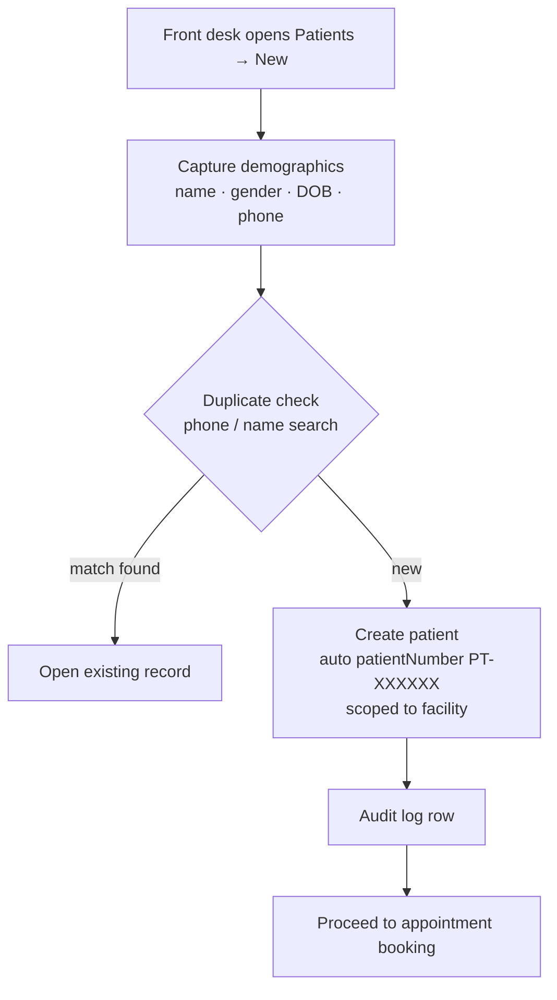

### 2. Appointment booking (`appointment`)

```mermaid
flowchart TD
    A[Select patient] --> B[Choose clinic + doctor + slot]
    B --> C[Create appointment · status BOOKED]
    C --> D{Patient arrives?}
    D -->|yes| E[Check-in · status CHECKED_IN\njoins queue]
    D -->|no-show| F[Remains BOOKED / rebooked]
    E --> G[Triage]
```

### 3. Queue management (`queue`)

```mermaid
flowchart TD
    A[CHECKED_IN appointments] --> B[Facility/branch queue\nordered by check-in time + priority]
    B --> C[Triage station pulls next]
    C --> D[Triage complete → READY_FOR_DOCTOR]
    D --> E[Doctor queue per clinician]
    E --> F[Doctor starts consult → IN_CONSULTATION]
    F --> G[Consult completed → COMPLETED\nleaves queue]
```

### 4. Triage (`triage`)

```mermaid
flowchart TD
    A[Nurse selects patient from queue] --> B[Record vitals\nBP · temp · pulse · SpO2 · weight]
    B --> C[Assign priority NORMAL/URGENT]
    C --> D[Complete triage]
    D --> E[Appointment → READY_FOR_DOCTOR]
```

### 5. Consultation (`consultation`)

```mermaid
flowchart TD
    A[Doctor opens consultation workspace] --> B[Chief complaint · history · examination]
    B --> C[Diagnosis - ICD-10 catalog assisted]
    C --> D{Orders}
    D --> E[Lab orders]
    D --> F[Prescriptions]
    D --> G[Referral / admission]
    C --> H[Treatment plan + notes]
    H --> I[Complete consultation\nauto-bills consultation fee]
    I --> J[Appointment COMPLETED]
```

### 6. Laboratory workflow (`lab`, `doctor-lab-review`)

```mermaid
flowchart TD
    A[Lab order created\nfrom consult or direct] --> B[Auto-bill ordered tests]
    B --> C[Lab queue: pending samples]
    C --> D[Technician enters results\nlab.result.enter]
    D --> E{Verification}
    E -->|lab.result.verify| F[Verified results]
    F --> G[Doctor lab review queue]
    G --> H[Clinician reviews & signs off]
    H --> I[Results visible to patient portal\nif enabled]
```

### 7. Radiology workflow (`operational-module`)

```mermaid
flowchart TD
    A[Imaging request via operational module RADIOLOGY] --> B[Record created\nOperationalModuleRecord]
    B --> C[Auto/manual billing of procedure]
    C --> D[Imaging performed · findings captured]
    D --> E[Report attached to record]
    E --> F[Clinician review + module operations report]
```

### 8. Pharmacy workflow (`prescription`, `pharmacy`, `pharmacy-stock`)

```mermaid
flowchart TD
    A[Prescription from consultation] --> B[Pharmacy queue]
    B --> C{Stock check per item\nBranchMedicineStock}
    C -->|out of stock| D[Suggest alternatives /\npartial dispense]
    C -->|available| E[Dispense · pharmacy.dispense]
    E --> F[Stock decremented + movement journal]
    E --> G[Auto-bill dispensed items]
    H[Walk-in customer] --> I[OTC sale · otc.sale\nOtcSale + items + payment]
    I --> F
```

### 9. Billing (`billing`)

```mermaid
flowchart TD
    A[Clinical event\nconsult/lab/dispense/bed-day] --> B[addAutoInvoiceItem\nsourceModule traceability]
    B --> C[Open invoice per visit\nsubtotal/discount/tax → balance]
    C --> D[Cashier reviews invoice]
    D --> E{Payment method}
    E --> F[Cash]
    E --> G[M-PESA STK]
    E --> H[SHA coverage via claim]
    F & G & H --> I[recalculateInvoice\nbalance & status]
    I --> J{Balance zero?}
    J -->|yes| K[Close invoice]
    J -->|no| D
    K --> L[eTIMS fiscalization queued\nQR + CU number on receipt]
```

### 10. Payment processing (M-PESA detail)

```mermaid
flowchart TD
    A[Cashier requests STK push] --> B[Daraja OAuth token\ncached per facility]
    B --> C[STK push → CheckoutRequestID\nprompt lock + concurrency cap]
    C --> D{Callback / status poll}
    D -->|success| E[Payment COMPLETED\nidempotent receipt checks]
    D -->|failed / timeout| F[Payment FAILED\nresend possible]
    E --> G[Invoice recalculated → fiscalization]
    E --> H[Notification + audit row]
```

### 11. Inventory (`pharmacy-stock`, `master-catalog`)

```mermaid
flowchart TD
    A[Master medicine catalog] --> B[Branch stock records\nqty · buying/selling price]
    B --> C[Restock entries]
    B --> D[Dispense / OTC decrements]
    C & D --> E[PharmacyStockMovement journal]
    E --> F[Low-stock alerts + reports]
    F --> G[Stock adjustment · stock.adjust\naudited]
```

### 12. Procurement (`operational-module` + central store)

```mermaid
flowchart TD
    A[Department raises requisition\nProcurement module record] --> B[Approval per facility policy]
    B --> C[Purchase order to supplier]
    C --> D[Goods received → central store]
    D --> E[Stock records updated]
    E --> F[Invoice matched → finance]
```

### 13. Admission (`ipd`)

```mermaid
flowchart TD
    A[Doctor decides to admit] --> B[Select ward + free bed]
    B --> C[Create admission · bed OCCUPIED]
    C --> D[Daily bed-day charges → billing]
    C --> E[IPD clinical record\nvitals · notes · reviews · treatment chart]
    E --> F[Transfers between beds tracked]
```

### 14. Discharge (`ipd`, `ipd-clinical`)

```mermaid
flowchart TD
    A[Doctor initiates discharge] --> B[Discharge summary\ndiagnosis · course · medication]
    B --> C[Final bed-day billing posted]
    C --> D{Invoice settled?}
    D -->|no| E[Cashier settles balance]
    D -->|yes| F[discharge.complete permission]
    E --> F
    F --> G[Bed released → AVAILABLE]
    G --> H[Discharge PDF + audit row]
```

### 15. User authentication (`auth`)

```mermaid
flowchart TD
    A[Login form] --> B[POST /auth/login]
    B --> C{Lockout check\nfailed-attempt counters}
    C -->|locked| D[Delay + rejection]
    C -->|ok| E{bcrypt verify}
    E -->|fail| F[Increment counter + jittered delay]
    E -->|ok| G[Bump session version\nsingle active session]
    G --> H[Issue JWT + user + permissions]
    H --> I[Client stores token · loads /auth/me]
    I --> J[20-min inactivity auto-logout]
```

### 16. Role-based access control

```mermaid
flowchart TD
    A[Request with JWT] --> B[JwtStrategy validates token\n+ session version]
    B --> C[RolesGuard\nroute @Roles vs user role]
    C --> D[PermissionsGuard\n@Permissions vs ROLE_PERMISSIONS matrix]
    D --> E[StepUpGuard for sensitive routes]
    E --> F[ScopeService\nfacility/branch tenancy filter]
    F --> G[Handler executes]
    C & D & E -->|deny| X[403 Forbidden]
```

### 17. Notifications (`notification`)

```mermaid
flowchart TD
    A[Domain event\npayment · low stock · claim update] --> B[NotificationService.create]
    B --> C[(notifications table\nfacility/branch/staff targeting)]
    C --> D[Header bell + notifications page]
    D --> E[Mark read / resolve]
```

### 18. Reports (`reports`)

```mermaid
flowchart TD
    A[Manager opens Reports] --> B[Scoped aggregate queries\nbilling · IPD · modules · profit]
    B --> C[CacheService dashboard TTLs]
    C --> D[Charts + tables]
    D --> E[PDF/CSV export\nheavy jobs via queue]
```

### 19. Audit logging (`audit-log`)

```mermaid
flowchart TD
    A[Mutating request] --> B[AuditInterceptor\nactor · module · entity]
    C[Sensitive service actions] --> D[Explicit AuditLogService.create\nbefore/after payloads]
    B & D --> E[(audit_logs)]
    E --> F[Severity classification\n+ security notifications]
    F --> G[Audit browser · audit.read]
```

### 20. System startup

```mermaid
flowchart TD
    A[node dist/main] --> B[validateEnvironment\nfail fast on unsafe config]
    B --> C[NestFactory.create AppModule]
    C --> D[Security: x-powered-by off · trust proxy ·\nbody limits · CORS allow-list · headers]
    D --> E[Global pipes/filters/interceptors]
    E --> F[Module init: Prisma connect ·\nRedis optional · integration worker if enabled]
    F --> G[listen PORT → /health/live green]
```

### 21. Exception handling

```mermaid
flowchart TD
    A[Throw in handler/service] --> B{HttpException?}
    B -->|yes| C[Preserve status + message]
    B -->|no| D[Wrap as 500\ngeneric public message]
    C & D --> E[GlobalExceptionFilter envelope]
    E --> F[SafeLogger with X-Request-Id\nsecrets redacted]
    F --> G[Client shows toast/inline error\n401 → logout]
```

### Related

- [SYSTEM_ARCHITECTURE.md](#system-architecture) — request lifecycle
- [INTEGRATIONS.md](#integrations-overview) — eTIMS/DHA sequence diagrams
- [clinical-workflow.md](../clinical-workflow.md) — narrative clinical guide


---

# Part II — API

## API Reference

> Auto-generated from the NestJS controllers by
> `backend/scripts/generate-api-reference.mjs`. Regenerate after adding or
> changing routes: `cd backend && node scripts/generate-api-reference.mjs`.

**47 controllers · 341 endpoints**

### Conventions

- **Base URL**: the backend service root (e.g. `http://localhost:3000`).
- **Authentication**: routes guarded by `AuthGuard('jwt')` require
  `Authorization: Bearer <access token>` obtained from `POST /auth/login`.
  Controllers with no auth guard are public (webhooks, health, verification).
- **Authorization**: `Permissions` values are enforced by
  `PermissionsGuard` from the role→permission matrix in
  `backend/src/auth/permissions.ts`; `Roles` values by `RolesGuard`.
  `Step-up` marks routes requiring recent re-authentication
  (`StepUpGuard`).
- **Validation**: request bodies are validated by the global
  `ValidationPipe` (`whitelist`, `forbidNonWhitelisted`, `transform`)
  against the DTO listed per route (see `dto/` folder of each module).
- **Errors**: failures return the standard envelope produced by the global
  exception filter — `{ statusCode, message, error }` with appropriate
  HTTP status (400 validation, 401 unauthenticated, 403 forbidden,
  404 not found, 409/422 domain conflicts, 429 rate limited, 500 internal).
- **Correlation**: every response carries `X-Request-Id`; clients may
  supply their own via `X-Request-Id`/`X-Correlation-Id`.

### Endpoint index by module

- [ai-assistant](#module-ai-assistant)
- [app-root](#module-app-root)
- [appointment](#module-appointment)
- [audit-log](#module-audit-log)
- [auth](#module-auth)
- [billing](#module-billing)
- [branch](#module-branch)
- [clinic](#module-clinic)
- [clinical-safety](#module-clinical-safety)
- [consultation](#module-consultation)
- [department](#module-department)
- [doctor-lab-review](#module-doctor-lab-review)
- [enterprise](#module-enterprise)
- [facility](#module-facility)
- [facility-subscription](#module-facility-subscription)
- [feedback](#module-feedback)
- [integration](#module-integration)
- [ipd](#module-ipd)
- [ipd-clinical](#module-ipd-clinical)
- [lab](#module-lab)
- [master-catalog](#module-master-catalog)
- [notification](#module-notification)
- [operational-module](#module-operational-module)
- [patient](#module-patient)
- [patient-portal](#module-patient-portal)
- [pharmacy](#module-pharmacy)
- [pharmacy-stock](#module-pharmacy-stock)
- [prescription](#module-prescription)
- [prescription-item](#module-prescription-item)
- [queue](#module-queue)
- [reports](#module-reports)
- [resilience](#module-resilience)
- [role](#module-role)
- [settings](#module-settings)
- [sha-claims](#module-sha-claims)
- [staff](#module-staff)
- [triage](#module-triage)
- [user](#module-user)
- [user-location](#module-user-location)
- [user-review](#module-user-review)

### Module: ai-assistant

#### AiAssistantController

Source: `src/ai-assistant/ai-assistant.controller.ts` · Class guards: `AuthGuard('jwt')`

| Method | Path | Handler | Authorization | Request body (DTO) |
| --- | --- | --- | --- | --- |
| GET | `/ai-assistant/status` | getStatus | – | – |
| POST | `/ai-assistant/clinical-draft` | createClinicalDraft | – | `ClinicalAiRequestDto` |
| POST | `/ai-assistant/identity-ocr` | extractIdentity | – | `IdentityOcrRequestDto` |

### Module: app-root

#### AppController

Source: `src/app.controller.ts` · **Public (no class-level auth guard)**

| Method | Path | Handler | Authorization | Request body (DTO) |
| --- | --- | --- | --- | --- |
| GET | `/` | getHello | – | – |

### Module: appointment

#### AppointmentController

Source: `src/appointment/appointment.controller.ts` · Class guards: `AuthGuard('jwt')`

| Method | Path | Handler | Authorization | Request body (DTO) |
| --- | --- | --- | --- | --- |
| POST | `/appointments` | create | – | `CreateAppointmentDto` |
| GET | `/appointments` | findAll | – | – |
| GET | `/appointments/number/:appointmentNumber` | findByAppointmentNumber | – | – |
| GET | `/appointments/:id` | findOne | – | – |
| PATCH | `/appointments/:id` | update | – | `UpdateAppointmentDto` |
| PATCH | `/appointments/:id/check-in` | checkIn | – | – |
| PATCH | `/appointments/:id/start-consultation` | startConsultation | – | – |
| PATCH | `/appointments/:id/complete` | completeAppointment | – | – |
| DELETE | `/appointments/:id` | remove | – | – |

### Module: audit-log

#### AuditLogController

Source: `src/audit-log/audit-log.controller.ts` · Class guards: `AuthGuard('jwt'), RolesGuard`

| Method | Path | Handler | Authorization | Request body (DTO) |
| --- | --- | --- | --- | --- |
| POST | `/audit-logs` | create | – | `CreateAuditLogDto` |
| GET | `/audit-logs` | findAll | – | – |
| GET | `/audit-logs/export` | exportAuditLogs | – | – |
| GET | `/audit-logs/module/:moduleName` | findByModule | – | – |
| GET | `/audit-logs/entity/:entityType/:entityId` | findByEntity | – | – |
| GET | `/audit-logs/:id` | findOne | – | – |

### Module: auth

#### AuthTestController

Source: `src/auth/auth-test.controller.ts` · Class guards: `JwtAuthGuard, RolesGuard`

| Method | Path | Handler | Authorization | Request body (DTO) |
| --- | --- | --- | --- | --- |
| GET | `/auth-test/admin-only` | adminOnly | roles: SUPER_ADMIN, ADMIN | – |
| GET | `/auth-test/doctor-only` | doctorOnly | roles: DOCTOR | – |
| GET | `/auth-test/lab-only` | labOnly | roles: LAB_TECH | – |

#### AuthController

Source: `src/auth/auth.controller.ts` · **Public (no class-level auth guard)**

| Method | Path | Handler | Authorization | Request body (DTO) |
| --- | --- | --- | --- | --- |
| POST | `/auth/login` | login | – | `LoginDto` |
| POST | `/auth/forgot-password` | forgotPassword | – | `ForgotPasswordDto` |
| POST | `/auth/reset-password` | resetPassword | – | `ResetPasswordDto` |
| GET | `/auth/me` | getProfile | – | – |
| POST | `/auth/accept-deactivation` | acceptDeactivation | – | – |
| POST | `/auth/step-up` | createStepUpToken | – | `StepUpDto` |

### Module: billing

#### BillingController

Source: `src/billing/billing.controller.ts` · Class guards: `AuthGuard('jwt'), PermissionsGuard, StepUpGuard`

| Method | Path | Handler | Authorization | Request body (DTO) |
| --- | --- | --- | --- | --- |
| POST | `/billing/services` | createBillingService | `billing.write` · roles: SUPER_ADMIN, ADMIN, FACILITY_ADMIN · guards: RolesGuard | `CreateBillingServiceDto` |
| GET | `/billing/services` | getAllBillingServices | `billing.read` | – |
| GET | `/billing/tariffs/pricing-template` | getServiceTariffPricingTemplate | `billing.write` · roles: SUPER_ADMIN, ADMIN, FACILITY_ADMIN · guards: RolesGuard | – |
| POST | `/billing/tariffs/pricing-import` | importServiceTariffs | `billing.write` · roles: SUPER_ADMIN, ADMIN, FACILITY_ADMIN · guards: RolesGuard | `ImportServiceTariffsCsvDto` |
| POST | `/billing/tariffs` | createServiceTariff | `billing.write` · roles: SUPER_ADMIN, ADMIN, FACILITY_ADMIN · guards: RolesGuard | `CreateServiceTariffDto` |
| GET | `/billing/tariffs` | getServiceTariffs | `billing.read` | – |
| PATCH | `/billing/tariffs/:id` | updateServiceTariff | `billing.write` · roles: SUPER_ADMIN, ADMIN, FACILITY_ADMIN · guards: RolesGuard | `UpdateServiceTariffDto` |
| POST | `/billing/invoices` | createInvoice | `billing.write` | `CreateInvoiceDto` |
| POST | `/billing/patients/:id/open-invoice` | openPatientInvoice | `billing.write` | `OpenPatientInvoiceDto` |
| GET | `/billing/patients/:id/workspace` | getPatientBillingWorkspace | `billing.read` | – |
| POST | `/billing/admissions/:id/bed-charge` | postAdmissionBedCharge | `billing.write` | `PostBedChargeDto` |
| GET | `/billing/invoices` | getAllInvoices | `billing.read` | – |
| GET | `/billing/invoices/:id/pdf` | downloadInvoicePdf | `billing.read` | – |
| GET | `/billing/invoices/verify/public` | verifyInvoicePublic | – | – |
| GET | `/billing/invoices/verify/public.pdf` | downloadVerifiedInvoicePdf | – | – |
| GET | `/billing/invoices/:id` | getInvoiceById | `billing.read` | – |
| POST | `/billing/invoices/:id/items` | addInvoiceItem | `billing.write` | `AddInvoiceItemDto` |
| POST | `/billing/invoices/:id/close` | closeInvoice | `billing.write` | – |
| PATCH | `/billing/invoice-items/:id` | updateInvoiceItem | `billing.write` | `UpdateInvoiceItemDto` |
| PATCH | `/billing/invoice-items/:id/remove` | removeInvoiceItem | `billing.write` | `RemoveInvoiceItemDto` |
| GET | `/billing/patient/:patientNumber` | getPatientBillingByPatientNumber | `billing.read` | – |
| POST | `/billing/payments/cash` | createCashPayment | `payment.collect` | `CreateCashPaymentDto` |
| GET | `/billing/payments/:id/receipt.pdf` | downloadPaymentReceiptPdf | `billing.read` | – |
| POST | `/billing/payments/mpesa/request` | createMpesaPaymentRequest | `payment.collect` | `CreateMpesaPaymentRequestDto` |
| POST | `/billing/payments/:id/mpesa/resend` | resendMpesaPaymentRequest | `payment.collect` | – |
| POST | `/billing/payments/mpesa/confirm` | confirmMpesaPayment | – | `ConfirmMpesaPaymentDto` |
| PATCH | `/billing/payments/mpesa/fail/:checkoutRequestId` | failMpesaPayment | `payment.manual_confirm` · step-up | – |
| GET | `/billing/payments/mpesa/status/:checkoutRequestId` | getMpesaPaymentStatus | `payment.collect` | – |
| GET | `/billing/dashboard` | getBillingDashboard | `billing.read` | – |
| GET | `/billing/revenue-integrity` | getRevenueIntegrity | `reports.read` | – |
| GET | `/billing/cashier-close` | getCashierClose | `reports.read` | – |

#### MpesaCallbackController

Source: `src/billing/billing.controller.ts` · **Public (no class-level auth guard)**

| Method | Path | Handler | Authorization | Request body (DTO) |
| --- | --- | --- | --- | --- |
| POST | `/billing/payments/mpesa/callback` | handleCallback | – | `unknown` |

#### BillingPublicController

Source: `src/billing/billing.controller.ts` · **Public (no class-level auth guard)**

| Method | Path | Handler | Authorization | Request body (DTO) |
| --- | --- | --- | --- | --- |
| GET | `/billing-public/invoices/verify` | verifyInvoice | – | – |
| GET | `/billing-public/invoices/verify.pdf` | downloadInvoicePdf | – | – |

#### PayheroBillingController

Source: `src/billing/payhero.controller.ts` · Class guards: `AuthGuard('jwt'), PermissionsGuard`

| Method | Path | Handler | Authorization | Request body (DTO) |
| --- | --- | --- | --- | --- |
| POST | `/billing/payments/payhero/request` | createPayheroPaymentRequest | `payment.collect` | `CreatePayheroPaymentRequestDto` |
| GET | `/billing/payments/payhero/status/:paymentId` | getPayheroPaymentStatus | `payment.collect` | – |

#### PayheroCallbackController

Source: `src/billing/payhero.controller.ts` · **Public (no class-level auth guard)**

| Method | Path | Handler | Authorization | Request body (DTO) |
| --- | --- | --- | --- | --- |
| POST | `/billing/payments/payhero/callback` | handleCallback | – | `Record<string` |

### Module: branch

#### BranchController

Source: `src/branch/branch.controller.ts` · Class guards: `AuthGuard('jwt')`

| Method | Path | Handler | Authorization | Request body (DTO) |
| --- | --- | --- | --- | --- |
| POST | `/branches` | create | roles: SUPER_ADMIN, ADMIN, FACILITY_ADMIN · guards: RolesGuard | `CreateBranchDto` |
| GET | `/branches` | findAll | – | – |
| GET | `/branches/facility/:facilityId` | findByFacility | – | – |
| GET | `/branches/code/:code` | findByCode | – | – |
| GET | `/branches/:id` | findOne | – | – |
| PATCH | `/branches/:id` | update | roles: SUPER_ADMIN, ADMIN, FACILITY_ADMIN · guards: RolesGuard | `UpdateBranchDto` |
| DELETE | `/branches/:id` | remove | roles: SUPER_ADMIN, ADMIN, FACILITY_ADMIN · guards: RolesGuard | – |
| POST | `/branches/access/grant` | grantUserBranchAccess | roles: SUPER_ADMIN, ADMIN, FACILITY_ADMIN · guards: RolesGuard | `GrantUserBranchAccessDto` |
| GET | `/branches/access/user/:userId` | getUserBranchAccesses | – | – |
| PATCH | `/branches/access/user/home-branch` | setUserHomeBranch | roles: SUPER_ADMIN, ADMIN, FACILITY_ADMIN · guards: RolesGuard | `SetUserHomeBranchDto` |

### Module: clinic

#### ClinicController

Source: `src/clinic/clinic.controller.ts` · Class guards: `AuthGuard('jwt')`

| Method | Path | Handler | Authorization | Request body (DTO) |
| --- | --- | --- | --- | --- |
| POST | `/clinics` | create | roles: SUPER_ADMIN, ADMIN, FACILITY_ADMIN · guards: RolesGuard | `CreateClinicDto` |
| GET | `/clinics` | findAll | – | – |
| GET | `/clinics/facility/:facilityId` | findByFacility | – | – |
| GET | `/clinics/branch/:branchId` | findByBranch | – | – |
| GET | `/clinics/code/:code` | findByCode | – | – |
| GET | `/clinics/:id` | findOne | – | – |
| PATCH | `/clinics/:id` | update | roles: SUPER_ADMIN, ADMIN, FACILITY_ADMIN · guards: RolesGuard | `UpdateClinicDto` |
| DELETE | `/clinics/:id` | remove | roles: SUPER_ADMIN, ADMIN, FACILITY_ADMIN · guards: RolesGuard | – |

### Module: clinical-safety

#### ClinicalSafetyController

Source: `src/clinical-safety/clinical-safety.controller.ts` · Class guards: `AuthGuard('jwt'), PermissionsGuard`

| Method | Path | Handler | Authorization | Request body (DTO) |
| --- | --- | --- | --- | --- |
| POST | `/clinical-safety/evaluate` | evaluate | `consultation.write` | `EvaluateClinicalSafetyDto` |

### Module: consultation

#### ConsultationController

Source: `src/consultation/consultation.controller.ts` · Class guards: `AuthGuard('jwt')`

| Method | Path | Handler | Authorization | Request body (DTO) |
| --- | --- | --- | --- | --- |
| POST | `/consultations` | create | – | `CreateConsultationDto` |
| GET | `/consultations` | findAll | – | – |
| GET | `/consultations/:id/workspace` | getWorkspace | – | – |
| GET | `/consultations/number/:consultationNumber` | findByConsultationNumber | – | – |
| GET | `/consultations/appointment/:appointmentId` | findByAppointmentId | – | – |
| GET | `/consultations/patient/:patientId` | findByPatientId | – | – |
| GET | `/consultations/:id` | findOne | – | – |
| PATCH | `/consultations/:id` | update | – | `UpdateConsultationDto` |
| PATCH | `/consultations/:id/complete` | complete | – | – |
| DELETE | `/consultations/:id` | remove | – | – |

### Module: department

#### DepartmentController

Source: `src/department/department.controller.ts` · Class guards: `AuthGuard('jwt')`

| Method | Path | Handler | Authorization | Request body (DTO) |
| --- | --- | --- | --- | --- |
| POST | `/departments` | create | roles: SUPER_ADMIN, ADMIN, FACILITY_ADMIN · guards: RolesGuard | `CreateDepartmentDto` |
| GET | `/departments` | findAll | – | – |
| GET | `/departments/facility/:facilityId` | findByFacility | – | – |
| GET | `/departments/branch/:branchId` | findByBranch | – | – |
| GET | `/departments/code/:code` | findByCode | – | – |
| GET | `/departments/:id` | findOne | – | – |
| PATCH | `/departments/:id` | update | roles: SUPER_ADMIN, ADMIN, FACILITY_ADMIN · guards: RolesGuard | `UpdateDepartmentDto` |
| DELETE | `/departments/:id` | remove | roles: SUPER_ADMIN, ADMIN, FACILITY_ADMIN · guards: RolesGuard | – |

### Module: doctor-lab-review

#### DoctorLabReviewController

Source: `src/doctor-lab-review/doctor-lab-review.controller.ts` · **Public (no class-level auth guard)**

| Method | Path | Handler | Authorization | Request body (DTO) |
| --- | --- | --- | --- | --- |
| GET | `/doctor-lab-review/appointment/:appointmentId` | getOrdersByAppointment | – | – |
| GET | `/doctor-lab-review/order/:orderId` | getSingleOrderReview | – | – |
| GET | `/doctor-lab-review/doctor/:doctorId` | getDoctorPendingReviews | – | – |

### Module: enterprise

#### EnterpriseController

Source: `src/enterprise/enterprise.controller.ts` · **Public (no class-level auth guard)**

| Method | Path | Handler | Authorization | Request body (DTO) |
| --- | --- | --- | --- | --- |
| GET | `/enterprise/status` | getStatus | – | – |

### Module: facility

#### FacilityController

Source: `src/facility/facility.controller.ts` · Class guards: `AuthGuard('jwt')`

| Method | Path | Handler | Authorization | Request body (DTO) |
| --- | --- | --- | --- | --- |
| POST | `/facilities` | create | roles: SUPER_ADMIN, ADMIN, FACILITY_ADMIN · guards: RolesGuard | `CreateFacilityDto` |
| GET | `/facilities` | findAll | – | – |
| GET | `/facilities/default` | findDefault | – | – |
| GET | `/facilities/code/:code` | findByCode | – | – |
| GET | `/facilities/:id` | findOne | – | – |
| PATCH | `/facilities/:id` | update | roles: SUPER_ADMIN, ADMIN, FACILITY_ADMIN · guards: RolesGuard | `UpdateFacilityDto` |
| DELETE | `/facilities/:id` | remove | roles: SUPER_ADMIN, ADMIN, FACILITY_ADMIN · guards: RolesGuard | – |

### Module: facility-subscription

#### FacilitySubscriptionController

Source: `src/facility-subscription/facility-subscription.controller.ts` · Class guards: `AuthGuard('jwt')`

| Method | Path | Handler | Authorization | Request body (DTO) |
| --- | --- | --- | --- | --- |
| GET | `/facility-subscriptions/my-status` | getMyStatus | – | – |
| GET | `/facility-subscriptions/platform` | findPlatform | roles: SUPER_ADMIN · guards: RolesGuard | – |
| POST | `/facility-subscriptions/payments` | recordPayment | roles: SUPER_ADMIN · guards: RolesGuard | `RecordFacilitySubscriptionPaymentDto` |

### Module: feedback

#### FeedbackController

Source: `src/feedback/feedback.controller.ts` · Class guards: `AuthGuard('jwt')`

| Method | Path | Handler | Authorization | Request body (DTO) |
| --- | --- | --- | --- | --- |
| POST | `/feedback` | create | – | `CreateFeedbackDto` |
| GET | `/feedback/mine` | findMine | – | – |
| GET | `/feedback/platform` | findPlatform | roles: SUPER_ADMIN · guards: RolesGuard | – |
| PATCH | `/feedback/:id/reply` | reply | roles: SUPER_ADMIN · guards: RolesGuard | `ReplyFeedbackDto` |

### Module: integration

#### DhaController

Source: `src/integration/dha/dha.controller.ts` · Class guards: `AuthGuard('jwt'), PermissionsGuard`

| Method | Path | Handler | Authorization | Request body (DTO) |
| --- | --- | --- | --- | --- |
| GET | `/integrations/dha/status` | getStatus | `billing.read` | – |
| POST | `/integrations/dha/patients/verify` | verifyPatient | `patient.read` | `VerifyPatientDto` |
| POST | `/integrations/dha/practitioners/verify` | verifyPractitioner | `users.manage` | `VerifyPractitionerDto` |
| POST | `/integrations/dha/facilities/verify` | verifyFacility | `billing.read` | `VerifyFacilityDto` |
| POST | `/integrations/dha/eligibility` | checkEligibility | `billing.read` | `CheckEligibilityDto` |
| POST | `/integrations/dha/consent` | recordConsent | `patient.write` | `RecordConsentDto` |
| POST | `/integrations/dha/referrals` | submitReferral | `consultation.write` | `SubmitReferralDto` |
| POST | `/integrations/dha/encounters/consultation/:consultationId` | submitEncounter | `consultation.write` | – |
| GET | `/integrations/dha/transactions` | listTransactions | `billing.read` | – |

#### EtimsController

Source: `src/integration/etims/etims.controller.ts` · Class guards: `AuthGuard('jwt'), PermissionsGuard`

| Method | Path | Handler | Authorization | Request body (DTO) |
| --- | --- | --- | --- | --- |
| GET | `/integrations/etims/status` | getStatus | `billing.read` | – |
| GET | `/integrations/etims/invoices/:invoiceId` | getInvoiceFiscalStatus | `billing.read` | – |
| POST | `/integrations/etims/invoices/:invoiceId/submit` | submitInvoice | `billing.write` | – |
| POST | `/integrations/etims/invoices/:invoiceId/credit-note` | createCreditNote | `billing.write` | `CreateEtimsAmendmentDto` |
| POST | `/integrations/etims/invoices/:invoiceId/debit-note` | createDebitNote | `billing.write` | `CreateEtimsAmendmentDto` |
| POST | `/integrations/etims/invoices/:invoiceId/cancel` | cancelInvoice | `billing.write` | `CancelEtimsInvoiceDto` |
| POST | `/integrations/etims/sync` | syncNow | `billing.write` | – |
| GET | `/integrations/etims/queue/dead-letters` | listDeadLetters | `billing.read` | – |
| POST | `/integrations/etims/queue/:requestId/requeue` | requeue | `billing.write` | – |

### Module: ipd

#### IpdController

Source: `src/ipd/ipd.controller.ts` · Class guards: `AuthGuard('jwt')`

| Method | Path | Handler | Authorization | Request body (DTO) |
| --- | --- | --- | --- | --- |
| POST | `/ipd/wards` | createWard | – | `CreateWardDto` |
| GET | `/ipd/wards` | getAllWards | – | – |
| POST | `/ipd/beds` | createBed | – | `CreateBedDto` |
| GET | `/ipd/beds` | getAllBeds | – | – |
| POST | `/ipd/admissions` | createAdmission | – | `CreateAdmissionDto` |
| GET | `/ipd/admissions` | getAllAdmissions | – | – |
| GET | `/ipd/admissions/active` | getActiveAdmissions | – | – |
| GET | `/ipd/admissions/:id` | getAdmissionById | – | – |
| PATCH | `/ipd/wards/:id` | updateWard | – | `UpdateWardDto` |
| PATCH | `/ipd/beds/:id` | updateBed | – | `UpdateBedDto` |
| PATCH | `/ipd/beds/:id/status` | updateBedStatus | – | `UpdateBedStatusDto` |
| PATCH | `/ipd/admissions/:id/transfer-bed` | transferAdmissionBed | – | `TransferAdmissionBedDto` |
| PATCH | `/ipd/admissions/:id/discharge` | dischargeAdmission | – | – |

### Module: ipd-clinical

#### IpdClinicalController

Source: `src/ipd-clinical/ipd-clinical.controller.ts` · Class guards: `AuthGuard('jwt')`

| Method | Path | Handler | Authorization | Request body (DTO) |
| --- | --- | --- | --- | --- |
| POST | `/ipd-clinical/progress-notes` | createProgressNote | – | `CreateIpdProgressNoteDto` |
| GET | `/ipd-clinical/progress-notes/admission/:admissionId` | getProgressNotesByAdmission | – | – |
| POST | `/ipd-clinical/vitals` | createVitalRecord | – | `CreateIpdVitalRecordDto` |
| GET | `/ipd-clinical/vitals/admission/:admissionId` | getVitalRecordsByAdmission | – | – |
| POST | `/ipd-clinical/doctor-reviews` | createDoctorReview | – | `CreateIpdDoctorReviewDto` |
| GET | `/ipd-clinical/doctor-reviews/admission/:admissionId` | getDoctorReviewsByAdmission | – | – |
| POST | `/ipd-clinical/treatment-chart` | createTreatmentEntry | – | `CreateTreatmentChartEntryDto` |
| GET | `/ipd-clinical/treatment-chart/admission/:admissionId` | getTreatmentChartByAdmission | – | – |
| PATCH | `/ipd-clinical/treatment-chart/:entryId/administer` | administerTreatment | – | – |
| POST | `/ipd-clinical/admissions/:admissionId/medicine-administration` | administerAdmissionMedicine | – | `AdministerIpdMedicineDto` |
| POST | `/ipd-clinical/discharge-summary` | createOrUpdateDischargeSummary | – | `CreateIpdDischargeSummaryDto` |
| GET | `/ipd-clinical/discharge-summary/admission/:admissionId` | getDischargeSummaryByAdmission | – | – |
| GET | `/ipd-clinical/lab-orders/admission/:admissionId` | getAdmissionLabOrders | – | – |
| GET | `/ipd-clinical/dashboard/admission/:admissionId` | getAdmissionClinicalDashboard | – | – |
| GET | `/ipd-clinical/documents/admissions/:admissionId/medical-summary.pdf` | downloadMedicalSummaryPdf | – | – |
| GET | `/ipd-clinical/documents/admissions/:admissionId/discharge-summary.pdf` | downloadDischargeSummaryPdf | – | – |
| GET | `/ipd-clinical/documents/admissions/:admissionId/treatment-chart.pdf` | downloadTreatmentChartPdf | – | – |

### Module: lab

#### LabController

Source: `src/lab/lab.controller.ts` · Class guards: `AuthGuard('jwt')`

| Method | Path | Handler | Authorization | Request body (DTO) |
| --- | --- | --- | --- | --- |
| POST | `/lab/tests` | createTestCatalogItem | roles: SUPER_ADMIN, ADMIN, FACILITY_ADMIN · guards: RolesGuard | `CreateLabTestDto` |
| GET | `/lab/tests` | getAllTests | – | – |
| POST | `/lab/orders` | createOrder | – | `CreateLabOrderDto` |
| GET | `/lab/orders` | getAllOrders | – | – |
| GET | `/lab/orders/:id` | getOrderById | – | – |
| GET | `/lab/queue` | getLabQueue | – | – |
| POST | `/lab/results` | createResult | – | `CreateLabResultDto` |
| GET | `/lab/orders/:id/results` | getResultsByOrder | – | – |

### Module: master-catalog

#### MasterCatalogController

Source: `src/master-catalog/master-catalog.controller.ts` · Class guards: `AuthGuard('jwt'), RolesGuard`

| Method | Path | Handler | Authorization | Request body (DTO) |
| --- | --- | --- | --- | --- |
| GET | `/master-catalog/overview` | getOverview | – | – |
| GET | `/master-catalog/medicines` | getMedicines | – | – |
| GET | `/master-catalog/medicines/template` | getMedicinesTemplate | – | – |
| POST | `/master-catalog/medicines/import` | importMedicines | – | `ImportMasterCatalogCsvDto` |
| GET | `/master-catalog/billing-services` | getBillingServices | – | – |
| GET | `/master-catalog/billing-services/template` | getBillingServicesTemplate | – | – |
| POST | `/master-catalog/billing-services/import` | importBillingServices | – | `ImportMasterCatalogCsvDto` |
| GET | `/master-catalog/lab-tests` | getLabTests | – | – |
| GET | `/master-catalog/lab-tests/template` | getLabTestsTemplate | – | – |
| POST | `/master-catalog/lab-tests/import` | importLabTests | – | `ImportMasterCatalogCsvDto` |

### Module: notification

#### NotificationController

Source: `src/notification/notification.controller.ts` · Class guards: `AuthGuard('jwt')`

| Method | Path | Handler | Authorization | Request body (DTO) |
| --- | --- | --- | --- | --- |
| POST | `/notifications` | create | – | `CreateNotificationDto` |
| GET | `/notifications` | findAll | – | – |
| GET | `/notifications/stats` | getStats | – | – |
| GET | `/notifications/recipients` | getRecipients | – | – |
| GET | `/notifications/branch-alerts` | getBranchAlerts | – | – |
| GET | `/notifications/pharmacy-alerts` | getPharmacyAlerts | – | – |
| GET | `/notifications/unresolved-count` | getUnresolvedCount | – | – |
| GET | `/notifications/pharmacist-dashboard/:staffId` | getPharmacistDashboardAlerts | – | – |
| GET | `/notifications/cashier-dashboard/:staffId` | getCashierDashboardAlerts | – | – |
| GET | `/notifications/admin-operations/:userId` | getAdminOperationsAlerts | – | – |
| GET | `/notifications/user/:userId` | findForUser | – | – |
| GET | `/notifications/staff/:staffId` | findForStaff | – | – |
| GET | `/notifications/:id` | findOne | – | – |
| PATCH | `/notifications/read-all` | markScopedAsRead | – | – |
| PATCH | `/notifications/:id/read` | markAsRead | – | – |
| PATCH | `/notifications/:id/resolve` | resolve | – | `ResolveNotificationDto` |
| PATCH | `/notifications/staff/:staffId/read-all` | markAllForStaffAsRead | – | – |
| PATCH | `/notifications/user/:userId/read-all` | markAllForUserAsRead | – | – |

### Module: operational-module

#### OperationalModuleController

Source: `src/operational-module/operational-module.controller.ts` · Class guards: `AuthGuard('jwt')`

| Method | Path | Handler | Authorization | Request body (DTO) |
| --- | --- | --- | --- | --- |
| GET | `/operational-modules/summary` | getGlobalSummary | – | – |
| GET | `/operational-modules/:moduleSlug/records` | findModuleRecords | – | – |
| POST | `/operational-modules/:moduleSlug/records` | create | – | `CreateOperationalModuleRecordDto` |
| GET | `/operational-modules/:moduleSlug/records/:id` | findOne | – | – |
| PATCH | `/operational-modules/:moduleSlug/records/:id` | update | – | `UpdateOperationalModuleRecordDto` |

### Module: patient

#### PatientController

Source: `src/patient/patient.controller.ts` · Class guards: `AuthGuard('jwt')`

| Method | Path | Handler | Authorization | Request body (DTO) |
| --- | --- | --- | --- | --- |
| POST | `/patients` | create | – | `CreatePatientDto` |
| GET | `/patients` | findAll | – | – |
| GET | `/patients/search/suggestions` | searchSuggestions | – | – |
| POST | `/patients/duplicate-check` | duplicateCheck | – | `PossibleDuplicatePatientDto` |
| GET | `/patients/number/:patientNumber` | findByPatientNumber | – | – |
| GET | `/patients/:id` | findOne | – | – |
| PATCH | `/patients/:id` | update | – | `UpdatePatientDto` |
| DELETE | `/patients/:id` | remove | – | – |

### Module: patient-portal

#### PatientPortalController

Source: `src/patient-portal/patient-portal.controller.ts` · Class guards: `AuthGuard('jwt')`

| Method | Path | Handler | Authorization | Request body (DTO) |
| --- | --- | --- | --- | --- |
| GET | `/patient-portal/profile` | getProfile | – | – |
| GET | `/patient-portal/appointments` | getAppointments | – | – |
| GET | `/patient-portal/invoices` | getInvoices | – | – |
| GET | `/patient-portal/lab-results` | getLabResults | – | – |
| GET | `/patient-portal/prescriptions` | getPrescriptions | – | – |

### Module: pharmacy

#### OtcSalesController

Source: `src/pharmacy/otc-sales.controller.ts` · Class guards: `AuthGuard('jwt'), PermissionsGuard`

| Method | Path | Handler | Authorization | Request body (DTO) |
| --- | --- | --- | --- | --- |
| GET | `/pharmacy/otc/medicines/search` | searchMedicines | – | – |
| POST | `/pharmacy/otc/sales` | createSale | – | `CreateOtcSaleDto` |
| GET | `/pharmacy/otc/sales` | listSales | – | – |
| GET | `/pharmacy/otc/sales/:id` | getSale | – | – |
| POST | `/pharmacy/otc/sales/:id/items` | addItem | – | `OtcSaleItemInputDto` |
| PATCH | `/pharmacy/otc/sales/:id/items/:itemId` | updateItem | – | `UpdateOtcSaleItemDto` |
| DELETE | `/pharmacy/otc/sales/:id/items/:itemId` | removeItem | – | – |
| POST | `/pharmacy/otc/sales/:id/pay` | recordPayment | – | `RecordOtcSalePaymentDto` |
| POST | `/pharmacy/otc/sales/:id/complete` | completeSale | – | – |
| GET | `/pharmacy/otc/sales/:id/receipt.pdf` | downloadReceiptPdf | – | – |
| POST | `/pharmacy/otc/sales/:id/cancel` | cancelSale | – | – |

#### PharmacyController

Source: `src/pharmacy/pharmacy.controller.ts` · Class guards: `AuthGuard('jwt'), PermissionsGuard`

| Method | Path | Handler | Authorization | Request body (DTO) |
| --- | --- | --- | --- | --- |
| POST | `/pharmacy/medicines` | createMedicine | `stock.adjust` | `CreateMedicineDto` |
| GET | `/pharmacy/medicines` | getAllMedicines | – | – |
| GET | `/pharmacy/medicines/:id` | getMedicineById | – | – |
| POST | `/pharmacy/prescriptions` | createPrescription | `consultation.write` | `CreatePrescriptionDto` |
| GET | `/pharmacy/prescriptions` | getAllPrescriptions | – | – |
| GET | `/pharmacy/prescriptions/:id` | getPrescriptionById | – | – |
| GET | `/pharmacy/queue` | getPharmacyQueue | `pharmacy.dispense` | – |
| PATCH | `/pharmacy/prescriptions/:id/dispense` | dispensePrescription | `pharmacy.dispense` | – |
| POST | `/pharmacy/direct-administrations` | directMedicineAdministration | `consultation.write` | `DirectMedicineAdministrationDto` |

### Module: pharmacy-stock

#### PharmacyStockController

Source: `src/pharmacy-stock/pharmacy-stock.controller.ts` · Class guards: `AuthGuard('jwt')`

| Method | Path | Handler | Authorization | Request body (DTO) |
| --- | --- | --- | --- | --- |
| POST | `/pharmacy-stock` | create | – | `CreateBranchMedicineStockDto` |
| GET | `/pharmacy-stock` | findAll | – | – |
| GET | `/pharmacy-stock/low-stock` | getLowStock | – | – |
| GET | `/pharmacy-stock/branch/:branchId/pricing-template` | getBranchPricingTemplate | – | – |
| POST | `/pharmacy-stock/branch/:branchId/pricing-import` | importBranchPricing | – | `ImportBranchPricingCsvDto` |
| GET | `/pharmacy-stock/branch/:branchId/search` | searchBranchMedicines | – | – |
| GET | `/pharmacy-stock/branch/:branchId` | findByBranch | – | – |
| GET | `/pharmacy-stock/branch/:branchId/medicine/:medicineId/alternatives` | findMedicineAlternatives | – | – |
| GET | `/pharmacy-stock/:id` | findOne | – | – |
| PATCH | `/pharmacy-stock/:id` | update | – | `UpdateBranchMedicineStockDto` |
| PATCH | `/pharmacy-stock/:id/add-stock/:quantity` | addStock | – | – |
| PATCH | `/pharmacy-stock/:stockId/restock` | restockBranchMedicine | – | `RestockBranchMedicineDto` |
| PATCH | `/pharmacy-stock/:id/deduct-stock/:quantity` | deductStock | – | – |

### Module: prescription

#### PrescriptionController

Source: `src/prescription/prescription.controller.ts` · Class guards: `AuthGuard('jwt'), PermissionsGuard`

| Method | Path | Handler | Authorization | Request body (DTO) |
| --- | --- | --- | --- | --- |
| POST | `/prescriptions` | create | `consultation.write` | `CreatePrescriptionDto` |
| GET | `/prescriptions` | findAll | – | – |
| GET | `/prescriptions/consultation/:consultationId` | findByConsultationId | – | – |
| GET | `/prescriptions/patient/:patientId` | findByPatientId | – | – |
| GET | `/prescriptions/:id` | findOne | – | – |
| PATCH | `/prescriptions/:id` | update | `consultation.write` | `UpdatePrescriptionDto` |
| DELETE | `/prescriptions/:id` | remove | `consultation.write` | – |

### Module: prescription-item

#### PrescriptionItemController

Source: `src/prescription-item/prescription-item.controller.ts` · Class guards: `AuthGuard('jwt'), PermissionsGuard`

| Method | Path | Handler | Authorization | Request body (DTO) |
| --- | --- | --- | --- | --- |
| POST | `/prescription-items` | create | `consultation.write` | `CreatePrescriptionItemDto` |
| GET | `/prescription-items/prescription/:prescriptionId` | findByPrescriptionId | – | – |
| GET | `/prescription-items/:id` | findOne | – | – |
| PATCH | `/prescription-items/:id` | update | `consultation.write` | `UpdatePrescriptionItemDto` |
| DELETE | `/prescription-items/:id` | remove | `consultation.write` | – |

### Module: queue

#### QueueController

Source: `src/queue/queue.controller.ts` · Class guards: `AuthGuard('jwt')`

| Method | Path | Handler | Authorization | Request body (DTO) |
| --- | --- | --- | --- | --- |
| GET | `/queue` | getFullQueue | – | – |
| GET | `/queue/today` | getTodayQueue | – | – |
| GET | `/queue/waiting` | getWaitingQueue | – | – |
| GET | `/queue/doctor/:doctorId` | getDoctorQueue | – | – |
| GET | `/queue/stats` | getQueueStats | – | – |

### Module: reports

#### ReportsController

Source: `src/reports/reports.controller.ts` · Class guards: `AuthGuard('jwt')`

| Method | Path | Handler | Authorization | Request body (DTO) |
| --- | --- | --- | --- | --- |
| GET | `/reports/dashboard` | getReportsDashboard | – | – |
| GET | `/reports/dashboard/export` | getReportsDashboardExport | – | – |
| GET | `/reports/modules` | getModuleOperationsReport | – | – |
| GET | `/reports/modules/export` | getModuleOperationsExport | – | – |
| GET | `/reports/dashboard-summary` | getDashboardSummary | – | – |
| GET | `/reports/opd` | getOpdAnalytics | – | – |
| GET | `/reports/billing` | getBillingAnalytics | – | – |
| GET | `/reports/lab` | getLabAnalytics | – | – |
| GET | `/reports/pharmacy` | getPharmacyAnalytics | – | – |
| GET | `/reports/otc-sales` | getOtcSalesReport | – | – |
| GET | `/reports/otc-sales/export` | getOtcSalesReportExport | – | – |
| GET | `/reports/profit` | getProfitAnalytics | – | – |
| GET | `/reports/profit/export` | getProfitAnalyticsExport | – | – |
| GET | `/reports/ipd` | getIpdAnalytics | – | – |
| GET | `/reports/doctor-workload` | getDoctorWorkload | – | – |
| GET | `/reports/system-health` | getSystemHealth | – | – |
| GET | `/reports/medical/consultations/:id.pdf` | downloadConsultationMedicalReportPdf | – | – |

### Module: resilience

#### HealthController

Source: `src/resilience/health.controller.ts` · **Public (no class-level auth guard)**

| Method | Path | Handler | Authorization | Request body (DTO) |
| --- | --- | --- | --- | --- |
| GET | `/health/live` | live | – | – |
| GET | `/health/ready` | ready | – | – |
| GET | `/health/deep` | deep | – | – |

### Module: role

#### RoleController

Source: `src/role/role.controller.ts` · Class guards: `AuthGuard('jwt'), RolesGuard`

| Method | Path | Handler | Authorization | Request body (DTO) |
| --- | --- | --- | --- | --- |
| POST | `/roles` | create | – | `CreateRoleDto` |
| GET | `/roles` | findAll | – | – |
| GET | `/roles/code/:code` | findByCode | – | – |
| GET | `/roles/:id` | findOne | – | – |
| PATCH | `/roles/:id` | update | – | `UpdateRoleDto` |
| DELETE | `/roles/:id` | remove | – | – |

### Module: settings

#### SettingsController

Source: `src/settings/settings.controller.ts` · Class guards: `AuthGuard('jwt'), RolesGuard`

| Method | Path | Handler | Authorization | Request body (DTO) |
| --- | --- | --- | --- | --- |
| POST | `/settings` | create | – | `CreateSettingDto` |
| POST | `/settings/seed-defaults` | seedDefaults | – | – |
| GET | `/settings` | findAll | – | – |
| GET | `/settings/public` | findPublic | – | – |
| GET | `/settings/category/:category` | findByCategory | – | – |
| GET | `/settings/key/:settingKey` | findByKey | – | – |
| GET | `/settings/:id` | findOne | – | – |
| PATCH | `/settings/:id` | update | – | `UpdateSettingDto` |
| PATCH | `/settings/key/:settingKey/value` | updateByKey | – | – |
| DELETE | `/settings/:id` | remove | – | – |

### Module: sha-claims

#### ShaClaimsController

Source: `src/sha-claims/sha-claims.controller.ts` · Class guards: `AuthGuard('jwt')`

| Method | Path | Handler | Authorization | Request body (DTO) |
| --- | --- | --- | --- | --- |
| GET | `/sha-claims` | findAll | – | – |
| GET | `/sha-claims/summary` | getSummary | – | – |
| GET | `/sha-claims/:id/pdf` | downloadClaimPdf | – | – |
| POST | `/sha-claims` | create | roles: SUPER_ADMIN, ADMIN, FACILITY_ADMIN · guards: RolesGuard | `CreateShaClaimDto` |
| PATCH | `/sha-claims/:id` | update | roles: SUPER_ADMIN, ADMIN, FACILITY_ADMIN · guards: RolesGuard | `UpdateShaClaimDto` |

### Module: staff

#### StaffController

Source: `src/staff/staff.controller.ts` · Class guards: `AuthGuard('jwt')`

| Method | Path | Handler | Authorization | Request body (DTO) |
| --- | --- | --- | --- | --- |
| POST | `/staff` | create | roles: SUPER_ADMIN, ADMIN, FACILITY_ADMIN · guards: RolesGuard | `CreateStaffDto` |
| GET | `/staff` | findAll | – | – |
| GET | `/staff/:id` | findOne | – | – |
| PATCH | `/staff/:id` | update | roles: SUPER_ADMIN, ADMIN, FACILITY_ADMIN · guards: RolesGuard | `UpdateStaffDto` |
| DELETE | `/staff/:id` | remove | roles: SUPER_ADMIN, ADMIN, FACILITY_ADMIN · guards: RolesGuard | – |

### Module: triage

#### TriageController

Source: `src/triage/triage.controller.ts` · Class guards: `AuthGuard('jwt')`

| Method | Path | Handler | Authorization | Request body (DTO) |
| --- | --- | --- | --- | --- |
| POST | `/triage` | create | – | `CreateTriageDto` |
| GET | `/triage` | findAll | – | – |
| GET | `/triage/waiting` | findWaiting | – | – |
| GET | `/triage/ready-for-doctor` | findReadyForDoctor | – | – |
| GET | `/triage/appointment/:appointmentId` | findByAppointmentId | – | – |
| GET | `/triage/:id` | findOne | – | – |
| PATCH | `/triage/:id/start` | startTriage | – | – |
| PATCH | `/triage/:id/complete` | completeTriage | – | `UpdateTriageDto` |

### Module: user

#### UserController

Source: `src/user/user.controller.ts` · Class guards: `AuthGuard('jwt'), RolesGuard`

| Method | Path | Handler | Authorization | Request body (DTO) |
| --- | --- | --- | --- | --- |
| POST | `/users` | create | – | `CreateUserDto` |
| GET | `/users` | findAll | – | – |
| GET | `/users/username/:username` | findByUsername | – | – |
| GET | `/users/email/:email` | findByEmail | – | – |
| GET | `/users/:id` | findOne | – | – |
| PATCH | `/users/:id` | update | – | `UpdateUserDto` |
| PATCH | `/users/:id/reset-password` | adminResetPassword | – | `AdminResetPasswordDto` |
| DELETE | `/users/:id` | remove | – | – |

### Module: user-location

#### UserLocationController

Source: `src/user-location/user-location.controller.ts` · Class guards: `AuthGuard('jwt')`

| Method | Path | Handler | Authorization | Request body (DTO) |
| --- | --- | --- | --- | --- |
| POST | `/user-locations/logout` | markLogout | – | – |
| POST | `/user-locations/precise` | recordPreciseLocation | – | `PreciseLocationDto` |
| GET | `/user-locations/platform/overview` | getPlatformOverview | roles: SUPER_ADMIN · guards: RolesGuard | – |
| GET | `/user-locations/platform/events` | getPlatformEvents | roles: SUPER_ADMIN · guards: RolesGuard | – |

### Module: user-review

#### UserReviewController

Source: `src/user-review/user-review.controller.ts` · **Public (no class-level auth guard)**

| Method | Path | Handler | Authorization | Request body (DTO) |
| --- | --- | --- | --- | --- |
| GET | `/reviews/public` | findPublicReviews | – | – |
| GET | `/reviews/me` | getMyReviewStatus | guards: AuthGuard('jwt') | – |
| POST | `/reviews/me` | upsertMyReview | guards: AuthGuard('jwt') | `UpsertUserReviewDto` |

### Key sequence diagrams

#### Login and authenticated request

```mermaid
sequenceDiagram
    participant C as Client (Next.js)
    participant A as POST /auth/login
    participant G as AuthGuard('jwt') + PermissionsGuard
    participant S as Domain service
    C->>A: { username, password }
    A->>A: bcrypt verify + lockout check + single-session version
    A-->>C: { accessToken (JWT), user, role, permissions }
    C->>G: GET /patients (Authorization: Bearer)
    G->>G: verify JWT, load session version, check permission
    G->>S: request user context (facility/branch scope)
    S-->>C: scoped data
```

#### M-PESA STK payment

```mermaid
sequenceDiagram
    participant UI as Billing UI
    participant B as POST /billing/payments/mpesa/request
    participant D as Safaricom Daraja
    participant CB as POST /billing/payments/mpesa/callback (public)
    UI->>B: { invoiceId, phoneNumber, amount }
    B->>D: OAuth + STK push
    D-->>B: CheckoutRequestID
    B-->>UI: pending payment record
    D->>CB: async result callback
    CB->>CB: confirm/fail payment, recalculate invoice
    CB->>CB: trigger eTIMS fiscalization (queued)
    UI->>B: GET /billing/payments/mpesa/status/:checkoutRequestId
    B-->>UI: COMPLETED / FAILED
```

#### Fiscalized billing event (eTIMS)

```mermaid
sequenceDiagram
    participant B as BillingService
    participant E as EtimsService
    participant Q as integration_outbound_requests
    participant W as IntegrationQueueWorker
    participant K as KRA eTIMS (mock/sandbox/production)
    B->>E: onBillingFinalized(invoiceId)
    E->>Q: create fiscal doc + enqueue (idempotent)
    W->>Q: claim due request
    W->>K: saveTrnsSalesOsdc
    K-->>W: CU invoice number + receipt signature
    W->>E: store CU data + QR, status ACCEPTED
```


---

# Part III — Security & Access

## Authentication

Implemented in [`backend/src/auth/`](../../backend/src/auth) (Passport JWT)
and consumed by the frontend `AuthProvider`.

### 1. Login flow

```mermaid
sequenceDiagram
    participant U as User
    participant FE as Next.js /login
    participant API as POST /auth/login
    participant DB as users table

    U->>FE: username + password
    FE->>API: credentials
    API->>DB: load user + role + staff + facility state
    API->>API: lockout check (failed attempts / lockedUntil)
    API->>API: progressive login delay (jittered,\ncapped by AUTH_FAILED_LOGIN_DELAY_MAX_MS)
    API->>API: bcrypt.compare(password, passwordHash)
    alt invalid
        API->>DB: increment failedLoginAttempts\nlock after MAX_FAILED_LOGIN_ATTEMPTS
        API-->>FE: 401 (audited)
    else valid
        API->>DB: reset counters, bump sessionVersion
        API-->>FE: { accessToken (JWT), user, role, permissions, scope }
        FE->>FE: store token (localStorage hms_access_token)
        FE->>API: GET /auth/me (hydrate session)
    end
```

Key mechanics (all verifiable in `auth.service.ts`):

- **Password hashing** — bcrypt (`bcryptjs`, cost 10). Password policy
  enforced by `password-policy.ts` (minimum length `PASSWORD_MIN_LENGTH`,
  default 12, complexity checks; unit-tested).
- **Brute-force protection** — per-user failed-attempt counter with
  account lock after `MAX_FAILED_LOGIN_ATTEMPTS`, plus a progressive,
  jittered delay on every attempt; rate limiter additionally caps
  `/auth/*` at `AUTH_RATE_LIMIT_MAX`/window per IP.
- **Single active session** — each login bumps `User.sessionVersion`;
  `JwtStrategy.validate` rejects tokens carrying an older version, so a
  new login invalidates all previous tokens.
- **Login blocks** — deactivated users, facilities with
  subscription/compliance login blocks, and pending-deactivation flows are
  enforced during validation.

### 2. Token & session management

| Aspect | Implementation |
| --- | --- |
| Token type | Signed JWT (HS256) — `JWT_SECRET` (min 32 chars; 48+ high-entropy enforced in production) |
| Lifetime | `JWT_EXPIRES_IN` (default `1d`) |
| Claims | `sub` (userId), username, roleId/code, staffId, facility/branch scope, sessionVersion |
| Transport | `Authorization: Bearer` header only (no cookies → no CSRF surface) |
| Storage (frontend) | `localStorage` `hms_access_token`; cleared on logout/401 |
| Revocation | Session-version bump (login, password change, admin reset) invalidates outstanding tokens |
| Idle timeout | Frontend auto-logout after 20 min inactivity (60s warning); activity events reset the timer |
| Session registry | `UserSession` rows track sessions; `user-location` module records IP/geo per session for the security dashboard |

### 3. Step-up re-authentication

Sensitive routes are annotated `@StepUpRequired()` and enforced by
`StepUpGuard` when `STEP_UP_ENFORCEMENT_ENABLED=true`: the client must
present a short-lived step-up token (obtained by re-entering the password,
TTL `STEP_UP_TTL_SECONDS`, default 300s) in addition to the session JWT.
Rollout is feature-flagged (disabled by default) so facilities can adopt
it without breaking existing clients.

### 4. Password reset & account recovery

- `PasswordResetToken` rows with expiry back the
  forgot/reset-password flow (`/forgot-password`, `/reset-password`
  pages). In development, `RETURN_DEV_RESET_TOKEN=true` returns the token
  in the response for testing; in production the token is delivered
  out-of-band.
- Admin-initiated resets (`users.manage`) bump the session version,
  logging the user out everywhere.

### 5. Patient portal authentication

The patient portal (`patient-portal` module + `/patient-access` pages) is
feature-flagged (`PATIENT_PORTAL_ENABLED`) and uses dedicated portal users
(`Patient.portalUserId → User`) with the `PATIENT` role restricted to
`patient.portal.read` — portal accounts can never access staff endpoints.

### 6. Machine-to-machine credentials

Outbound integrations authenticate independently of user sessions:
M-PESA Daraja OAuth (cached consumer-key tokens), KRA eTIMS device
credentials, DHA OAuth2 client credentials with cached single-flight
refresh. See [INTEGRATIONS.md](#integrations-overview).

### Related

- [AUTHORIZATION.md](#authorization) — roles, permissions, scoping
- [SECURITY.md](#security) — threat model and hardening


---

## Authorization

Three cooperating layers: **role-based access control** (route guards),
**fine-grained permissions** (role→permission matrix), and **tenant
scoping** (facility/branch isolation on every query).

### 1. Enforcement pipeline

```mermaid
flowchart LR
    REQ[Authenticated request] --> RG["RolesGuard\n@Roles('SUPER_ADMIN', ...)"]
    RG --> PG["PermissionsGuard\n@Permissions('billing.write')"]
    PG --> SG[StepUpGuard\nsensitive routes]
    SG --> SC[ScopeService\nfacility/branch filters + assertions]
    SC --> H[Handler]
    RG & PG & SG -->|deny| F403[403 Forbidden]
    SC -->|cross-tenant access| F403
```

Per-route requirements for all 341 endpoints are listed in
[API_REFERENCE.md](#api-reference).

### 2. Permission catalog

Defined in [`backend/src/auth/permissions.ts`](../../backend/src/auth/permissions.ts):

| Permission | Grants |
| --- | --- |
| `patient.read` / `patient.write` | View / register & update patients |
| `billing.read` / `billing.write` | View invoices & tariffs / create-modify billing |
| `payment.collect` | Record payments (cash, M-PESA prompts) |
| `payment.manual_confirm` | Manually confirm M-PESA payments |
| `mpesa.settings.update` | Manage facility M-PESA credentials |
| `lab.order` / `lab.result.enter` / `lab.result.verify` | Order tests / enter results / verify results |
| `pharmacy.dispense` / `otc.sale` / `stock.adjust` | Dispense / walk-in sales / stock corrections |
| `consultation.write` | Triage, consults, referrals, encounters |
| `admission.manage` / `discharge.complete` | IPD admissions / discharge sign-off |
| `reports.read` / `audit.read` | Analytics / audit browser |
| `users.manage` / `facility.manage` | User & staff admin / facility-branch admin |
| `patient.portal.read` | Patient portal self-service |

### 3. Roles → permissions matrix

21 built-in roles (`ROLE_PERMISSIONS`), summarized:

| Role | Permission profile |
| --- | --- |
| `SUPER_ADMIN`, `ADMIN` | All permissions |
| `FACILITY_ADMIN`, `BRANCH_ADMIN` | Full operational set for their facility/branch (no platform admin) |
| `RECEPTIONIST` | `patient.*`, appointments, `billing.read` |
| `TRIAGE_NURSE` | `patient.read`, `consultation.write` |
| `NURSE`, `IPD_NURSE` | + `admission.manage` |
| `WARD_MANAGER` | Ward/bed management set |
| `DOCTOR`, `CLINICIAN` | `patient.read`, `consultation.write`, `lab.order`, prescriptions |
| `LAB_TECHNICIAN` | `lab.result.enter` |
| `LAB_MANAGER` | + `lab.result.verify`, lab admin |
| `PHARMACIST` | `pharmacy.dispense`, `otc.sale`, `billing.read` |
| `PHARMACY_MANAGER` | + `stock.adjust`, pricing |
| `CASHIER` | `payment.collect`, `billing.*` |
| `BILLING_OFFICER` | Billing set + reports |
| `INVENTORY_OFFICER` | `stock.adjust`, `reports.read` |
| `REPORTS_MANAGER` | `reports.read` |
| `AUDITOR` | `audit.read`, `reports.read` (read-only) |
| `PATIENT` | `patient.portal.read` only |

The full authoritative matrix (kept in code, unit-tested in
`permissions.spec.ts`) is also documented in
[roles-permissions-matrix.md](../roles-permissions-matrix.md).

### 4. Tenant scoping (`ScopeService`)

Beyond route-level checks, **every** data access is constrained to the
caller's tenancy:

- `buildReadScope(user)` produces Prisma `where` fragments limiting
  queries to the user's `homeFacilityId` and allowed branches
  (`UserBranchAccess`; `canAccessAllBranchesInFacility` for facility-wide
  staff). Platform admins see across facilities.
- `assertBranchAccess(user, facilityId, branchId)` guards mutations —
  attempts to write another facility's records raise 403 even with the
  right permission.
- The **patient portal** role is additionally restricted to the patient's
  own records via the portal-user link.

### 5. Subscription & compliance gates

`FacilitySubscriptionInterceptor` overlays commercial/compliance policy on
top of RBAC: facilities with lapsed subscriptions or failed compliance
enter **write-lock** (reads allowed, mutations blocked with an actionable
message) or **login-block** states, driven by `Facility` compliance fields
and `FacilitySubscriptionPayment` history.

### 6. Frontend authorization

The sidebar and page actions render from the `role`/`permissions` array
returned at login (module catalog entries declare required permissions),
so users only see what they can do — but the **backend guards remain the
authority**; UI checks are purely cosmetic.

### 7. Adding a new permission (checklist)

1. Add to `HMS_PERMISSIONS` and the appropriate roles in
   `ROLE_PERMISSIONS` (`backend/src/auth/permissions.ts`).
2. Annotate routes with `@Permissions('new.permission')`.
3. Update `permissions.spec.ts` expectations.
4. Gate frontend actions via the auth payload.
5. Regenerate [API_REFERENCE.md](#api-reference).


---

## Security

Security posture of the HMS across transport, application, data, and
operational layers, with a threat model and recommendations. Companion
checklists: [production-security-checklist.md](../production-security-checklist.md),
[security-monitoring.md](../security-monitoring.md),
[security-testing.md](../security-testing.md).

### 1. Defense-in-depth summary

| Layer | Controls |
| --- | --- |
| Transport | HTTPS everywhere (Vercel/Render TLS); HSTS in production; CORS origin allow-list with credential support |
| HTTP hardening | `x-powered-by` disabled; `X-Content-Type-Options: nosniff`; `X-Frame-Options: DENY`; `Referrer-Policy: no-referrer`; restrictive `Permissions-Policy`; body-size limits (`BODY_LIMIT`) |
| Authentication | bcrypt password hashing; lockout + progressive jittered delays; single-active-session via session versions; JWT expiry; step-up re-auth for sensitive actions ([AUTHENTICATION.md](#authentication)) |
| Authorization | Route guards (roles + permissions) and tenant scoping on every query ([AUTHORIZATION.md](#authorization)) |
| Input | Global `ValidationPipe` (whitelist, forbid unknown values); Prisma parameterized queries (no raw SQL injection surface) |
| Rate limiting | Category-based limits (auth 10/min default, search, dashboards, PDFs, M-PESA prompts, public verification) via Redis or memory |
| Secrets | Environment-only; startup validation rejects weak/missing production secrets; `SafeLoggerService` redacts tokens/passwords/keys/DB URLs from all logs; integration API audit stores metadata only |
| Auditability | Immutable `audit_logs` with actor, facility, before/after; integration API log per external call with correlation IDs; user-location/session tracking |
| Supply chain | Locked dependencies (`npm ci`); CI `npm audit` (high+ on production deps) and gitleaks secret scan on every PR; Dependabot config |

### 2. Threat model (STRIDE-oriented)

| Threat | Vector | Mitigations |
| --- | --- | --- |
| Spoofing | Credential stuffing, token theft | Lockouts + delays + rate limits; short-lived JWTs; session versioning (stolen tokens die on next login); localStorage exposure accepted with XSS mitigations below — see recommendations |
| Tampering | Cross-tenant writes, payment forgery | `ScopeService` assertions on every mutation; M-PESA callbacks validated against stored `CheckoutRequestID`s and duplicate-receipt checks; fiscal documents immutable once ACCEPTED (reversal only via credit notes) |
| Repudiation | Disputed clinical/financial actions | Audit rows with actor + before/after on all sensitive mutations; receipts/claims carry generated numbers; eTIMS CU signatures |
| Information disclosure | PHI leaks via logs/errors | Secret-redacting logger; generic 500 envelopes; no stack traces to clients; response payloads scoped by tenancy; data-privacy guidance in [data-privacy-consent.md](../data-privacy-consent.md) |
| Denial of service | Brute force, expensive endpoints | Rate-limit categories; request timeouts; body limits; queue-based heavy work; M-PESA prompt concurrency caps |
| Elevation of privilege | Role misuse, IDOR | Permission matrix enforced server-side; numeric IDs always filtered through facility scope (IDOR-safe by construction); step-up for the most sensitive operations |

### 3. Sensitive data handling

- **PHI** (demographics, diagnoses, results) — tenant-scoped, audited
  access; no PHI in logs or integration audit tables.
- **Credentials** — user password hashes only (bcrypt); facility M-PESA
  credentials stored per facility for multi-tenant Daraja; government
  credentials (eTIMS `cmcKey`, DHA client secret) live only in
  environment/secret managers.
- **Payment data** — no card data anywhere; M-PESA callbacks store
  compacted payloads with size caps.

### 4. Public endpoints (deliberate)

| Endpoint | Hardening |
| --- | --- |
| `POST /billing/payments/mpesa/callback`, PayHero callbacks | Matched to pending payments by provider request IDs; idempotent; audited; rate-limited |
| `GET /billing/public/verify/...` (invoice/receipt verification) | Requires invoice number + verification code pair; rate-limited (`PUBLIC_VERIFY_RATE_LIMIT_MAX`) |
| `/health/*` | No sensitive payloads |
| Password-reset request | Token-based, expiring, non-enumerating responses |

### 5. Security recommendations (prioritized)

1. **Token storage**: migrate the frontend token from `localStorage` to
   an httpOnly, SameSite cookie (with CSRF token) to harden against XSS
   exfiltration; alternatively add short-lived access + refresh rotation.
2. **Enable step-up in production** (`STEP_UP_ENFORCEMENT_ENABLED=true`)
   for payment confirmation, user management, and M-PESA settings.
3. **Content-Security-Policy**: add a strict CSP header on the frontend
   (currently relying on framework defaults).
4. **Decimal money migration** (integrity): move Float money columns to
   `Decimal` (also listed in [ROADMAP.md](#roadmap)).
5. **Field-level encryption** for national IDs and signatures at rest if
   required by DPA/regulator guidance.
6. **Webhook signatures**: when Safaricom/PayHero offer callback signing
   in your tier, verify signatures in addition to request-ID matching.
7. **Regular restore drills** of database backups
   ([DEPLOYMENT.md](#deployment) §Backups).

### 6. Vulnerability management

- CI fails on high-severity production-dependency advisories
  (`npm audit`) and on leaked secrets (gitleaks).
- Known remediations applied: transitive `multer` forced to 2.2.0
  (DoS advisories) via package override; `qs` bumped.
- Report vulnerabilities per [SECURITY.md policy](../../SECURITY.md) at the
  repository root (responsible disclosure).


---

# Part IV — Integrations

## Integrations Overview

All external connectivity, current status, and extension points. The
government integration layer has its own deep-dive set under
[integrations/](#government-integrations-dha-kra-etims).

### 1. Integration map

| Integration | Status | Module | Isolation |
| --- | --- | --- | --- |
| KRA eTIMS (fiscalization) | ✅ Implemented — mock adapter default, OSCU HTTP adapter for sandbox/production | `backend/src/integration/etims` | Port `EtimsClientPort` behind `ETIMS_CLIENT` token; durable retry queue |
| DHA / SHA digital health platform | ✅ Implemented — mock adapter default, FHIR R4 + OAuth2 HTTP adapter awaiting official endpoints | `backend/src/integration/dha` | Port `DhaClientPort` behind `DHA_CLIENT` token; durable retry queue |
| SHA claims (manual workflow) | ✅ In production use | `backend/src/sha-claims` | Local claim lifecycle; submission auto-triggers the DHA connector |
| Safaricom M-PESA (Daraja STK) | ✅ In production use | `backend/src/billing` | OAuth token cache, prompt locks, idempotent callbacks, reconciliation job |
| PayHero (facility subscription payments) | ✅ Implemented | `backend/src/billing/payhero-billing.service.ts` | Callback controller + subscription updates |
| Google Gemini (AI assistant) | ✅ Feature-flagged (`AI_ENABLED`) | `backend/src/ai-assistant` | Backend-only key; safety guidance in [ai-assistant-safety.md](../ai-assistant-safety.md) |
| IP geolocation | ✅ | `backend/src/user-location` | Cached (`IpGeolocationCache`); fail-soft |
| SMS / WhatsApp | 🔌 Extension point (`SMS_ENABLED`, `WHATSAPP_ENABLED` flags; `communication` module) | `backend/src/communication` | Provider adapter to be plugged in |
| Email | 🔌 Extension point | — | Password-reset delivery currently out-of-band; SMTP adapter planned |
| File/object storage | 🔌 Extension point | — | Binary assets stored as data-URLs today; object-storage offload planned |
| Auth providers (SSO) | 🔌 Extension point | `backend/src/auth` | Passport strategy slot; JWT issuance already centralized |

### 2. Architecture (government systems)

Core rule: **no business module calls an external API directly** —
billing/claims talk to `EtimsService`/`DhaService`, which validate,
persist, enqueue durably, and let the background worker deliver with
retries, exponential backoff, dead-lettering, and per-attempt audit
(`integration_api_logs`). Full diagrams:
[integrations/README.md](#government-integrations-dha-kra-etims).

```mermaid
sequenceDiagram
    participant BILL as BillingService
    participant ET as EtimsService
    participant Q as Durable queue (DB)
    participant W as Worker
    participant KRA as KRA eTIMS
    participant SHA as ShaClaimsService
    participant DHA as DhaService
    participant DHAP as DHA platform

    BILL->>ET: onBillingFinalized(invoiceId)
    ET->>Q: fiscal doc + SUBMIT_INVOICE (idempotent)
    W->>KRA: saveTrnsSalesOsdc
    KRA-->>W: CU number + signature
    W->>ET: store CU + QR → ACCEPTED
    SHA->>DHA: claim SUBMITTED
    DHA->>Q: FHIR Claim bundle → SUBMIT_CLAIM
    W->>DHAP: POST /api/v1/Claim
    DHAP-->>W: reference
    W->>DHA: transaction COMPLETED
```

### 3. M-PESA (Daraja) sequence

```mermaid
sequenceDiagram
    participant UI as Cashier UI
    participant API as BillingService
    participant DAR as Daraja
    UI->>API: STK request (invoice, phone, amount)
    API->>DAR: OAuth (cached) + STK push
    DAR-->>API: CheckoutRequestID → Payment PENDING
    DAR->>API: callback (public, idempotent)
    API->>API: confirm/fail + recalculate + fiscalize + notify
    UI->>API: status poll (10s cache)
```

Operational guards: per-invoice prompt lock, global concurrency cap,
duplicate-receipt rejection, reconciliation job, per-facility credentials
(`facility-mpesa-billing.service.ts`). Setup:
[DARAJA_RAILWAY_SETUP.md](../../DARAJA_RAILWAY_SETUP.md) and
[payments/](../payments) notes.

### 4. Extension recipe (adding a provider)

1. Define a port interface + DI token (pattern:
   `integration.constants.ts`).
2. Implement mock adapter first; bind by env mode in the module factory.
3. Route calls through a service that persists state and uses
   `IntegrationQueueService` for anything that must survive outages.
4. Log through `IntegrationLoggerService`; never log credentials.
5. Add env vars to validation + [CONFIGURATION.md](#configuration-reference);
   tests with the in-memory harness; document here.

### Related

- [integrations/etims.md](#kra-etims-details) ·
  [integrations/dha.md](#dha-details) ·
  [integrations/configuration.md](#integration-configuration) ·
  [integrations/deployment.md](../integrations/deployment.md) ·
  [integrations/testing.md](../integrations/testing.md) ·
  [integrations/troubleshooting.md](../integrations/troubleshooting.md)
- [mpesa-reconciliation.md](../mpesa-reconciliation.md) ·
  [sha-insurance-workflow.md](../sha-insurance-workflow.md)


---

## Government Integrations: DHA & KRA eTIMS

This HMS ships with an **integration layer** that connects billing and
claims workflows to two external government systems:

- **KRA eTIMS** — electronic Tax Invoice Management System (fiscalization of
  patient invoices, credit/debit notes, CU invoice numbers, QR receipts).
- **DHA** — Digital Health Agency interoperability (patient/practitioner/
  facility verification, eligibility, encounters, referrals, consent,
  health-record exchange, SHA claim submission) using FHIR R4 payloads.

Both integrations are **disabled by default** and are feature-flagged, so
existing deployments behave exactly as before until they are switched on.

### Architecture

No business module talks to a government API directly. Everything flows
through service abstractions bound to swappable adapters:

```mermaid
flowchart TD
    subgraph Core HMS
        BILL[BillingService]
        SHA[ShaClaimsService]
        CONS[Consultation / Referral flows]
    end

    subgraph Integration Layer
        ETIMS[EtimsService]
        DHA[DhaService]
        Q[(integration_outbound_requests\ndurable retry queue)]
        W[IntegrationQueueWorker]
        HTTP[IntegrationHttpClient\ntimeouts + retries + logging]
        AUDIT[(integration_api_logs\n+ audit_logs)]
    end

    subgraph Adapters
        EMOCK[EtimsMockClient]
        EHTTP[EtimsHttpClient - OSCU]
        DMOCK[DhaMockClient]
        DHTTP[DhaHttpClient - OAuth2 + FHIR]
    end

    BILL -->|onBillingFinalized| ETIMS
    SHA -->|onShaClaimSubmitted| DHA
    CONS -->|submitEncounter / submitReferral| DHA
    ETIMS --> Q
    DHA --> Q
    W --> Q
    W --> ETIMS
    W --> DHA
    ETIMS -->|ETIMS_CLIENT token| EMOCK
    ETIMS -->|ETIMS_CLIENT token| EHTTP
    DHA -->|DHA_CLIENT token| DMOCK
    DHA -->|DHA_CLIENT token| DHTTP
    EHTTP --> HTTP
    DHTTP --> HTTP
    HTTP --> AUDIT
    KRA[(KRA eTIMS API)]
    DHAAPI[(DHA API)]
    EHTTP --> KRA
    DHTTP --> DHAAPI
```

Key design points:

- **Ports and adapters.** `EtimsClientPort` / `DhaClientPort` interfaces are
  bound to the `ETIMS_CLIENT` / `DHA_CLIENT` DI tokens. `ETIMS_MODE` /
  `DHA_MODE` select the adapter (`mock`, `sandbox`, `production`) — swapping
  a mock for the real API is a configuration change, never a code change.
- **Durable offline queue.** Outbound work is stored in the
  `integration_outbound_requests` table. Rows survive restarts, retry with
  exponential backoff + jitter, and dead-letter after the retry budget (with
  an operator requeue endpoint). KRA/DHA downtime never blocks billing.
- **Structured audit.** Every external HTTP attempt writes an
  `integration_api_logs` row (endpoint, request id, correlation id, HTTP
  status, latency, retry count, outcome). Request/response bodies and
  credentials are never logged. Business events (fiscalization accepted,
  claim queued, cancellations) go to the existing `audit_logs` table.

### Billing workflow

```mermaid
sequenceDiagram
    participant P as Patient service
    participant B as BillingService
    participant E as EtimsService
    participant Q as Durable queue
    participant W as Worker
    participant K as KRA eTIMS
    participant D as DhaService

    P->>B: bill generated / payment completed
    B->>B: invoice validation + receipt
    B->>E: onBillingFinalized(invoiceId)
    E->>E: validate + create fiscal document
    E->>Q: enqueue SUBMIT_INVOICE (idempotent)
    Note over B: billing returns immediately
    W->>Q: claim due request
    W->>E: submitDocument
    E->>K: saveTrnsSalesOsdc
    K-->>E: CU invoice no + receipt signature
    E->>E: store CU number, QR code, status ACCEPTED
    alt SHA workflow applies
        B->>D: (via ShaClaimsService) claim SUBMITTED
        D->>Q: enqueue SUBMIT_CLAIM (FHIR bundle)
        W->>D: submit claim
        D->>D: store response, transaction COMPLETED
    end
```

Reliability loop for every outbound request:

```
request -> validate -> queue -> send -> success? -> store response -> complete
                                  |no
                                  v
              retry with exponential backoff (jittered)
                                  |budget exhausted
                                  v
              DEAD_LETTER -> operator requeue or automatic
              recovery of stuck rows after crash
```

### Module map

| Path (under `backend/src/integration/`) | Purpose |
| --- | --- |
| `integration.module.ts` | DI wiring; adapter selection by mode |
| `integration.constants.ts` / `integration.types.ts` | Tokens, enums, shared contracts |
| `integration-config.service.ts` | Typed env access (secrets never logged) |
| `integration-logger.service.ts` / `integration-audit.service.ts` | Structured logs + persisted audit trail |
| `http/` | Resilient HTTP client + retry/backoff policy |
| `queue/` | Durable outbound queue + background worker |
| `token/` | Cached single-flight OAuth token manager |
| `etims/` | eTIMS service, invoice builder, tax utils, controller, adapters |
| `dha/` | DHA service, FHIR types + mapper, controller, adapters |
| `testing/` | In-memory Prisma stub and shared test fakes |

### REST endpoints

All endpoints require a JWT and the listed permission.

| Endpoint | Permission | Purpose |
| --- | --- | --- |
| `GET /integrations/etims/status` | `billing.read` | Flag, mode, queue stats |
| `GET /integrations/etims/invoices/:invoiceId` | `billing.read` | Fiscal documents + QR for an invoice |
| `POST /integrations/etims/invoices/:invoiceId/submit` | `billing.write` | Manual fiscalization |
| `POST /integrations/etims/invoices/:invoiceId/credit-note` | `billing.write` | Credit note (full or `itemIds` subset) |
| `POST /integrations/etims/invoices/:invoiceId/debit-note` | `billing.write` | Debit note |
| `POST /integrations/etims/invoices/:invoiceId/cancel` | `billing.write` | Cancel via full credit note |
| `POST /integrations/etims/sync` | `billing.write` | Drain one queue batch now |
| `GET /integrations/etims/queue/dead-letters` | `billing.read` | Inspect dead letters |
| `POST /integrations/etims/queue/:requestId/requeue` | `billing.write` | Requeue a dead letter |
| `GET /integrations/dha/status` | `billing.read` | Flag, mode, API version, queue stats |
| `POST /integrations/dha/patients/verify` | `patient.read` | Patient verification |
| `POST /integrations/dha/practitioners/verify` | `users.manage` | Practitioner verification |
| `POST /integrations/dha/facilities/verify` | `billing.read` | Facility verification |
| `POST /integrations/dha/eligibility` | `billing.read` | SHA eligibility check |
| `POST /integrations/dha/consent` | `patient.write` | Record consent |
| `POST /integrations/dha/referrals` | `consultation.write` | Submit a referral |
| `POST /integrations/dha/encounters/consultation/:id` | `consultation.write` | Submit an encounter bundle |
| `GET /integrations/dha/transactions` | `billing.read` | DHA transaction trail |

### Further reading

- [Configuration guide & environment variables](#integration-configuration)
- [KRA eTIMS integration details](#kra-etims-details)
- [DHA integration details](#dha-details)
- [Testing guide](../integrations/testing.md)
- [Deployment guide](../integrations/deployment.md)
- [Troubleshooting](../integrations/troubleshooting.md)


---

## KRA eTIMS Details

Fiscalizes every finalized patient bill with KRA's electronic Tax Invoice
Management System. Implemented in `backend/src/integration/etims/`.

### When fiscalization triggers

`BillingService` calls `EtimsService.onBillingFinalized(invoiceId)` after:

- a cash payment is recorded,
- an M-PESA payment is confirmed (manual, callback, or status query),
- SHA coverage is applied to an invoice,
- an invoice is closed.

The call is **idempotent** (one active SALE document per invoice, enforced
locally before KRA ever sees a duplicate) and **non-blocking**: the
document is created locally, queued durably, and submitted by the
background worker. eTIMS downtime never fails or delays billing.

### Document lifecycle

```
PENDING -> QUEUED -> ACCEPTED   (CU number, receipt signature, QR stored)
                  -> REJECTED   (KRA refused; non-retryable, audited)
                  -> CANCELLED  (reversed by a full credit note)
```

Retryable failures keep the document `QUEUED` while the durable queue
retries with exponential backoff; exhausted requests land in the
dead-letter list (`GET /integrations/etims/queue/dead-letters`) and can be
requeued after the cause is fixed.

### What is stored per fiscalized document (`etims_invoices`)

- `cuInvoiceNumber`, `cuReceiptNumber` — control-unit identifiers from KRA
- `receiptSignature`, `internalData`, `sdcId`, `mrcNumber`, `sdcDateTime`
- `qrCodeUrl` — the KRA receipt verification URL
  (`.../indexEtimsReceiptData?Data={tin}{bhfId}{rcptSign}`)
- `qrCodeData` — pre-rendered QR PNG (data URL) for receipts
- tax totals and the per-code `taxBreakdown`
- full `requestPayload` / `responsePayload` for audit and replay analysis
- `attemptCount`, `lastAttemptAt`, `errorMessage`, `correlationId`

### VAT handling for medical services

Kenyan medical services are VAT-exempt, so every invoice line defaults to
KRA tax type **A (exempt)** — configurable via `ETIMS_DEFAULT_TAX_CODE`.
The tax utilities also support `B` (16%), `C` (zero-rated), `D` (non-VAT)
and `E` (8%) for vatable pharmacy/consumable lines; amounts are treated as
VAT-inclusive and the tax is extracted per line.

### Credit notes, debit notes, cancellation

- **Credit note** — `POST /integrations/etims/invoices/:id/credit-note`
  with `{ reason, itemIds? }`. Sent with `rcptTyCd=R` referencing the
  original CU invoice number (`orgInvcNo`). `itemIds` produces a partial
  credit note.
- **Debit note** — `.../debit-note`. Additional charge referencing the
  original sale (`rcptTyCd=S`, `orgInvcNo` set).
- **Cancellation** — `.../cancel` issues a **full credit note** and marks
  the local sale `CANCELLED`. This mirrors KRA practice: an accepted fiscal
  document cannot be deleted, only reversed.

Trader document numbers are derived from the HMS invoice number
(`INV-000001`, `INV-000001-CN1`, `INV-000001-DN1`); the numeric `invcNo`
sent to KRA is the immutable `etims_invoices.id`.

### Adapters

- **`EtimsMockClient`** (`ETIMS_MODE=mock`, default) — deterministic
  in-memory implementation mirroring KRA semantics (result `000` success,
  `801` duplicate). Used in development, tests, and CI.
- **`EtimsHttpClient`** (`sandbox`/`production`) — OSCU-style HTTP adapter.
  Authentication uses the device credentials (`tin`, `bhfId`, `cmcKey`)
  issued during device initialization (`/selectInitOsdcInfo`); sales go to
  `/saveTrnsSalesOsdc`; status lookups to `/selectTrnsSalesStatus`.
  Transient KRA result codes are retried; permanent ones dead-letter.

### Assumptions (pending official confirmation)

- Endpoint paths follow the published OSCU specification; a VSCU
  deployment only needs a different `ETIMS_BASE_URL`.
- Item classification uses a healthcare UNSPSC-style default
  (`85121800`) until a full KRA item-catalog sync is implemented.
- Patients rarely present a KRA PIN at the point of care, so `custTin` is
  null (walk-in sale) unless a PIN is later captured on the patient record.


---

## DHA Details

Connects the HMS to the Digital Health Agency's interoperability platform
using FHIR R4 payloads. Implemented in `backend/src/integration/dha/`.

### Supported operations

| Operation | Style | FHIR resource | Trigger |
| --- | --- | --- | --- |
| Patient verification | synchronous | – | `POST /integrations/dha/patients/verify` |
| Practitioner verification | synchronous | – | `POST /integrations/dha/practitioners/verify` |
| Facility verification | synchronous | – | `POST /integrations/dha/facilities/verify` |
| Eligibility check | synchronous | `CoverageEligibilityRequest` | `POST /integrations/dha/eligibility` |
| Consent handling | synchronous | `Consent` | `POST /integrations/dha/consent` |
| Encounter submission | queued | `Bundle` (Patient, Organization, Practitioner, Encounter) | `POST /integrations/dha/encounters/consultation/:id` |
| Referral | queued | `ServiceRequest` | `POST /integrations/dha/referrals` |
| Health-record exchange | adapter method | `Bundle` (document) | `DhaClientPort.exchangeHealthRecord` |
| SHA claim submission | queued | `Bundle` (Patient, Organization, Claim) | automatic when a SHA claim first moves to `SUBMITTED` |
| Audit events | adapter method | `AuditEvent` | `DhaClientPort.submitAuditEvent` |

Every operation writes a `dha_transactions` row with the FHIR request,
the DHA response, the DHA-side reference, correlation id, and API version —
a complete interoperability audit trail.

Synchronous operations call the adapter inline and record
`COMPLETED`/`FAILED`. Queued operations ride the durable retry queue: DHA
downtime leaves them `QUEUED` with automatic backoff retries, and DHA
rejections mark them `FAILED` without retry (dead-lettered for review).

### SHA claims flow

`ShaClaimsService.update()` detects the first transition to `SUBMITTED`
and calls `DhaService.onShaClaimSubmitted(claimId)`. A FHIR transaction
bundle (Patient + Organization + Claim with ICD-10 diagnosis coding) is
queued for the DHA/SHA platform. Local claim handling never fails because
of DHA issues; failures are visible in the transaction trail.

### FHIR mapping

`FhirMapperService` (pure, fully unit-tested) maps HMS entities to
minimal FHIR R4 resources:

- `Patient` → identifiers (HMS patient number, optional national id),
  name, telecom, gender, birth date
- `Facility` → `Organization` with KMHFL-style identifier and address
- `Staff` → `Practitioner` with board registration number and cadre
- `Consultation` → `Encounter` (class AMB, ICD-10 reason codes, period,
  practitioner participant, service provider)
- Referrals → `ServiceRequest` (intent `order`)
- Consent → `Consent` with permit/deny provisions
- Eligibility → `CoverageEligibilityRequest`

### Adapters and API versioning

- **`DhaMockClient`** (`DHA_MODE=mock`, default) — deterministic responses;
  identifiers containing `UNKNOWN` simulate not-found/ineligible for
  negative-path testing. This adapter stands in until production DHA
  endpoints and credentials are available and is replaced purely by
  configuration.
- **`DhaHttpClient`** (`sandbox`/`production`) — OAuth2 client-credentials
  authentication with cached, single-flight token refresh; a `401`
  invalidates the token and retries once. Endpoints are versioned
  (`/api/{DHA_API_VERSION}/...`) and exchange `application/fhir+json`, with
  `X-API-Version` and `X-Facility-Code` headers on every call.

### Assumptions (pending official API documentation)

- Endpoint paths follow FHIR REST conventions
  (`/api/v1/Encounter`, `/api/v1/Claim`, `/api/v1/patients/verify`, …).
  When the official DHA specification is published, only `DhaHttpClient`
  changes — the `DhaClientPort` contract and all business logic stay
  stable.
- OAuth2 client credentials is assumed as the authentication scheme.
- Identifier systems (`https://dha.go.ke/identifier/...`) are placeholders
  until DHA publishes canonical URIs.


---

## Integration Configuration

All settings live in environment variables (see `backend/.env.example`).
Secrets must never be committed; use your platform's secret manager
(Render environment groups, GitHub Actions secrets, etc.).

### Setup instructions

1. Apply the database migration (adds `etims_invoices`,
   `integration_outbound_requests`, `integration_api_logs`,
   `dha_transactions`):

   ```bash
   cd backend
   npm run prisma:migrate:deploy          # MySQL
   npm run prisma:migrate:postgres        # PostgreSQL deployments
   ```

2. Start in **mock mode** first (no external connectivity needed):

   ```bash
   ETIMS_ENABLED=true ETIMS_MODE=mock \
   DHA_ENABLED=true  DHA_MODE=mock  npm run start:dev
   ```

3. Verify with `GET /integrations/etims/status` and
   `GET /integrations/dha/status`, then complete a test payment and check
   `GET /integrations/etims/invoices/:invoiceId`.

4. Switch to `sandbox` and finally `production` once credentials are
   issued. Environment validation refuses to boot if required variables
   are missing for the selected mode.

### KRA eTIMS variables

| Variable | Default | Description |
| --- | --- | --- |
| `ETIMS_ENABLED` | `false` | Master switch. Billing is unaffected when off. |
| `ETIMS_MODE` | `mock` | `mock`, `sandbox`, or `production` (selects the adapter). |
| `ETIMS_BASE_URL` | – | OSCU API base URL. **Required** for sandbox/production. |
| `ETIMS_TIN` | – | Facility KRA PIN. **Required** for sandbox/production. |
| `ETIMS_BHF_ID` | `00` | KRA branch office id. |
| `ETIMS_CMC_KEY` | – | Device communication key issued at device init. **Secret. Required** for sandbox/production. |
| `ETIMS_DEVICE_SERIAL` | – | Device serial registered with KRA. |
| `ETIMS_TIMEOUT_MS` | `15000` | Per-request timeout. |
| `ETIMS_MAX_ATTEMPTS` | `8` | Queue-level retry budget per document. |
| `ETIMS_DEFAULT_TAX_CODE` | `A` | KRA tax type for lines without an override. `A` = VAT-exempt (medical services). |
| `ETIMS_VAT_RATE` | `16` | Standard VAT percent for tax code `B`. |
| `ETIMS_RECEIPT_VERIFY_URL` | KRA default per mode | Override for the QR verification URL. |

### DHA variables

| Variable | Default | Description |
| --- | --- | --- |
| `DHA_ENABLED` | `false` | Master switch. |
| `DHA_MODE` | `mock` | `mock`, `sandbox`, or `production`. |
| `DHA_BASE_URL` | – | DHA API base URL. **Required** for sandbox/production. |
| `DHA_TOKEN_URL` | – | OAuth2 token endpoint (client credentials). |
| `DHA_CLIENT_ID` / `DHA_CLIENT_SECRET` | – | OAuth2 client credentials. **Secret. Required** for sandbox/production. |
| `DHA_API_VERSION` | `v1` | Version segment used in paths and `X-API-Version`. |
| `DHA_FACILITY_CODE` | – | KMHFL facility code sent as `X-Facility-Code`. |
| `DHA_TIMEOUT_MS` | `15000` | Per-request timeout. |
| `DHA_MAX_ATTEMPTS` | `8` | Queue-level retry budget per submission. |

### Queue worker variables

| Variable | Default | Description |
| --- | --- | --- |
| `INTEGRATION_WORKER_ENABLED` | `true` | Starts the background poller when any integration is enabled. Safe to run in web and worker processes concurrently (claiming is atomic). |
| `INTEGRATION_WORKER_POLL_MS` | `5000` | Poll interval. |
| `INTEGRATION_QUEUE_BATCH_SIZE` | `10` | Requests drained per tick. |
| `INTEGRATION_RETRY_BASE_DELAY_MS` | `30000` | First retry delay (doubles each attempt, ±20% jitter). |
| `INTEGRATION_RETRY_MAX_DELAY_MS` | `3600000` | Retry delay cap (1 hour). |
| `INTEGRATION_STUCK_REQUEST_MS` | `600000` | PROCESSING rows older than this are recovered to PENDING (crash recovery). |

### Security notes

- Tokens are cached in memory and refreshed before expiry
  (single-flight); a `401` invalidates the cache and the call is retried
  once with a fresh token.
- The structured logger redacts anything matching secret patterns
  (tokens, keys, passwords) and the API audit table stores metadata only —
  never headers or bodies.
- Environment validation enforces the presence of credentials before the
  app will boot with a live mode enabled.


---

# Part V — Operations

## Deployment

Production topology: **backend on Render** (Node web service + managed
PostgreSQL 16, blueprint in [`render.yaml`](../../render.yaml)) and
**frontend on Vercel**. MySQL remains supported for self-hosted
deployments; the PostgreSQL path is the managed-cloud default. There is
no Docker image in-repo — both platforms build from source (a
containerization task is listed in [ROADMAP.md](#roadmap)).

### 1. Build & release pipeline

```mermaid
flowchart LR
    PR[Pull request] --> CI[GitHub Actions\nlint · build · unit + integration tests\ncoverage gate · npm audit · gitleaks]
    CI -->|all required checks pass| MERGE[Merge to main]
    MERGE --> RENDER[Render autodeploy\nautoDeployTrigger: checksPass]
    RENDER --> BUILD[npm ci → prisma generate postgres → nest build]
    BUILD --> PRE[preDeploy: prisma migrate deploy]
    PRE --> START[start:prod\nhealth check /health/live]
    MERGE --> VERCEL[Vercel build\nnext build → deploy]
```

CI details in [.github/workflows/ci.yml](../../.github/workflows/ci.yml):
backend lint/build/tests, integration suite with coverage thresholds,
security scanning, frontend build — the workflow fails if any required
check fails.

### 2. Render deployment (backend + PostgreSQL)

Provisioned by the blueprint:

- **Database** `invinceible-core-hms-postgres` (PostgreSQL 16, Frankfurt).
- **Web service** `invinceible-core-hms-api`: `rootDir: backend`,
  build `npm ci && npm run prisma:generate:postgres && npm run build`,
  pre-deploy `npm run prisma:migrate:postgres`, start
  `npm run start:prod`, health check `/health/live`.
- Env vars wired from the database (`DATABASE_URL`), generated
  (`JWT_SECRET`), or set manually (`FRONTEND_URL`, M-PESA + integration
  credentials, `TRUST_PROXY=true`).

Step-by-step runbook (custom domains, secrets, cutover from MySQL):
[deployment/render.md](../deployment/render.md) and
[deployment/mysql-to-render-postgres.md](../deployment/mysql-to-render-postgres.md).

#### Optional worker process

For heavier facilities, add a second Render service running
`npm run start:prod:worker` (same env). Queue claiming is atomic, so web
+ worker can both process integrations safely; set
`INTEGRATION_WORKER_ENABLED=false` on web to dedicate integration traffic
to the worker.

### 3. Vercel deployment (frontend)

Set `NEXT_PUBLIC_API_BASE_URL` (backend URL) and `NEXT_PUBLIC_APP_URL`;
build command `npm run build`. Add every deployed frontend origin to the
backend `FRONTEND_ORIGINS`.

### 4. Self-hosted (MySQL) deployment

```bash
cd backend
npm ci
# .env with DATABASE_PROVIDER=mysql + DATABASE_URL + JWT_SECRET + FRONTEND_URL
npm run prisma:migrate:deploy
npm run build
npm run start:prod          # plus optionally start:prod:worker
cd ../frontend && npm ci && npm run build && npm run start
```

### 5. Scaling guidance

| Pressure | Lever |
| --- | --- |
| Request throughput | Scale Render instances horizontally (stateless API; provide `REDIS_URL` so rate limits/caches are shared) |
| Background load | Dedicated worker service; raise `QUEUE_CONCURRENCY`, `INTEGRATION_QUEUE_BATCH_SIZE` |
| Database | Render plan upgrade; hot-path indexes already in place; see [PERFORMANCE.md](#performance-scalability) |
| Reports | Cache TTLs; future Rust engine for heavy rollups |

### 6. Monitoring, logging, health

- Health endpoints: `/health/live`, `/health/ready` (DB), `/health/deep`
  (DB + Redis + queues) — wire Render health checks and external uptime
  probes to these.
- Structured, secret-redacted logs to stdout (Render log streams);
  correlation via `X-Request-Id`.
- Operational dashboards & alert suggestions:
  [MONITORING.md](#monitoring-observability), [operations-alerting.md](../operations-alerting.md).

### 7. Backup & disaster recovery

- **Database**: Render managed daily snapshots + PITR per plan; for
  MySQL self-hosting use `mysqldump` on a schedule. Backup/restore notes
  generator: `npm run db:backup:notes`.
- **Recovery order**: restore DB → deploy backend (migrations are
  idempotent) → verify `/health/deep` → deploy frontend. Durable
  integration queue self-recovers stuck work after restart; dead letters
  are requeueable via the eTIMS admin endpoints.
- **RPO/RTO**: driven by snapshot cadence (≤24h RPO on daily snapshots;
  minutes-level with PITR). Test restores quarterly.
- **Configuration**: keep an encrypted copy of environment variables /
  secret-manager export alongside backups.

### 8. Deployment checklist

1. CI green on the release commit.
2. Migrations reviewed (both MySQL + PostgreSQL sets when schema changed).
3. New env vars added to Render/Vercel **before** deploy.
4. `/health/deep` green post-deploy; smoke: login, patient search,
   invoice + cash payment, M-PESA sandbox prompt.
5. Verify integration queue drains (`GET /integrations/etims/status`).
6. Release notes in [CHANGELOG.md](#changelog); tag release per
   [release-checklist.md](../release-checklist.md).


---

## Configuration Reference

All configuration is environment-driven. Backend variables are validated
at startup by
[`backend/src/config/env.validation.ts`](../../backend/src/config/env.validation.ts)
— missing or unsafe production values **prevent boot**. Templates:
[`backend/.env.example`](../../backend/.env.example) and root
[`.env.example`](../../.env.example).

### Backend

#### Core

| Variable | Default | Notes |
| --- | --- | --- |
| `PORT` | `3000` | HTTP port |
| `NODE_ENV` | `development` | `production` activates stricter validation + HSTS |
| `DATABASE_PROVIDER` | `mysql` | `mysql` or `postgresql` (selects schema + migrations) |
| `DATABASE_URL` | — **required** | Connection string |
| `TRUST_PROXY` | unset | `true` behind Render/other proxies |
| `BODY_LIMIT` | `4mb` | JSON/urlencoded body cap |
| `REQUEST_TIMEOUT_MS` | `30000` | Global request timeout |
| `FRONTEND_URL` / `FRONTEND_ORIGINS` | — required in prod | CORS allow-list |

#### Authentication & security

| Variable | Default | Notes |
| --- | --- | --- |
| `JWT_SECRET` | — **required** | ≥32 chars; production: ≥48 high-entropy (weak values rejected) |
| `JWT_EXPIRES_IN` | `1d` | Token lifetime |
| `PASSWORD_MIN_LENGTH` | `12` | Policy floor |
| `AUTH_FAILED_LOGIN_DELAY_MAX_MS` | `2500` | Progressive delay cap |
| `STEP_UP_ENFORCEMENT_ENABLED` | `false` | Enforce step-up re-auth |
| `STEP_UP_TTL_SECONDS` | `300` | Step-up token lifetime |
| `PASSWORD_RESET_BASE_URL` | dev URL | Reset-link base |
| `RETURN_DEV_RESET_TOKEN` | `false` | Dev-only convenience |

#### Cache, rate limits, queue

| Variable | Default | Notes |
| --- | --- | --- |
| `REDIS_URL` | empty | Optional; memory fallback everywhere |
| `CACHE_PREFIX` | `inv_hms` | Key namespace |
| `CACHE_DEFAULT_TTL_SECONDS` / `CACHE_DASHBOARD_TTL_SECONDS` / `CACHE_REFERENCE_TTL_SECONDS` | 60 / 30 / 300 | TTL tiers |
| `CACHE_IN_MEMORY_MAX_ITEMS` | `10000` | Fallback cache bound |
| `RATE_LIMIT_TTL_SECONDS` / `RATE_LIMIT_MAX` | 60 / 120 | Global bucket |
| `AUTH_RATE_LIMIT_MAX` / `SEARCH_RATE_LIMIT_MAX` / `DASHBOARD_RATE_LIMIT_MAX` / `PDF_RATE_LIMIT_MAX` / `MPESA_RATE_LIMIT_MAX` / `PUBLIC_VERIFY_RATE_LIMIT_MAX` | 10/60/120/20/5/30 | Category buckets |
| `QUEUE_ENABLED` / `QUEUE_CONCURRENCY` / `QUEUE_PREFIX` | true / 5 / `inv_hms` | Job queue |
| `WORKER_MODE` | `false` | `true` in the dedicated worker process |
| `SLOW_REQUEST_MS` / `SLOW_DB_QUERY_MS` | 1000 / 500 | Slow-op logging thresholds |
| `LOG_LEVEL` | `info` | `debug` enables verbose logs |

#### Feature flags

| Variable | Default | Feature |
| --- | --- | --- |
| `SHA_ENABLED` | `true` | SHA claims workflow |
| `PATIENT_PORTAL_ENABLED` | `false` | Patient portal APIs |
| `AI_ENABLED` | `false` | Gemini clinical assistant |
| `SMS_ENABLED` / `WHATSAPP_ENABLED` | `false` | Messaging channels (stubs until providers configured) |
| `CLINICAL_DECISION_SUPPORT_ENABLED` | `true` | Safety checks |
| `DATA_WAREHOUSE_ENABLED` | `false` | Outbox feed |
| `MOBILE_OPTIMIZED_VIEWS_ENABLED` | `true` | Mobile variants |

#### Payments (M-PESA Daraja)

| Variable | Default | Notes |
| --- | --- | --- |
| `MPESA_ENV` | `sandbox` | `sandbox`/`production` |
| `MPESA_CONSUMER_KEY` / `MPESA_CONSUMER_SECRET` / `MPESA_PASSKEY` | — | **Secrets**; per-facility credentials can override in-app |
| `MPESA_SHORTCODE` | `174379` | Paybill/till |
| `MPESA_CALLBACK_URL` | — | Public callback URL |
| `MPESA_TRANSACTION_TYPE` | `CustomerPayBillOnline` | Or `CustomerBuyGoodsOnline` |
| `MPESA_PROMPT_LOCK_SECONDS` / `MPESA_MAX_CONCURRENT_PROMPTS` / `MPESA_REQUEST_TIMEOUT_MS` / `MPESA_STATUS_CACHE_SECONDS` | 90 / 20 / 15000 / 10 | Operational guards |

#### Government integrations (KRA eTIMS, DHA)

Full reference in [integrations/configuration.md](#integration-configuration).
Summary: `ETIMS_ENABLED`/`ETIMS_MODE`/`ETIMS_BASE_URL`/`ETIMS_TIN`/
`ETIMS_BHF_ID`/`ETIMS_CMC_KEY`/`ETIMS_DEVICE_SERIAL`/tax + timeout knobs;
`DHA_ENABLED`/`DHA_MODE`/`DHA_BASE_URL`/`DHA_TOKEN_URL`/`DHA_CLIENT_ID`/
`DHA_CLIENT_SECRET`/`DHA_API_VERSION`/`DHA_FACILITY_CODE`;
`INTEGRATION_WORKER_*` and `INTEGRATION_RETRY_*` queue tuning. Live modes
require their credentials at boot.

#### AI assistant

| Variable | Notes |
| --- | --- |
| `GEMINI_API_KEY` | Backend-only secret |
| `GEMINI_MODEL` | Default `gemini-2.5-flash-lite` |

### Frontend

| Variable | Notes |
| --- | --- |
| `NEXT_PUBLIC_API_BASE_URL` | Backend URL (required on deployments; localhost guard otherwise) |
| `NEXT_PUBLIC_APP_URL` | Canonical app URL for links/QRs |

### Configuration principles

1. **Fail fast** — invalid production config aborts startup with a named
   variable in the error.
2. **Safe defaults** — everything optional defaults to the safest
   behavior (features off, mock adapters, memory fallbacks).
3. **No secrets in code or logs** — enforced by validation + redacting
   logger + CI secret scan.


---

## Monitoring & Observability

### 1. Health endpoints

| Endpoint | Checks | Use |
| --- | --- | --- |
| `GET /health/live` | Process up | Render health check / liveness probe |
| `GET /health/ready` | Database reachability | Readiness gates, deploy verification |
| `GET /health/deep` | DB + Redis + queue depths | On-call diagnostics, uptime probes |

### 2. Logging

- All backend logs flow through `SafeLoggerService`: structured
  message + JSON context, secrets redacted, long payloads truncated.
- `RequestLoggingMiddleware` logs each request with method, route,
  status, latency, and request ID; requests slower than
  `SLOW_REQUEST_MS` are flagged, as are DB queries above
  `SLOW_DB_QUERY_MS`.
- Integration API calls log timestamp, endpoint, request ID, response
  code, latency, retry count, and correlation ID — and persist the same
  metadata to `integration_api_logs`.
- `LOG_LEVEL=debug` enables verbose diagnostics.

Correlation flow: client → `X-Request-Id` header → all logs → audit rows
→ integration logs. One ID traces a payment from UI click to KRA response.

### 3. Built-in operational dashboards

| Surface | Content |
| --- | --- |
| `/reports` (frontend) | Billing, revenue-integrity, cashier close, module operations, profit analytics |
| `GET /integrations/etims/status`, `/integrations/dha/status` | Queue depth per status, mode, flags |
| `GET /integrations/etims/queue/dead-letters` | Failed government submissions awaiting action |
| Audit browser (`audit.read`) | Security-relevant events with severity |
| User-location overview | Active sessions, geo anomalies |
| Ops dashboard guide | [operations-dashboard.md](../operations-dashboard.md) |

### 4. Alerting recommendations

Wire log-based/HTTP probes to alert on:

1. `/health/ready` failing > 2 min (DB down).
2. Any `DEAD_LETTER` rows in `integration_outbound_requests` (fiscal
   compliance risk) — see [integrations/troubleshooting.md](../integrations/troubleshooting.md).
3. Sustained `TIMEOUT`/`NETWORK_ERROR` outcomes in `integration_api_logs`.
4. M-PESA callbacks absent for > N minutes during business hours.
5. 5xx rate above baseline; auth lockout spikes (credential stuffing).
6. Queue depth growth without drain (`/health/deep`).

Full playbook: [operations-alerting.md](../operations-alerting.md) and
[logging-observability.md](../logging-observability.md).

### 5. Capacity & performance telemetry

Slow-request/query flags plus the k6 critical-path script
(`load-tests/k6-critical-hms.js`) provide the baseline; run it against
staging before capacity changes ([load-testing.md](../load-testing.md),
[PERFORMANCE.md](#performance-scalability)).


---

## Error Handling

### 1. Backend pipeline

```mermaid
flowchart TD
    A[Exception raised] --> B{Type}
    B -->|HttpException\nBadRequest, NotFound, Forbidden...| C[Status + curated message kept]
    B -->|Validation failure\nValidationPipe| D[400 with first violation message]
    B -->|Timeout\nRequestTimeoutInterceptor| E[408/504 envelope]
    B -->|Unknown Error| F[500 · generic public message\nfull details logged internally]
    C & D & E & F --> G[GlobalExceptionFilter\n  statusCode · message · error  ]
    G --> H[SafeLogger structured record\nrequestId · route · latency · redacted context]
    H --> I[Client receives envelope + X-Request-Id]
```

Principles:

- **Never leak internals** — stack traces, SQL, and secrets never reach
  clients; the redacting logger scrubs them from logs too.
- **Operator-actionable messages** — domain services throw precise
  errors ("Payment exceeds outstanding balance of 1500", "Invoice has no
  accepted eTIMS sale to amend").
- **Correlation-first debugging** — every error log carries the request
  ID returned to the client, so a user report can be matched to logs and
  to `integration_api_logs` rows.

### 2. Status code conventions

| Code | Meaning here |
| --- | --- |
| 400 | Validation or domain rule violation |
| 401 | Missing/expired/invalidated JWT (client logs out) |
| 403 | RBAC, tenancy, step-up, or subscription write-lock refusal |
| 404 | Entity not found within the caller's scope |
| 409 | Uniqueness conflicts (duplicate receipt/invoice numbers) |
| 429 | Rate-limit categories exceeded |
| 5xx | Unexpected server fault (alerting-worthy) |

### 3. Failure isolation patterns

- **Billing vs integrations** — fiscalization/DHA triggers are wrapped so
  external failures *never* fail the financial operation; work lands in
  the durable retry queue instead ([INTEGRATIONS.md](#integrations-overview)).
- **Optional infrastructure** — Redis/AI/geo outages degrade to fallbacks
  with warnings, not errors.
- **External call taxonomy** — integration HTTP errors are classified
  `HTTP_ERROR` / `TIMEOUT` / `NETWORK_ERROR` with retryability rules
  (5xx/408/425/429 retry; other 4xx dead-letter).
- **Payment callbacks** — idempotent by provider request ID; replays and
  unknown callbacks are absorbed and audited, never 500.

### 4. Frontend handling

- `apiFetch` throws typed `ApiError { status, message }`; 401 triggers
  logout + redirect; 403 renders permission messaging; validation errors
  map onto form fields; other errors surface as toasts/inline alerts with
  the server message.
- Mutations don't auto-retry; queries retry conservatively. Skeletons and
  empty/error states are explicit per widget, so one failed panel never
  blanks a page.

### 5. Background job errors

| Mechanism | On failure |
| --- | --- |
| `JobQueueService` | Retry up to `maxAttempts`, then Redis dead-letter list; failures logged with job ID |
| Integration queue | Exponential backoff w/ jitter → `DEAD_LETTER` row; operator requeue endpoint; stuck `PROCESSING` rows auto-recovered after crash |
| Prisma transaction failures | Roll back atomically; caller receives domain error |


---

## Performance & Scalability

Deep-dive companion: [performance-scalability.md](../performance-scalability.md),
[database-storage-efficiency.md](../database-storage-efficiency.md).

### 1. Request-path budget

| Control | Mechanism |
| --- | --- |
| Timeouts | `REQUEST_TIMEOUT_MS` global interceptor; 25s frontend fetch timeout |
| Payload caps | `BODY_LIMIT` 4mb; compact-JSON serializer for stored payloads |
| Rate limiting | Category buckets keep abusive/hot endpoints bounded |
| Heavy work off-path | PDFs, bulk reports, reconciliation, and all government API calls run via queues |

### 2. Caching strategy

`CacheService` (Redis-first, bounded in-memory fallback):

| Tier | TTL (default) | Examples |
| --- | --- | --- |
| Reference | 300s | Catalogs, tariffs, settings |
| Dashboard | 30s | Billing/reports widgets |
| Default | 60s | General reads |
| M-PESA status | 10s | Prompt status polling |

Frontend adds TanStack Query staleness windows per operation
(`lib/query-stale-times.ts`), eliminating redundant refetches.

### 3. Database performance

- Deliberate composite indexes on every hot path (tenancy + status +
  time; M-PESA `checkoutRequestId`; queue `status, nextAttemptAt`;
  catalog search) added via dedicated index migrations; audit with
  `npm run db:index:audit`.
- Pagination on all list endpoints (shared helpers).
- Storage hygiene tooling: `db:storage:audit`,
  `db:large-fields:report`, `db:cleanup:dry-run` (LongText/data-URL
  growth control).
- Slow-query flagging at `SLOW_DB_QUERY_MS`.

### 4. Concurrency & correctness under load

- M-PESA prompt locks + `MPESA_MAX_CONCURRENT_PROMPTS` prevent duplicate
  STK storms; payment confirmation is idempotent.
- Integration queue claims are atomic; multiple workers scale linearly
  without double submission.
- Financial recalculation funnels through `recalculateInvoice` for
  consistent balances.

### 5. Load testing

`load-tests/k6-critical-hms.js` exercises the critical path (login →
patient search → queue → billing). Run against staging with production
plans before scale-up; guidance in [load-testing.md](../load-testing.md).

### 6. Known bottlenecks & improvement backlog

| Area | Note | Direction |
| --- | --- | --- |
| `billing.service.ts` size (~4.4k lines) | Maintainability more than runtime | Split into invoice/payments/tariff services ([ROADMAP.md](#roadmap)) |
| Float money columns | Rounding done app-side | Migrate to `Decimal` |
| LongText data-URLs (logos/signatures) | Row-size growth | Object storage offload |
| Heavy report rollups | SQL aggregates today | Optional Rust engine (`backend/native/reports-engine`) is the prepared path |
| In-memory fallbacks on multi-instance | Rate limits/caches drift without Redis | Provide `REDIS_URL` when scaling beyond one instance |


---

# Part VI — Development & Quality

## Development Guide & Code Quality Report

### 1. Prerequisites

- Node.js 22 (matches CI + Render), npm
- MySQL 8 locally (or PostgreSQL with `DATABASE_PROVIDER=postgresql`)
- Optional: Redis (features degrade gracefully without it), Rust
  toolchain (only for the experimental reports engine)

### 2. First-time setup

```bash
git clone https://github.com/Owinovative/invinceible_core_hms_v2.git
cd invinceible_core_hms_v2

# Backend
cd backend
cp .env.example .env            # set DATABASE_URL + JWT_SECRET (≥32 chars)
npm ci                          # also runs prisma generate
npm run prisma:migrate:deploy
npm run db:seed:safe            # roles + baseline reference data
npm run start:dev               # http://localhost:3000

# Frontend (second terminal)
cd ../frontend
npm ci
# .env.local: NEXT_PUBLIC_API_BASE_URL=http://localhost:3000
npm run dev                     # http://localhost:3001
```

Government integrations run in **mock mode** out of the box
(`ETIMS_MODE=mock`, `DHA_MODE=mock`) — no external credentials needed for
development.

### 3. Everyday commands

| Command (backend) | Purpose |
| --- | --- |
| `npm run start:dev` | Watch-mode API |
| `npm run build` | Type-check + compile (CI parity) |
| `npm run lint` / `lint:integration` | ESLint (repo-wide w/ fix · integration layer strict) |
| `npm test` | Full Jest (see [TESTING.md](#testing) for suite status) |
| `npm run test:integration:cov` | Integration layer with coverage gates |
| `npx prisma studio` | DB browser |
| `node scripts/generate-api-reference.mjs` | Regenerate [API_REFERENCE.md](#api-reference) |
| `npm run db:*` | Data validation, storage audits, cleanup dry-runs |

Frontend: `npm run dev`, `npm run build`, `npm run lint`.

### 4. Conventions

- **Backend**: module-per-domain; controllers thin, services own rules;
  DTOs with class-validator; every list endpoint paginated & scoped;
  audit sensitive mutations; never log secrets (use `SafeLoggerService`);
  schema changes require BOTH MySQL and generated-PostgreSQL migrations.
- **Frontend**: one hook per operation wrapping a typed service function;
  shadcn primitives from `components/ui`; feature code under
  `components/<domain>`; new departments go through
  `lib/module-catalog.ts` rather than bespoke pages.
- **Commits/PRs**: scoped, reviewable, conventional-style prefixes
  (`feat:`, `fix:`, `docs:`, `test:`, `ci:`); PR expectations in
  [CONTRIBUTING.md](#contributing).

### 5. Adding a feature (typical path)

1. Prisma model + migrations (both dialects) → `npx prisma generate`.
2. Nest module: DTOs, service (scope checks + audit), controller
   (guards + permissions).
3. Wire into `app.module.ts`; extend `permissions.ts` if needed.
4. Frontend: service function → hook → UI; add to module catalog/sidebar.
5. Tests (service-level at minimum) + regenerate API reference + docs.

### 6. Code quality report (reverse-engineering findings)

**Strengths** — consistent module layout; strong tenancy/audit
discipline; resilient infrastructure (fallbacks, queues, health);
enterprise migrations discipline (index/perf migrations); validated
config; the integration layer is fully ports-and-adapters with 97%+ test
coverage.

**Technical debt & refactoring opportunities** (prioritized):

| Item | Location | Recommendation |
| --- | --- | --- |
| Monolithic billing service (~4.4k lines) | `backend/src/billing/billing.service.ts` | Split: invoices / payments (cash·M-PESA) / tariffs / dashboards; extract Daraja client to an adapter like eTIMS |
| Placeholder specs | `*.controller.spec.ts`, `*.service.spec.ts` (18-line stubs) across modules | Replace with real service tests; known "test-module provider cleanup" limitation in [CHANGELOG.md](#changelog) |
| Legacy lint debt | CRLF/prettier violations in older files (e.g. `sha-claims.service.ts`) | Repo-wide `eslint --fix` sweep in a dedicated formatting-only PR; then widen CI lint from integration-only to full `src/` |
| Float money columns | Prisma schema | Migrate to `Decimal`; audit rounding call-sites |
| Duplicated hook variants | `frontend/hooks` (e.g. `use-admission-lab-oders.ts` typo twin, `use-phamacy-queue.ts` vs `use-pharmacy-queue.ts`) | Deduplicate + delete dead variants |
| LongText data-URL storage | Signatures, logos, photos | Move to object storage; keep URLs |
| Dual schema maintenance | `prisma/` + generated `prisma-postgresql/` | Acceptable near-term; converge on PostgreSQL-only after MySQL sunset |
| Root `services/rust-worker` + `backend/native/reports-engine` | Experimental, unwired | Either integrate behind a flag or mark clearly as incubation (documented here) |

**Complexity hotspots**: `billing.service.ts`,
`facility-mpesa-billing.service.ts` + `payhero-billing.service.ts`
(overlapping payment logic), `auth.service.ts` (many concerns:
login/lockout/session/reset). No circular module dependencies detected
in the Nest graph; `forwardRef` is not used.

### 7. Troubleshooting dev environments

| Symptom | Fix |
| --- | --- |
| `nest`/`jest` not found or wrong Prisma major | Stale npx cache/node_modules — run `npm ci` in `backend/` and use local binaries |
| Boot fails naming an env var | Set it — startup validation is intentional ([CONFIGURATION.md](#configuration-reference)) |
| CORS errors in browser | Add your frontend origin to `FRONTEND_ORIGINS` |
| 403 on everything | Seed roles (`db:seed:safe`) and log in with an admin user |
| Integration docs stuck QUEUED | Worker disabled or integrations off — see [integrations/troubleshooting.md](../integrations/troubleshooting.md) |


---

## Contributing

This document adapts the root [CONTRIBUTING.md](../../CONTRIBUTING.md) for
day-to-day engineering. Invinceible Core HMS is healthcare
infrastructure: changes must protect **patient safety, facility
isolation, payment integrity, and uptime**.

### Ground rules

- Never weaken authentication, authorization, branch scoping, or audit
  logging; never log secrets or patient data.
- Typed DTOs on every route; guards + permissions on every controller;
  scope checks in services; pagination + Prisma `select` on lists.
- Queue heavy work (PDFs, exports, imports, external APIs).
- Schema changes ship with **both** MySQL and PostgreSQL migrations and a
  regenerated PostgreSQL schema.
- Feature flags for anything not production-ready; default off.

### Workflow

1. Branch from `main`: `feature/<slug>`, `fix/<slug>`, `docs/<slug>`.
2. Small, logical commits (`feat:`, `fix:`, `docs:`, `test:`, `ci:` …).
3. Before opening a PR:
   ```bash
   cd backend && npm run lint:integration && npm run build && npm test
   cd ../frontend && npm run build
   ```
4. PR description must cover: summary, security/privacy impact,
   facility-scoping impact, migration notes, commands run, limitations.
5. CI must pass (lint, builds, unit + integration tests with coverage
   gate, npm audit, secret scan). Reviews required before merge; no
   self-merges to `main`.

### Quality gates for new code

| Area | Expectation |
| --- | --- |
| New backend modules | Service tests; integration-layer-style coverage for external connectors |
| New endpoints | Guarded, validated, scoped, paginated; regenerate [API_REFERENCE.md](#api-reference) |
| New env vars | Validated in `env.validation.ts`, documented in [CONFIGURATION.md](#configuration-reference), added to `.env.example` |
| UI | Loading/empty/error states; permission-gated actions; mobile check |
| Docs | Update the relevant file in `/docs` in the same PR |

### Reporting issues & vulnerabilities

Bugs/features: GitHub issues with the provided templates.
Security reports: follow [SECURITY.md](../../SECURITY.md) (private
disclosure) — never open public issues for vulnerabilities.


---

## Testing

### 1. Test landscape

| Suite | Location | Status |
| --- | --- | --- |
| Auth unit tests | `backend/src/auth/password-policy.spec.ts`, `permissions.spec.ts` | ✅ Run in CI |
| Integration layer (eTIMS/DHA/queue/billing-flow) | `backend/src/integration/**/*.spec.ts` — 19 suites, 169 tests | ✅ Run in CI with coverage gate (90% stmts/lines/functions, 80% branches; currently ~97/98/96/84) |
| Legacy module specs | `*.controller.spec.ts` / `*.service.spec.ts` across modules | ⚠️ Placeholder stubs; need provider wiring (tracked in [CHANGELOG.md](#changelog) known limitations) |
| Frontend | — | ⚠️ No automated tests yet; build + lint enforced |
| Load tests | `load-tests/k6-critical-hms.js` | Manual, against staging |
| E2E | `backend/test/jest-e2e.json` scaffold | Not yet populated |

### 2. Running tests

```bash
cd backend
npm test                                   # full Jest (expect legacy stubs)
npx jest src/auth --runInBand              # CI unit subset
npm run test:integration                   # 169-test integration suite
npm run test:integration:cov               # + enforced coverage thresholds
```

The integration suite needs **no DB, network, or credentials**: real
services + durable queue + worker run over an in-memory Prisma stub with
mock government adapters — the exact object graph production uses in
mock mode. Helpers in `backend/src/integration/testing/`
(`InMemoryPrisma`, `seedBillingScenario`, `installFetchMock`,
`makeConfig`). Full guide: [integrations/testing.md](../integrations/testing.md).

### 3. What the integration suite proves

- **Unit**: invoice builder & VAT-exempt tax math, retry/backoff policy,
  HTTP client (timeouts, retries, secret hygiene, audit rows), durable
  queue semantics (idempotency, atomic claims, dead-letter, crash
  recovery), token manager, FHIR mapper, adapters, controllers.
- **Flow**: bill finalized → validate → queue → mock eTIMS → CU/QR
  stored → SHA claim → mock DHA → response stored → complete.
- **Failure**: API down, invalid token (401 refresh), timeout, network
  interruption, duplicate invoice (local guard + KRA 801), rejection,
  dead-letter requeue, stuck-request recovery.

### 4. Mocking strategy

| Dependency | Test double |
| --- | --- |
| Database | `InMemoryPrisma` (query-shape-compatible stub) |
| KRA eTIMS / DHA | `EtimsMockClient` / `DhaMockClient` (same adapters usable in dev/staging) |
| HTTP transport | Scripted `fetch` mock |
| Config | `makeConfig()` env-backed fake |
| Audit log | Jest spies |

### 5. Strategy & priorities to raise coverage

1. Convert placeholder specs to service tests for **billing** first
   (payments, recalculation, M-PESA callbacks) — highest financial risk.
2. Auth flows: lockout, session-version invalidation, step-up.
3. Scope enforcement regression suite (cross-tenant denial).
4. E2E happy path via `jest-e2e` scaffold with a disposable DB.
5. Frontend: component tests for billing + consultation workspaces.

CI reference: [.github/workflows/ci.yml](../../.github/workflows/ci.yml) —
any failing required check fails the PR.


---

# Part VII — Product

## UI / UX Guide

Screen-by-screen documentation of the staff dashboard, platform console,
patient portal, and public pages. Screenshots require a running
deployment with seeded data; every figure below is therefore marked
**[SCREENSHOT — manual capture]** with the exact route to capture.

### 1. Application shells

| Shell | Layout | Chrome |
| --- | --- | --- |
| Staff dashboard `(dashboard)` | Sidebar + header + content | Role-filtered module nav, global search, notification bell, facility/branch scope switcher, user menu, subscription banner, status footer |
| Platform console `(platform)` | Focused admin layout | Facility onboarding, subscriptions, platform metrics |
| Patient portal `/patient-access` | Simplified card layout | Patient self-service |
| Public | Bare pages | Verification, reviews, marketing |

Navigation is generated from `lib/module-catalog.ts` + the sidebar
component and filtered by the caller's role/permissions — users only see
modules they may use.

### 2. Core clinical screens

| Screen (route) | Purpose · users | Key components · data | Primary actions |
| --- | --- | --- | --- |
| **Dashboard** `/dashboard` | Daily overview · all staff | KPI cards, queues, revenue charts (`use-dashboard-data`) | Navigate to modules |
| **Patients** `/patients` | Registry · reception, clinicians | Search table, registration dialog (`use-patients`, `use-create-patient`) | Register, edit, open profile |
| **Appointments** `/appointments` | Booking · reception | Calendar/table, booking form (clinics, doctors) | Book, check-in, reschedule |
| **Queue** `/queue` | Waiting-room flow · nursing | Live queue by stage (`use-queue`, `use-waiting-triage`) | Pull next, start triage |
| **Triage** `/triage` | Vitals capture · triage nurse | Vitals form w/ validation (`use-start-triage`, `use-complete-triage`) | Record vitals, set priority |
| **Doctor queue** `/doctor-queue` | Per-clinician worklist · doctors | Ready patients (`use-ready-for-doctor-triage`) | Start consultation |
| **Consultation** `/consultation` | Encounter workspace · clinicians | Complaint/history/exam/diagnosis (ICD catalog), lab-order + prescription panels (`use-consultation-workspace`) | Order labs, prescribe, complete |
| **Lab** `/lab` | Lab bench · technicians/managers | Order queue, result entry, verification (`use-lab-queue`, `use-create-lab-result`) | Enter/verify results |
| **Radiology** `/radiology` | Imaging · radiology staff | Operational-module records | Log request→report |
| **Pharmacy** `/pharmacy` | Dispensing · pharmacists | Prescription queue, stock check, alternatives, OTC sale flow | Dispense, OTC sale |
| **Pharmacy stock** `/pharmacy-stock` (+ `/pharmacy-pricing`) | Inventory · pharmacy managers | Branch stock table, movements, restock/adjust, pricing import | Restock, adjust, reprice |
| **IPD** `/ipd` (+ `/icu`, `/maternity`, `/theatre`, `/emergency`) | Inpatient care · ward staff | Ward/bed board, admission workspace (vitals, notes, reviews, treatment chart), discharge dialog | Admit, chart, transfer, discharge |

### 3. Financial screens

| Screen | Purpose · users | Highlights |
| --- | --- | --- |
| **Billing** `/billing` | Cashier workstation · cashiers/billing officers | Patient billing workspace: open invoice, line items with source module, cash + M-PESA STK panels with live status, receipt printing (`use-patient-billing-workspace`, `use-create-cash-payment`, `use-create-mpesa-payment-request`) |
| **Invoices** `/invoices` | Invoice registry · finance | Filterable table, detail view w/ payments + fiscal status, PDF export |
| **Revenue integrity** `/revenue-integrity` | Leakage control · finance managers | Unbilled-service reconciliation, cashier close |
| **Insurance / SHA claims** `/insurance`, `/sha-claims` | Claims · claims officers | Claim lifecycle (DRAFT→SUBMITTED→APPROVED/REJECTED→PAID), signatures, claim PDF, coverage-to-invoice linkage |
| **Procurement / Central store** `/procurement`, `/central-store` | Supply chain | Requisition→PO→GRN records |

### 4. Administration & platform

| Screen | Purpose |
| --- | --- |
| `/settings` | Facility, branches, departments, clinics, users & roles, tariffs, M-PESA credentials, system settings |
| `/reports` | Cross-module analytics + exports |
| `/medical-records`, `/hr`, `/assets`, `/biomedical`, … | Operational-module record screens (catalog-driven) |
| `/audit` (in settings/reports area) | Audit browser (`audit.read`) |
| `/notifications`, `/feedback`, `/ai-assistant` | Alerts, user feedback, Gemini assistant (flagged) |
| `/platform` | SaaS owner: facilities, subscriptions, compliance, reviews |

### 5. Patient portal (`/patient-access/*`)

Profile, appointments, invoices, lab results, prescriptions — read-only
self-service bound to the portal user's patient record
(`patient.portal.read`). Feature-flagged server-side.

### 6. Public pages

| Route | Purpose |
| --- | --- |
| `/invoice-verify` | QR-landing: verify invoice/receipt authenticity by number + code |
| `/login`, `/forgot-password`, `/reset-password` | Auth |
| `/reviews`, `/facilities`, `/creators`, `/inspiration`, `/workflow` | Marketing/social proof |

### 7. Interaction standards

- **Loading**: skeleton loaders per widget; buttons disable with spinners
  during mutations.
- **Empty states**: instructive copy + primary action.
- **Errors**: toasts for operations, inline alerts for panels; 401 →
  automatic logout; permission-denied views explain the required role.
- **Confirmation**: destructive/financial actions require dialogs
  (and step-up where enforced).
- **Feedback loop**: every financial mutation reflects immediately via
  query invalidation; M-PESA panels poll status until terminal.

### 8. Screenshot capture checklist (manual)

Capture at 1440×900, light theme, seeded demo facility, and store under
`docs/assets/screenshots/` with these names:

1. `login.png` — `/login`
2. `dashboard.png` — `/dashboard`
3. `patients.png`, `patient-register.png`
4. `queue.png`, `triage.png`
5. `consultation.png` (with lab + prescription panels)
6. `lab-results.png`
7. `pharmacy-dispense.png`, `pharmacy-stock.png`
8. `ipd-board.png`, `ipd-workspace.png`
9. `billing-workspace.png`, `mpesa-prompt.png`, `receipt-pdf.png`
10. `sha-claim.png`
11. `reports.png`, `settings-users.png`, `audit-log.png`
12. `platform-console.png`, `patient-portal.png`, `invoice-verify.png`

### Related

- [DESIGN_SYSTEM.md](#design-system) · [FRONTEND.md](#frontend) ·
  [WORKFLOWS.md](#clinical-operational-workflows)


---

## Design System

Built on **Tailwind CSS 4** + **shadcn/ui** (Radix primitives) with a
fixed professional **light theme** (dark mode was deliberately removed in
v2 for clinical consistency — see [CHANGELOG.md](#changelog)).

### 1. Foundations

| Token area | Source | Notes |
| --- | --- | --- |
| Colors | CSS variables in `frontend/app/globals.css` (shadcn convention: `--background`, `--foreground`, `--primary`, `--secondary`, `--muted`, `--accent`, `--destructive`, `--border`, `--ring`, chart palette) | Semantic usage only — components reference tokens, never raw hex |
| Typography | Next.js font pipeline + Tailwind scale | Headings `font-semibold`; tabular numerals for money columns |
| Spacing / radius / shadow | Tailwind defaults + `--radius` | Cards and dialogs share radius token |
| Icons | `lucide-react` | 16/20px inline, 24px nav |
| Motion | `framer-motion` + `tw-animate-css` | Subtle enter/exit; no motion on data-critical tables |

### 2. Component library (`frontend/components/ui/`)

shadcn-generated primitives, customized per project: `button`, `input`,
`select`, `textarea`, `label`, `dialog`, `sheet`, `dropdown-menu`,
`table`, `card`, `badge`, `tabs`, `toast`, `skeleton`, `alert`,
`checkbox`, `switch`, form field wrappers, and composition helpers
(`cn()` from `lib/utils.ts` = clsx + tailwind-merge;
`class-variance-authority` for variants).

Variant conventions:

- **Button**: `default` (primary), `secondary`, `outline`, `ghost`,
  `destructive`, `link`; sizes `sm`/`default`/`lg`/`icon`.
- **Badge**: status colors map to domain vocabularies (e.g. invoice
  PENDING=muted, PAID=success-tinted, FAILED/REJECTED=destructive).
- **Table**: TanStack-driven data tables with sticky headers, skeleton
  rows, and pagination footer as the standard list pattern.

### 3. Composition patterns

| Pattern | Rule |
| --- | --- |
| Page header | Title + description + primary action (right-aligned) |
| Filters | Toolbar above tables; debounced search (`use-debounced-value`) |
| Forms | react-hook-form + zod; two-column on `lg+`, stacked mobile; inline errors under fields |
| Dialogs | Create/edit in `Dialog`, wide flows in `Sheet`; destructive confirms show consequence copy |
| Money | Right-aligned, 2-dp, KES; totals in panels (`addTotalsPanel` mirrors backend PDF style) |
| Status flow | Badges + timeline where lifecycle matters (claims, payments, fiscal docs) |
| Feedback | Toast on success/failure; optimistic UI only where reversal is safe |

### 4. Accessibility

Radix primitives supply focus management, ARIA roles, and keyboard
support for menus/dialogs/tabs; forms use proper `label` association;
color statuses always pair with text (no color-only meaning). Contrast
targets WCAG AA on the light palette.

### 5. Extending the system

1. Prefer composing existing `components/ui` primitives.
2. New primitive → generate via shadcn CLI (`components.json` is
   configured), then theme with tokens — no hard-coded colors.
3. Feature variants live beside the feature
   (`components/<domain>/…`), not in `ui/`.
4. Keep print/PDF parity in mind: receipts and claim forms have backend
   PDF equivalents (`backend/src/common/pdf/hospital-pdf.ts`).

Related: [UI_UX_GUIDE.md](#ui-ux-guide) · [FRONTEND.md](#frontend)


---

## Roadmap

Consolidated from the root [ROADMAP.md](../../ROADMAP.md) plus the
reverse-engineering findings in this documentation set.

### Near term

- Enforce **step-up verification** in production once prompt UX ships.
- Granular invoice permissions (create / line edit / line remove /
  discount approve).
- Move remaining large PDFs & reports fully to background jobs.
- Expand tests: auth flows, branch scoping, payments & M-PESA callbacks,
  stock transactions ([TESTING.md](#testing) priorities).
- Virtualized tables for the largest lists.
- **Documentation debt**: replace placeholder module specs; repo-wide
  lint/format sweep; screenshot pass for [UI_UX_GUIDE.md](#ui-ux-guide).

### Government & interoperability

- KRA eTIMS: sandbox → production device onboarding; item-catalog sync;
  automatic credit notes on post-fiscalization item removal; patient KRA
  PIN capture; QR/CU on printed receipts.
- DHA/SHA: swap mock adapter for official endpoints when published
  (isolated to `DhaHttpClient`); practitioner registry sync; e-claim
  status polling.
- HL7/FHIR gateway; external laboratory integration.

### Clinical depth

- Radiology order/result workflow (beyond operational-module records).
- Allergy & drug-interaction engine; richer terminology search.
- Lab normal ranges, critical-result escalation.
- IPD ward rounds and nursing chart improvements.

### Platform & architecture

- **Decimal money migration** (Float → Decimal).
- Billing service decomposition (invoices / payments / tariffs).
- Object storage for signatures, logos, photos.
- SMS/WhatsApp and email provider adapters (`communication` module).
- Docker images + IaC for self-hosted deployments.
- Data warehouse + read replicas (`DATA_WAREHOUSE_ENABLED` feed).
- Rust reports engine graduation for high-volume rollups.

### Operations

- Production dashboards (queues, Redis, DB, failed jobs, security
  events, M-PESA failures) and automated backup verification.
- Load-test milestones at 1k / 5k / 10k / 30k concurrent users.


---

## Changelog

Authoritative history lives in the root [CHANGELOG.md](../../CHANGELOG.md);
this copy summarizes releases for the documentation set.

### Unreleased

- **DHA & KRA eTIMS integration layer** (PR #114): ports-and-adapters
  government connectivity, durable offline retry queue, fiscal documents
  with CU numbers + QR codes, FHIR R4 DHA connector, 169-test suite with
  CI coverage gates, security scanning in CI, dependency remediations
  (multer override, qs).
- **Comprehensive system documentation** (this PR): full reverse-engineered
  `/docs` set — architecture, API reference (auto-generated, 341
  endpoints), database, workflows, security, operations, UI, master
  document + PDF export.
- Version 2 release cleanup: fixed professional light theme; dark-mode
  code removed; storage-efficiency tooling; compact payload handling.

### 2.0.0 — Release Candidate

- Render production deployment (backend + frontend) with PostgreSQL
  migration path (MySQL rollback preserved).
- Official printout/PDF foundations (invoices, receipts, medical reports,
  SHA forms).
- Consultation, prescription, pharmacy, stock, billing, and revenue
  workflow improvements; OTC sales foundation.
- Platform administration: facilities, branches, users, roles, settings,
  audit visibility; facility subscriptions & compliance gates.
- M-PESA hardening: per-facility credentials, callback safety,
  reconciliation foundations.
- Security hardening: password policy, lockouts, single active session,
  rate limits, audit redaction, production secret checks.
- Observability: health checks, structured logging, pagination, scoped
  search, cache/queue configuration.

#### Known limitations (2.0.0)

- MySQL → Render PostgreSQL cutover requires a rehearsed import +
  validation window.
- Legacy backend Jest specs need provider cleanup before the full suite
  passes (integration-layer suite is green and gated in CI).
- AI, SMS, WhatsApp, data warehouse, patient portal remain feature-flagged.

### Earlier

Iterative hardening of auth, billing, IPD, pharmacy, labs, reporting, and
multi-tenancy — see root changelog and git history for detail.


---

# Appendices

## Glossary

| Term | Definition |
| --- | --- |
| **Branch** | A physical site of a Facility; most records carry facilityId + optional branchId |
| **CU / CU invoice number** | KRA Control Unit identifier assigned to a fiscalized invoice by eTIMS |
| **Daraja** | Safaricom's M-PESA API platform (STK Push = phone payment prompt) |
| **DHA** | Digital Health Agency — Kenya's health information exchange authority |
| **Dead letter** | Queued request whose retry budget is exhausted; requires operator requeue |
| **eTIMS** | KRA electronic Tax Invoice Management System (fiscalization) |
| **Facility** | Tenant: a hospital/clinic organization in the multi-tenant platform |
| **FHIR R4** | HL7 Fast Healthcare Interoperability Resources, release 4 — DHA payload format |
| **Fiscalization** | Registering an invoice with KRA and storing the CU number, signature, and QR |
| **IPD / OPD** | Inpatient / Outpatient departments |
| **KMHFL** | Kenya Master Health Facility List (facility codes) |
| **OSCU / VSCU** | Online / Virtual Sales Control Unit — eTIMS integration device models |
| **OTC sale** | Over-the-counter pharmacy sale without a prescription |
| **PHI** | Protected Health Information |
| **RBAC** | Role-Based Access Control |
| **SHA** | Social Health Authority — Kenya's national health insurer |
| **Step-up** | Re-authentication required for sensitive actions on top of a valid session |
| **STK Push** | SIM Toolkit prompt asking a customer to authorize an M-PESA payment |
| **Tenant scoping** | Automatic restriction of every query/mutation to the caller's facility/branch |
| **Triage** | Nurse-led vitals capture and prioritization before consultation |


## Index

- **Appointments** — Workflows §2–3; Database (patient journey ER); UI Guide §2
- **Audit logging** — Backend §3; Workflows §19; Security §1; Monitoring §2
- **Authentication / JWT / sessions** — Authentication; API Reference (auth module)
- **Billing / invoices / payments** — Backend §5; Workflows §9–10; Database (billing ER); UI Guide §3
- **Caching** — Performance §2; Backend §4
- **CI/CD** — Deployment §1; Contributing
- **Configuration / environment variables** — Configuration Reference; Integration Configuration
- **CORS / security headers** — Security §1; System Architecture §4
- **Database schema / migrations** — Database
- **DHA** — Integrations; DHA Details; Workflows §16
- **Discharge / admissions** — Workflows §13–14; UI Guide §2
- **eTIMS / fiscalization** — Integrations; KRA eTIMS Details; Workflows §9
- **Error handling** — Error Handling; Workflows §21
- **Health checks** — Monitoring §1; Deployment §6
- **Laboratory** — Workflows §6; UI Guide §2
- **M-PESA** — Integrations §3; Workflows §10; Configuration (payments)
- **Multi-tenancy / scoping** — Authorization §4; System Architecture §1
- **Notifications** — Workflows §17; Frontend §5
- **Patient portal** — Authentication §5; UI Guide §5
- **Permissions / roles** — Authorization §2–3
- **Pharmacy / stock** — Backend §5; Workflows §8, §11; UI Guide §2
- **Queues (background)** — Backend §4, §6; Error Handling §5
- **Rate limiting** — Security §1; Configuration (cache/rate limits)
- **Reports** — Workflows §18; Backend §5; Monitoring §3
- **SHA claims** — Integrations; Workflows §9; UI Guide §3
- **Testing / coverage** — Testing; Development Guide
- **Triage / queue** — Workflows §3–4; UI Guide §2

